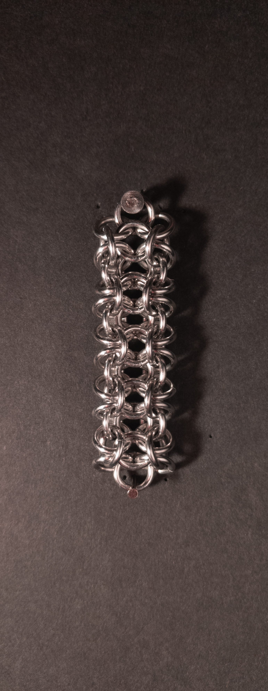
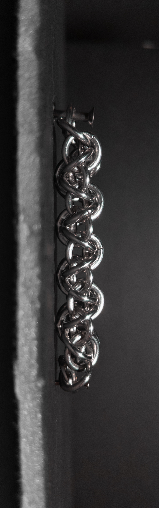
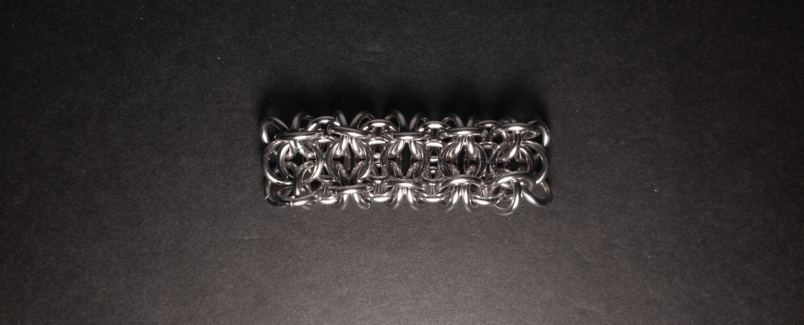

 posted: 2024-03-31 

## Gridlock Byzantine

### Overview

I came across [Gridlock Byzantine](https://www.mailleartisans.org/weaves/weavedisplay.php?key=469) by [Loke](https://www.mailleartisans.org/members/memberdisplay.php?key=1722) on [M.A.I.L.](https://www.mailleartisans.org/) and decided to make it. Gridlock Byzantine is a [Gridlock](gridlock.md) variant that looks similar to [Byzantine](byzantine.md) due to the added edge rings. If you want to make this weave yourself, I recommend this [tutorial](https://www.mailleartisans.org/articles/articledisplay.php?key=346) by [MaxumX](https://www.mailleartisans.org/members/memberdisplay.php?key=949).

### Materials

For the sample piece showcased in this post, I made the rings myself (bonus post coming soon if you are interested). I used 16 SWG Bright Aluminum wire from [The Ring Lord](https://theringlord.com/) coiled around a 6mm mandrel for an approximate aspect ratio of 3.7.

### Notes

The Gridlock Byzantine weave offers a blend of simplicity in understanding and complexity in construction. Despite its somewhat challenging nature, the weave yields an aesthetically pleasing design. However, when the weave is in a vertical orientation, the bottom may not retain its shape entirely, although longer chains can still maintain their visual appeal. With its flat and broad cross-section, the weave finds suitability in bracelets, chokers, and straps. It can also be fashioned into earrings or pendants, although stability at the bottom may impact aesthetic value. The name derives from its basis on Gridlock and its resemblance to Byzantine. Despite its moderate difficulty in construction, the weave's visual allure makes it a worthwhile technique to master.

### Pictures

#### Vertical

#### Vertical: Profile

#### Flat

#### Flat: Profile

#### In Process

 

 

