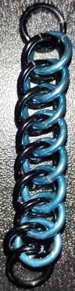

 posted: 2023-02-05 

## Half Persian 3-in-1

### Overview

Recently I found a good [tutorial](https://chainmail101.com/half-persian-3-in-1) that covers how to create [Half Persian 3-in-1](https://www.mailleartisans.org/weaves/weavedisplay.php?key=52). Half Persian 3-in-1 is a fun variation of the [Persian](https://www.mailleartisans.org/weaves/weavedisplay.php?key=44) weave that is simple to learn, easy to make, and well suited to creating two toned items.

### Materials

I used black and blue Anodized Aluminum rings all in a in 16 SWG with a 1/4" internal diameter with an aspect ratio of 4.03 that I bought from the [Ring Lord](https://theringlord.com/).

### Notes

While the beginning can be a tiny bit tricky the weave overall is quite easy to make and extend. When using an aspect ratio of 4.03 the weave is neither too loose nor too tight. Due to how the weave is set up it is very good at having either two colors of materials contrast against each other. Overall the weave looks quite nice and is very easy to make. This makes it very good for use in jewelry and a good beginner weave to learn.

### Pictures`

#### Top:

#### Bottom:

#### In-Process:

