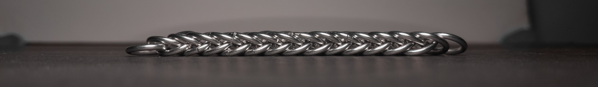
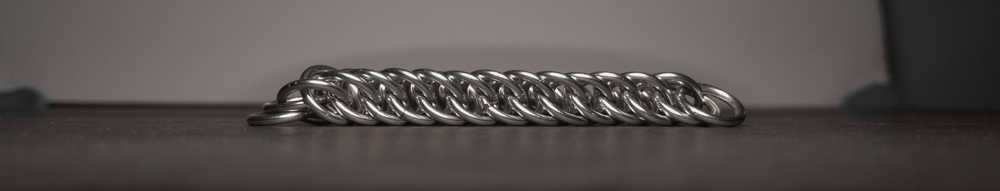
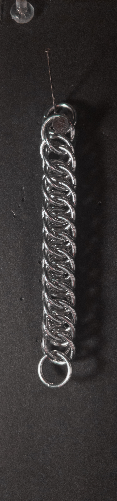
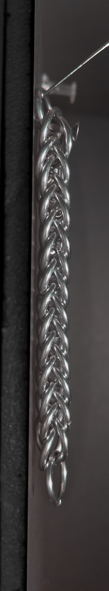
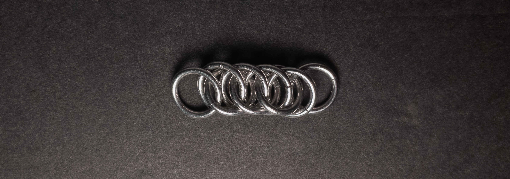

 posted: 2023-12-10 

## Half Persian 4-in-1

### Overview

While checking out [M.A.I.L.](https://www.mailleartisans.org/) for neat weaves to try, I found [Half Persian 4-in-1](https://www.mailleartisans.org/weaves/weavedisplay.php?key=50) by Antiquity. Half Persian 4-in-1 is the numerical progression of [Half Persian 3-in-1](half_persian_3_in_1.md), with each ring going through 4 rings compared to each ring of Half Persian 3-in-1 going through 3 rings. If you are interested in trying it out yourself, I highly recommend this [tutorial](https://www.mailleartisans.org/articles/articledisplay.php?key=192) by [Eli](https://www.mailleartisans.org/members/memberdisplay.php?key=1240).

### Materials

For the sample piece showcased in this post, I made the rings myself (bonus post coming soon if you are interested). I used 16 SWG Bright Aluminum wire from [The Ring Lord](https://theringlord.com/) coiled around an 8mm mandrel for an approximate aspect ratio of 4.9.

### Notes

Half Persian 4-in-1 is both simple to understand and create. However, achieving the perfect placement of the crucial first few rings may require some restarts. The resulting weave is visually striking and possesses a unique property: its appearance and cross-section can dynamically change when stretched or compressed. When stretched, the weave takes on a flat rectangular cross-section, and when compressed, its cross-section becomes square. This versatile characteristic makes it suitable for jewelry items such as bracelets, chokers, and necklaces. Also, it can be used as a cord if compression is not a concern. Additionally, the weave's dynamic changes during stretching and compression can make it a playful and engaging fidget item. Due to its distinctive and fun properties, I highly recommend learning the Half Persian 4-in-1 weave.

### Pictures

#### Flat

Stretched: 

Compressed: 

#### Flat: Profile

Stretched: 

Compressed: 

#### Vertical

#### Vertical: Profile

#### In Process

 

 

 

