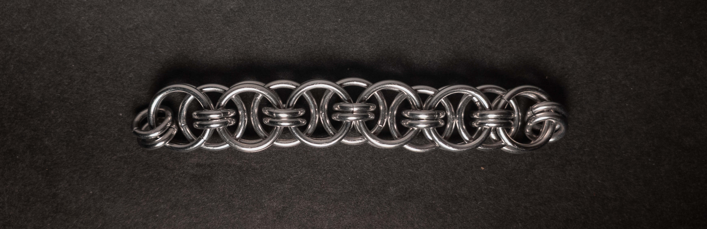
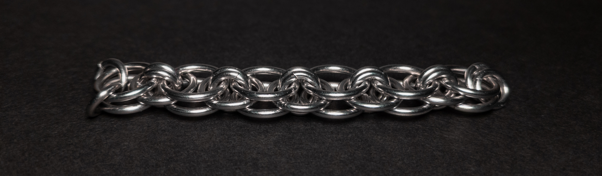
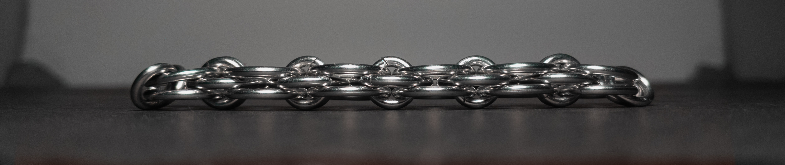
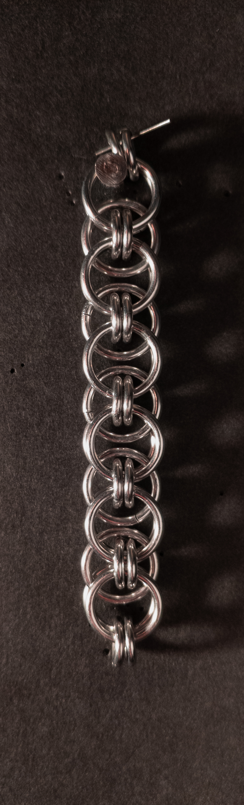
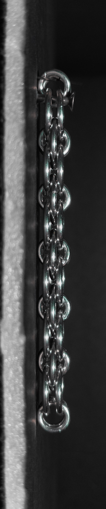
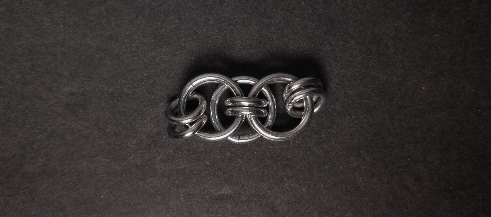
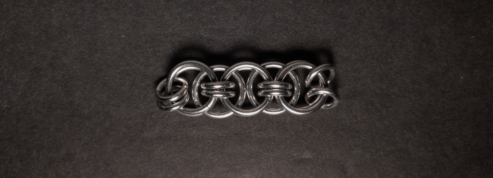
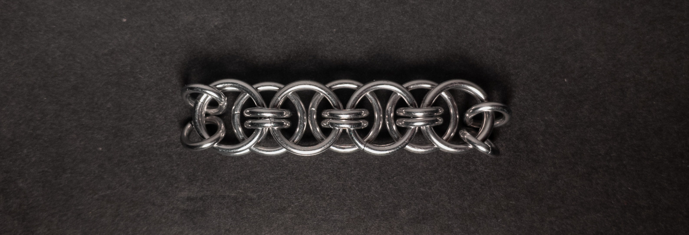
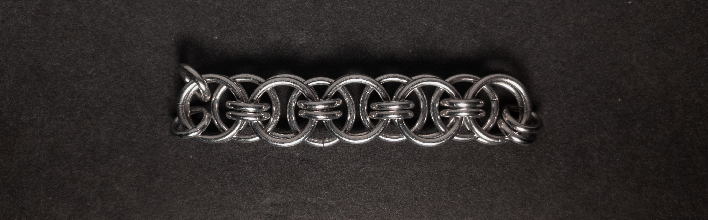

 posted: 2024-04-07 

## Helm Chain

### Overview

While searching [M.A.I.L.](https://www.mailleartisans.org/), I came across [Helm Chain](https://www.mailleartisans.org/weaves/weavedisplay.php?key=464) recorded by [Zlosk](https://www.mailleartisans.org/members/memberdisplay.php?key=9). Helm Chain is an interesting and unique weave serving as the base for many weaves. If you want to try making it yourself at home, I suggest this [tutorial](https://www.mailleartisans.org/articles/articledisplay.php?key=428) by [rengoddess](https://www.mailleartisans.org/members/memberdisplay.php?key=4399).

### Materials

For the sample piece showcased in this post, I used two sizes of rings made by hand(bonus post coming soon) from 16 SWG Bright Aluminum wire purchased from [The Ring Lord](https://theringlord.com/). The smaller rings have an ID(Inner Diameter) of 5mm for an AR(Aspect Ratio) of 3.1. The larger rings have an ID of 9mm for an AR of 5.5.

### Notes

The Helm Chain weave is not very complex to understand, though it can be a bit hard to make since step 4 can be tricky depending on your ring sizes. I find the weave to be moderately aesthetically appealing. Unfortunately, it is not very flexible when bending perpendicular to the flat side. Though the weave is flat and broad, its poor flexibility limits its applications; however, you can make bracelets or chokers if the wearer's wrists or neck are thick enough or even strapping if it doesn't need to be too flexible. Regardless, I would say its best use is in pendants or earrings. I only recommend learning to create this weave if you have an application in mind, as while it looks good and is only mildly challenging to craft, it doesn't have many applications.

### Pictures

#### Flat

#### Flat: Angled

#### Flat: Profile

#### Vertical

#### Vertical: Profile

#### In Process

 

 

 

