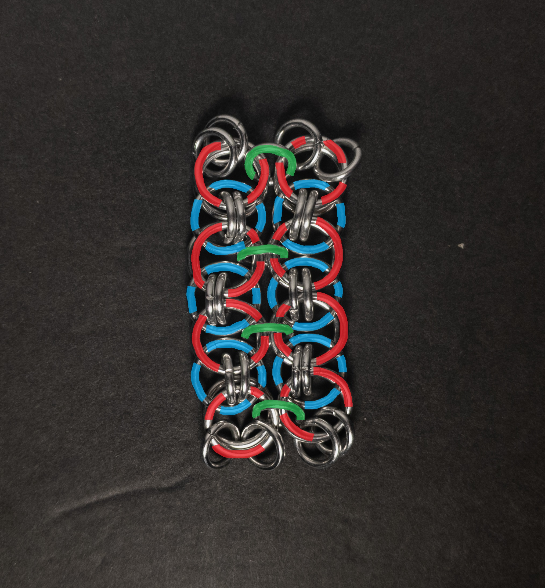
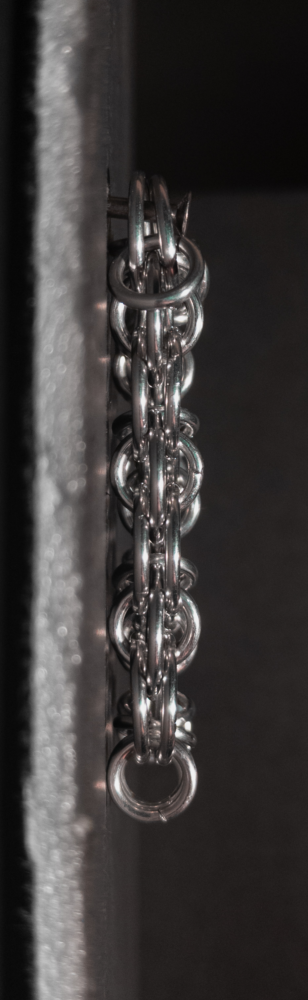

 posted: 2024-09-01 

## Helm Sheet

### Overview

After making and enjoying so many [Helm Chain](helm_chain.md) variants, I decided to search [M.A.I.L.](https://www.mailleartisans.org/) for more and found [Helm Sheet](https://www.mailleartisans.org/weaves/weavedisplay.php?key=1076) by [mithrilweaver](https://www.mailleartisans.org/members/memberdisplay.php?key=14507). Helm Sheet is another sheet variant of Helm Chain and the simplest one covered yet. Unfortunately, I couldn't find any tutorials showing how to make it, so I wrote one and included the [tutorial below](#tutorial) for those who wish to learn how to make it themselves.

### Materials

For the sample piece showcased in this post, I used two sizes of rings made from 16 SWG Bright Aluminum wire. The larger rings, which I made myself(bonus post coming soon), have an ID(Inner Diameter) of 10mm for an AR(Aspect Ratio) of 6.15. The smaller rings have an ID of .25in for an AR of 4, purchased from [The Ring Lord](https://theringlord.com/).

### Tutorial

1. Create a strip of Helm Chain as long as you would like one of the dimensions of the weave to be. When done, it should look something like this:

    

2. Create another strip of Helm Chain as long as the previous one and place it next to the previous one. When done, it should look something like this:

    

3. Join the new strip with the other one by adding new small rings(green in the image below) between each pair of stacked large rings in the chains(red in the image below) holding the sandwiched rings(blue in the image below) in place. When done, it should look something like this:

    

4. Repeat steps 2 & 3 until you are happy with the size of the sheet.

### Notes

The Helm Sheet weave is simple to understand but a bit more complex to create, inheriting the complexities of Helm Chain. The weave can look aesthetically appealing; however, that requires tension, and without tension, the weave looks messy. It could be less reliant on tension if the small rings were smaller, leaving less room between the individual chains. As a sheet weave, you can make bracelets, necklaces, or fabric with it. In my opinion, the mediocre aesthetics of the weave and the moderate complexity in creating it make me unable to recommend learning to make this weave.

### Pictures

#### Flat

#### Flat: Angled

#### Flat: Profile

#### Vertical

#### Vertical: Profile

#### In Process

 

