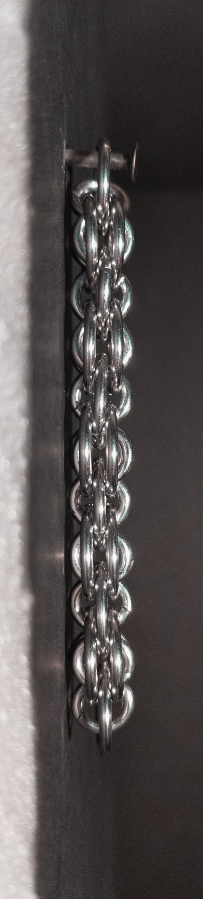

 posted: 2024-08-04 

## Helm's Deep Chain

### Overview

While looking for new weaves on [M.A.I.L.](https://www.mailleartisans.org/), I found [Helm's Deep Chain](https://www.mailleartisans.org/weaves/weavedisplay.php?key=714) by [Nárrína](https://www.mailleartisans.org/members/memberdisplay.php?key=6120). Helm's Deep Chain is a variant of [Helm Chain](helm_chain.md) characterized by an additional ring that joins adjacent pairs of sandwiched middle rings. If you want to make it yourself, I suggest you follow this helpful [video tutorial](https://www.youtube.com/watch?v=gQKaT9IWg1U) by [Aussie Maille](https://www.youtube.com/@AussieMaillers).

### Materials

For the sample piece showcased in this post, I used two sizes of rings made by hand(bonus post coming soon) from 16 SWG Bright Aluminum wire purchased from [The Ring Lord](https://theringlord.com/). The smaller rings have an ID(Inner Diameter) of 5mm for an AR(Aspect Ratio) of 3.1. The larger rings have an ID of 9mm for an AR of 5.5.

### Notes

The Helm's Deep Chain weave is moderately complex to understand and to create. In my opinion, its aesthetic appeal is mediocre. While the Helm's Deep Chain is more flexible than the Helm Chain, it's still not very flexible perpendicular to its flat side. This lack of flexibility limits its use cases; however, you can use it in chokers, necklaces, earrings, and pendants. Given the weave's moderate difficulty and mediocre aesthetic appeal, I recommend learning it only if you particularly like how it looks.

### Pictures

#### Flat

#### Flat: Angled

#### Flat: Profile

#### Vertical

#### Vertical: Profile

#### In Process

 

 

 

