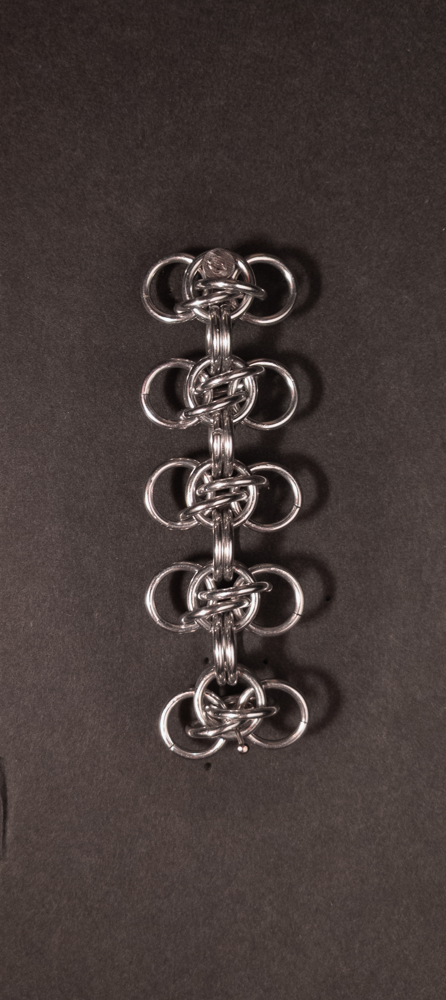
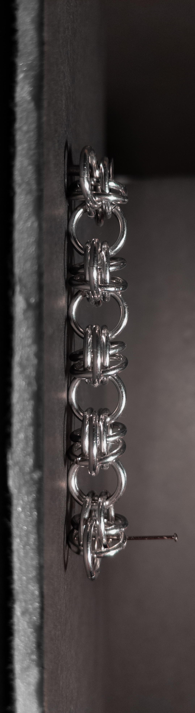
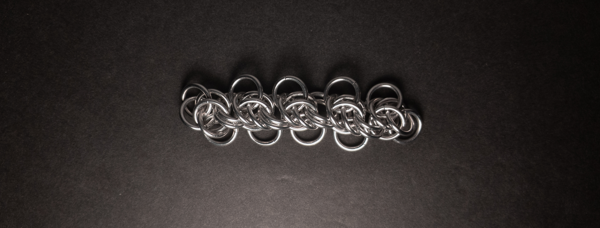
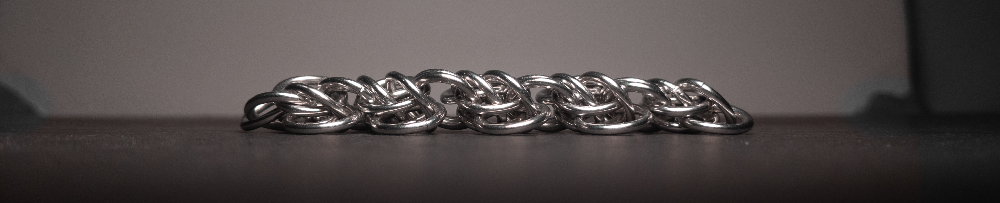
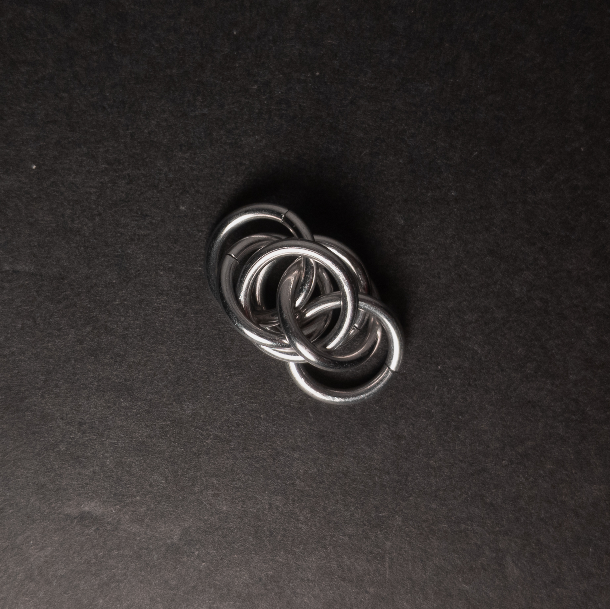
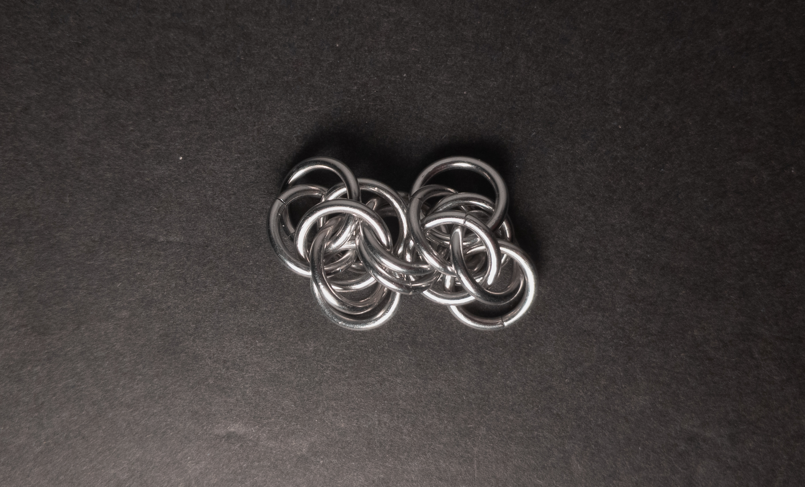
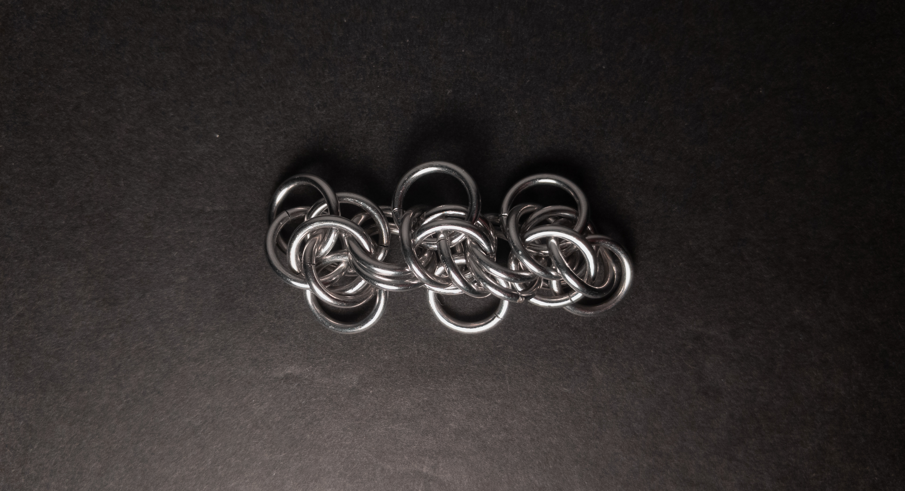
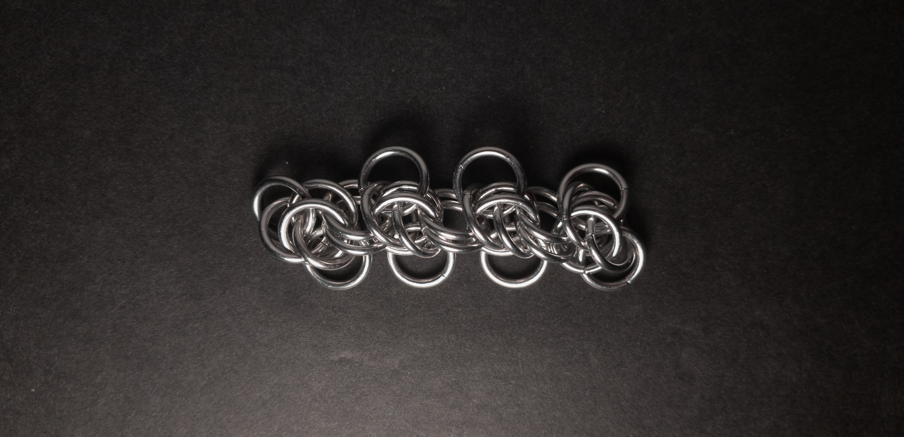

 posted: 2024-04-21 

## Honey Bee

### Overview

When I found [Scary Weave](scary_weave.md) on [M.A.I.L.](https://www.mailleartisans.org/) I also found [Honey Bee](https://www.mailleartisans.org/weaves/weavedisplay.php?key=786) by [Corvus](https://www.mailleartisans.org/members/memberdisplay.php?key=4033). Honey Bee is an interesting variant of Scary Weave, created by joining the units in a more simplistic way. I decided to try making this weave as I liked the Scary Weave units and wanted to see how this would work. If you want to try and make this yourself, I recommend this [tutorial](https://www.mailleartisans.org/articles/articledisplay.php?key=478) by Corvus as I found it very helpful.

### Materials

For the sample piece showcased in this post, I made the rings myself (bonus post coming soon if you are interested). I used 16 SWG Bright Aluminum wire from [The Ring Lord](https://theringlord.com/) coiled around an 8mm mandrel for an approximate aspect ratio of 4.9.

### Notes

The Honey Bee weave offers a mostly straightforward understanding and creation process. It boasts a striking appearance, particularly when under tension, although the end units may appear somewhat sloppy. However, the sloppy ends have less impact if the chain is lengthened or turned into a closed loop. It is well-suited for bracelets and chokers due to its flat and broad cross-section. However, unlike other weaves with similar cross-sections, it is not well suited for use as a strap due to stability at its sides. I advise caution with the individual units before joining, as, in my experience, the units are unstable alone. When I dropped units, I occasionally had to take them apart and re-make them. Compared to the Scary Weave from which it derives, the more direct method of joining units enhances stability, addressing a significant issue I have with Scary Weave. With aesthetics similar to Scary Weave and the addition of stability, I highly recommend you learn how to create this weave.

### Pictures

#### Vertical

#### Vertical: Profile

#### Flat

#### Flat: Profile

#### In Process

 

 

 

