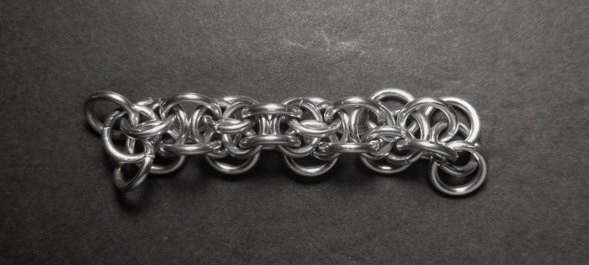

 posted: 2023-08-06 

## Hoodoo

### Overview

While looking for new weaves to try and make, I came across [Hoodoo](https://www.mailleartisans.org/weaves/weavedisplay.php?key=279) by [Blaise](https://www.mailleartisans.org/members/memberdisplay.php?key=249) on [MAIL](https://www.mailleartisans.org/), which I found very intriguing. While trying to make it, I found this [tutorial](https://www.mailleartisans.org/articles/articledisplay.php?key=393) by [ArmoredDrake](https://www.mailleartisans.org/members/memberdisplay.php?key=3020) incredibly helpful, even though it is for the sheeted version. If you like this weave, I recommend that you try it yourself.

### Materials

For the sample piece showcased in this post, I used Bright Aluminum rings purchased from [The Ring Lord](https://theringlord.com/). The rings are 16 SWG with a 1/4" internal diameter, resulting in an aspect ratio of 4.03.

### Notes

The Hoodoo weave presents a moderate level of complexity in terms of understanding and execution. Personally, it took me a few reads of the tutorial and several attempts to grasp it fully. It is also moderately difficult to make the weave as one needs to pay close attention to the orientation of the rings, which can change frequently. Unfortunately, the rings I used for the weave had a higher aspect ratio (AR) than the recommended AR of 3.2. As a result, my weave turned out looser than intended, making it less representative of the weave's potential. Nonetheless, the Hoodoo weave has the capacity to produce a wonderful aesthetic, though the images in this post are not the best representative. This weave is highly dependent on the AR of the rings; if it is too high the weave will be too loose. In conclusion,  I highly recommend learning this weave if you have appropriately sized rings.

### Pictures

#### Vertical

#### Vertical: Profile

#### Flat

#### Flat: Profile

#### In Process

 

 

 

