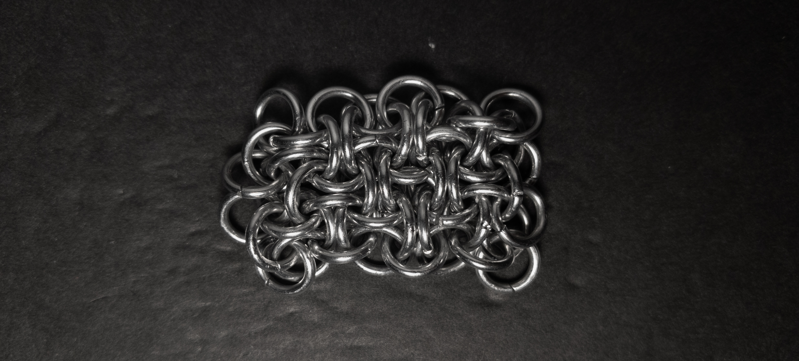

 posted: 2023-08-13 

## Hoodoo Sheet

### Overview

When I came across [Hoodoo](hoodoo.md) on [M.A.I.L.](https://www.mailleartisans.org/), I also found its sheet variant, [Hoodoo Sheet](https://www.mailleartisans.org/weaves/weavedisplay.php?key=282), both submitted by [Blaise](https://www.mailleartisans.org/members/memberdisplay.php?key=249). With the potential I saw in the chain variant, I knew that I had to make the sheet variant. Following this great [tutorial](https://www.mailleartisans.org/articles/articledisplay.php?key=393) by [ArmoredDrake](https://www.mailleartisans.org/members/memberdisplay.php?key=3020) and with additional help from the [chainmaillers](https://chainmaillers.com/) forums I was able to make the weave. This is the hardest weave I have made to date. If you wish to try it yourself, I suggest making a small piece first to see if you like it.

### Materials

For the sample piece showcased in this post, I used Bright Aluminum rings purchased from [The Ring Lord](https://theringlord.com/). The rings are 16 SWG with a 1/4" internal diameter, resulting in an aspect ratio of 4.03.

### Notes

While the Hoodoo Sheet weave is based on a fairly simple concept, it does require careful attention, particularly for the third and following lines. Personally, I found it very challenging to progress beyond the initial two chains. Although I used rings with the recommended aspect ratio (AR), I did find that the weave was quite stiff. Another issue I encountered was that the weave was loose around the edges. Despite these challenges, the Hoodoo Sheet is very visually appealing. Being a sheet weave, it can be used in a large variety of applications, from bracelets and chokers to even clothing; however, it is not well-suited for long, dangling applications such as necklaces. Considering its high level of difficulty, I would only recommend attempting to learn this weave if you possess considerable experience or have ample time to dedicate to mastering it.

### Pictures

#### Vertical

#### Vertical: Profile

#### Flat

#### Flat: Profile

 

 

 

 