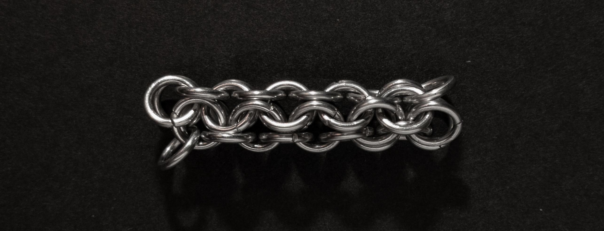
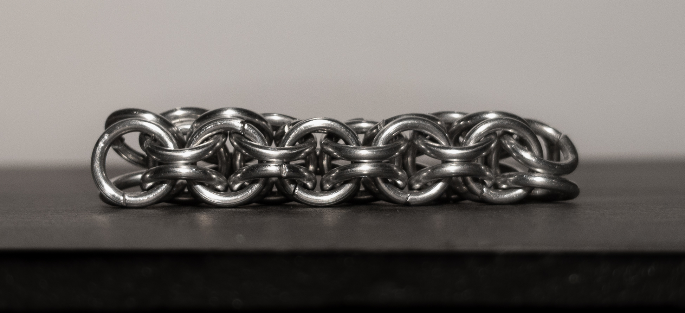
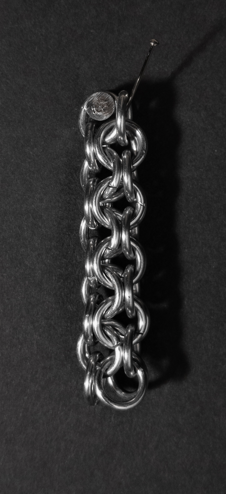
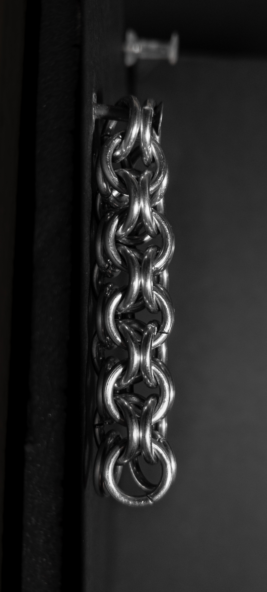
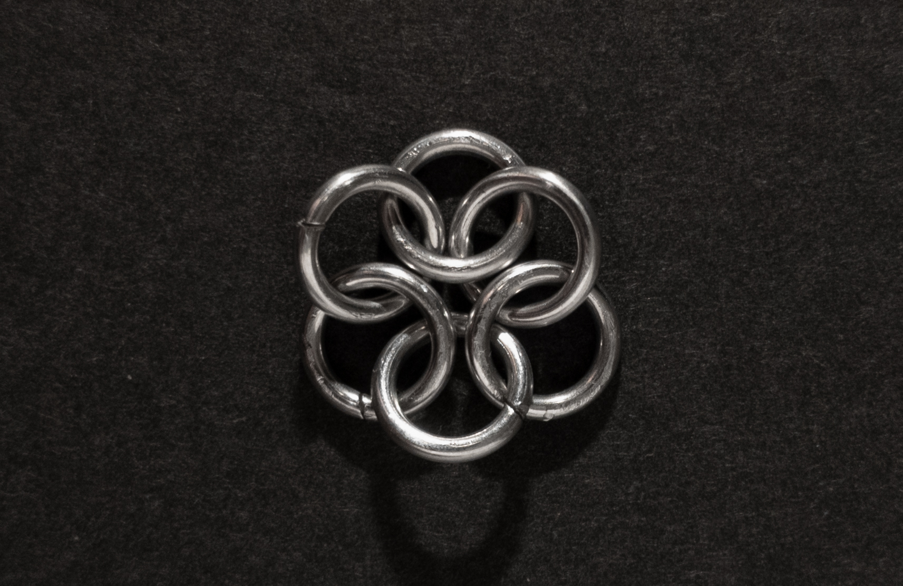
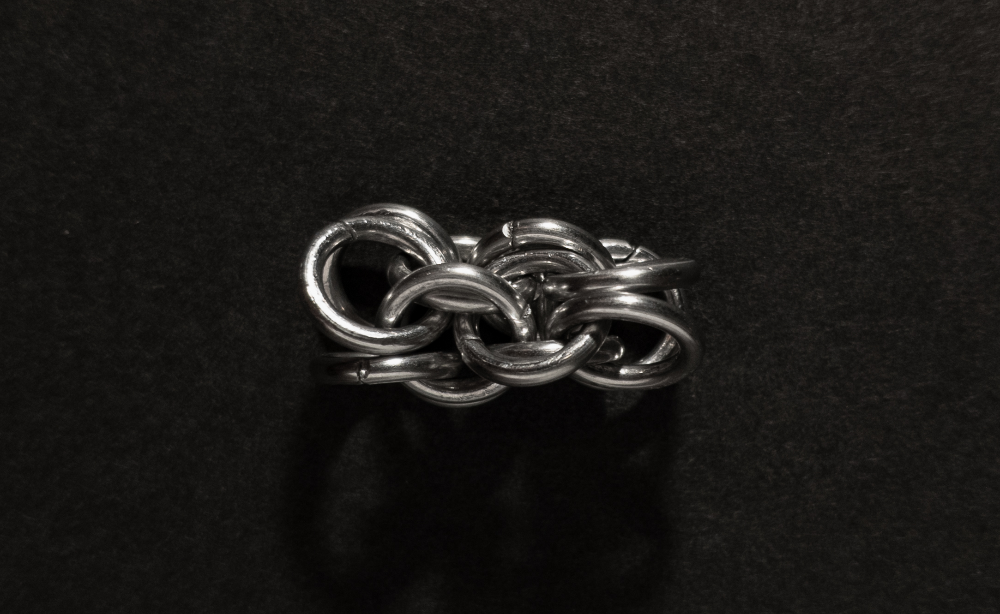
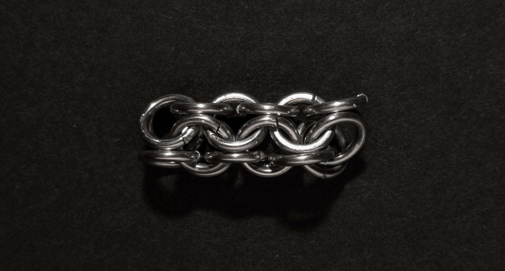
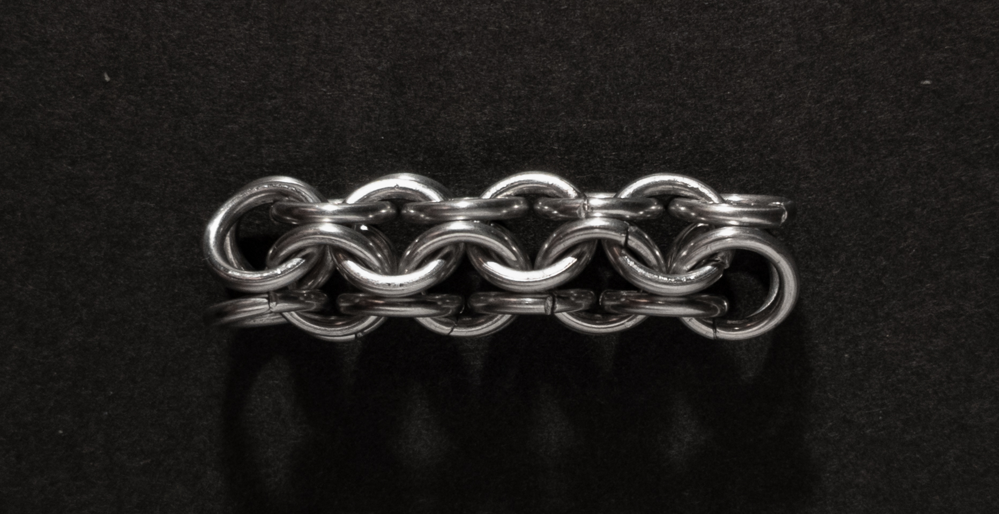

 posted: 2023-06-25 - updated: 2023-07-23 

## Inverted Round

### Overview

I found a [tutorial](https://www.mailleartisans.org/articles/articledisplay.php?key=304) by [cohort](https://www.mailleartisans.org/members/memberdisplay.php?key=658) on [M.A.I.L.](https://www.mailleartisans.org/) that shows how to create the [Inverted Round](https://www.mailleartisans.org/weaves/weavedisplay.php?key=110) weave. Inverted round is related to the [European 4-in-1](european_4_in_1.md) weave as a variant of [Roundmaille](roundmaille.md). If you are interested in round weaves I highly suggest trying it out.

### Materials

The rings used for the sample piece shown in this post are 16 SWG with a 1/4" internal diameter for an aspect ratio of 4.03 made of Bright Aluminum that I bought from the [Ring Lord](https://theringlord.com/).

### Notes

Inverted Round is a simple weave to make, though starting it can be a bit tricky. The weave looks great whether it's flat or vertical, but it looks better when it's flat because it can be difficult to end. Unless it's transitioned to another round weave or attached to a custom hook, it may be loose at the ends, which can be unattractive. The sample piece I made was a bit stiff because I used rings with an aspect ratio (AR) of 4.03, which is lower than the recommended 4.3. You can choose any AR within the range of 4.3 to 3.5 depending on the purpose of your project, whether it's for bracelets, necklaces, or structural use. Overall, Inverted Round is a beautiful, versatile, and easy-to-make weave that I highly recommend learning.

### Pictures

#### Flat

#### Flat: Profile

#### Vertical

#### Vertical: Profile

#### In Process

 

 

 

