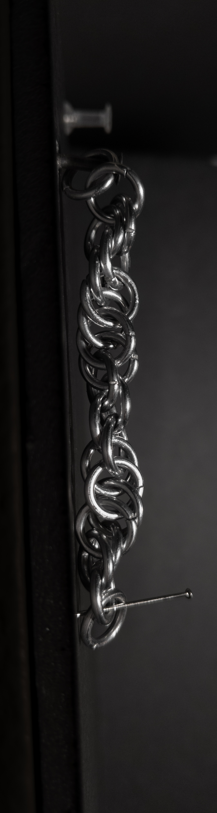
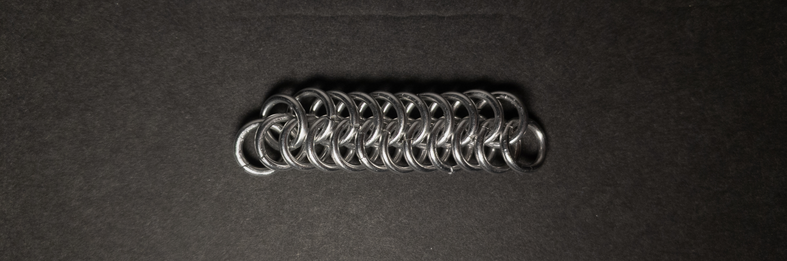
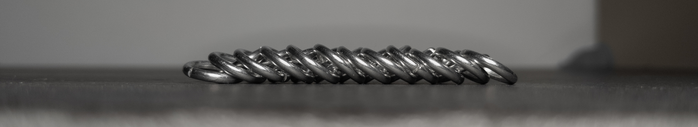
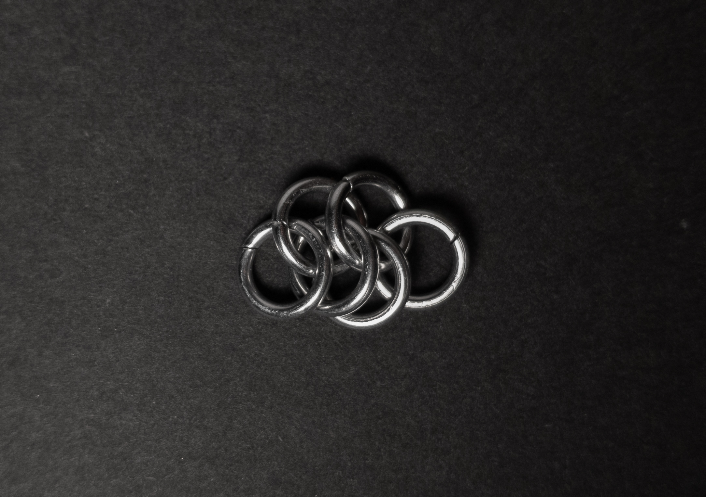
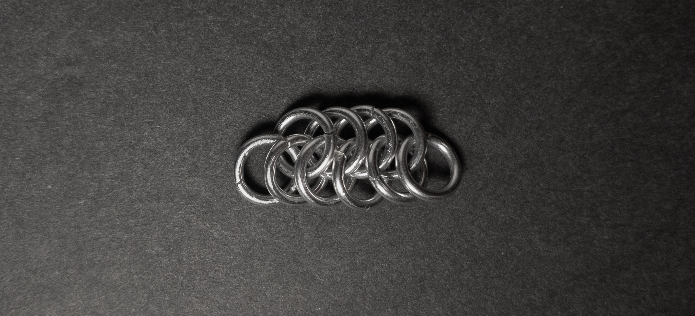
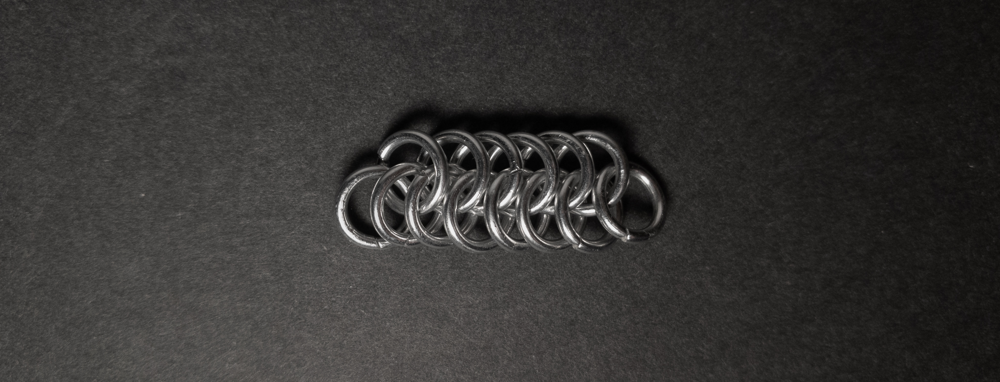
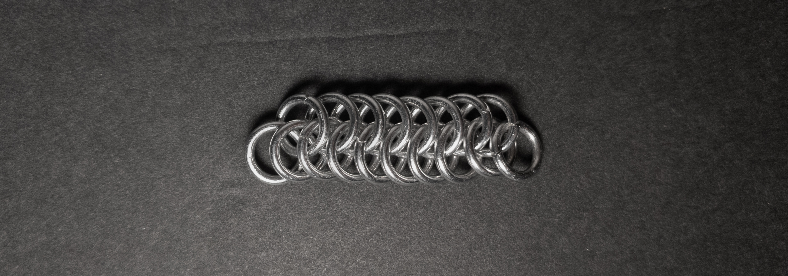

 posted: 2023-10-08 

## Jacob's Ladder

### Overview

When I checked out [M.A.I.L.](https://www.mailleartisans.org/) for variants of [European 6-in-1](european_6_in_1.md) I found [Jacob's Ladder](https://www.mailleartisans.org/weaves/weavedisplay.php?key=281) by [Armoured_Raven](https://www.mailleartisans.org/members/memberdisplay.php?key=947). Jacob's Ladder is an interesting variant similar to half of a single chain of European 6-in-1; this gives it interesting effects I found unpredictable. If the idea of this weave entices you, I recommend this [tutorial](https://www.mailleartisans.org/articles/articledisplay.php?key=147) by Armoured_Raven.

### Materials

For the sample piece showcased in this post, I used Bright Aluminum rings purchased from [The Ring Lord](https://theringlord.com/). The rings are 16 SWG with a 1/4" internal diameter, resulting in an aspect ratio of 4.03.

### Notes

The concept of Jacob's Ladder weave is relatively easy to grasp. However, its execution can be complex, especially during the initial stages. One notable drawback is its lack of stability. Jacob's Ladder is a versatile weave; it can be twisted into a spiral weave, as depicted in the vertical photos, or transformed into a partial European 6-in-1 chain, as seen in the flat and in-progress photos. When starting this weave, it is advisable to keep it on a flat surface to keep it stable. Interestingly, this weave has applications as a Spiral chain or Half European if torsion and locking are applied, and it has even sparked forum discussions about its use in magic tricks. While Jacob's Ladder is intriguing, it may not be worth learning unless you are interested in using it for magic tricks.

### Pictures

#### Vertical

#### Vertical: Profile

#### Flat

#### Flat: Profile

#### In Process

 

 

 

