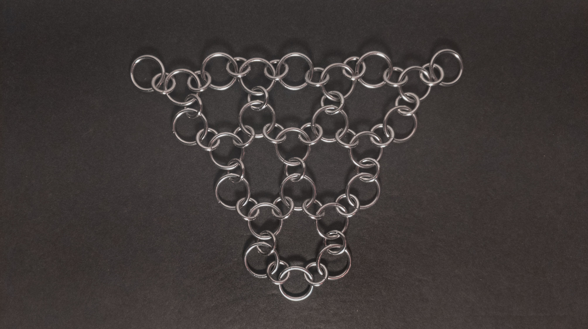
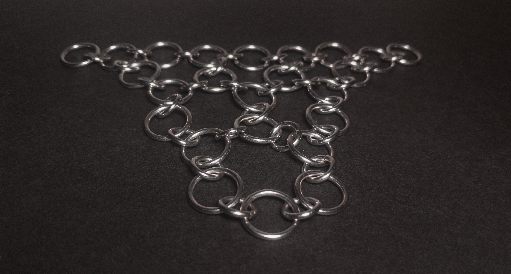
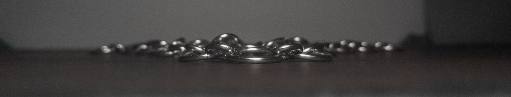
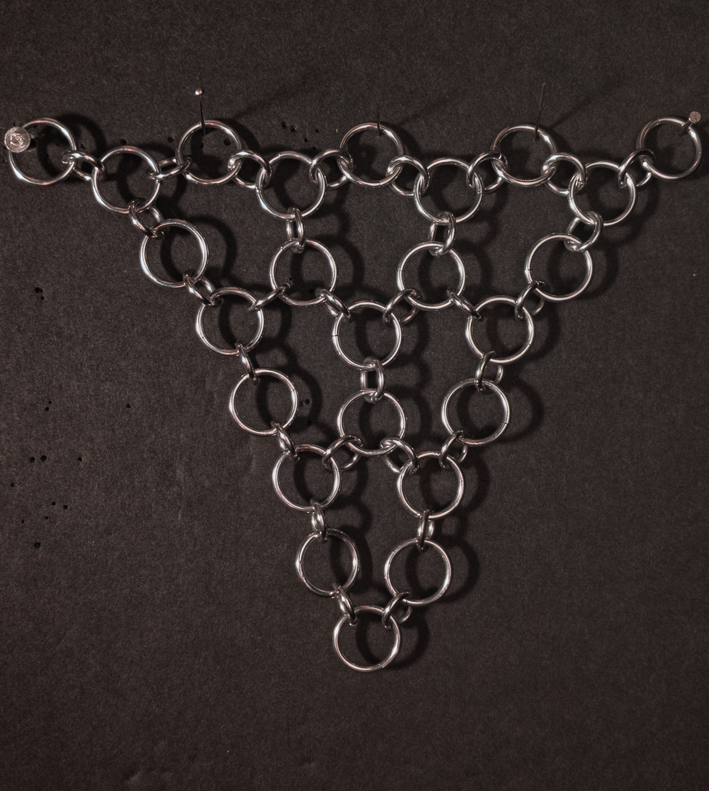
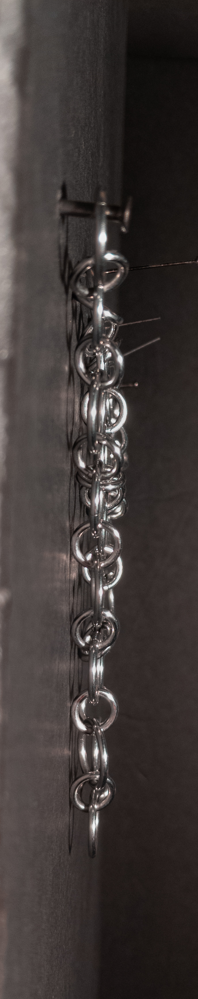
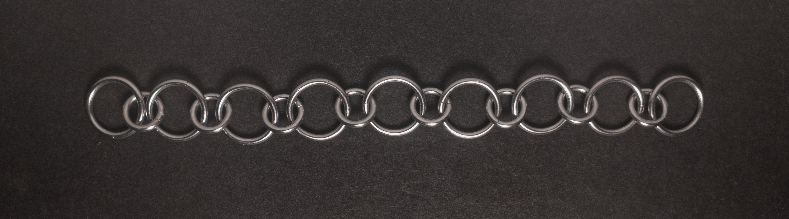
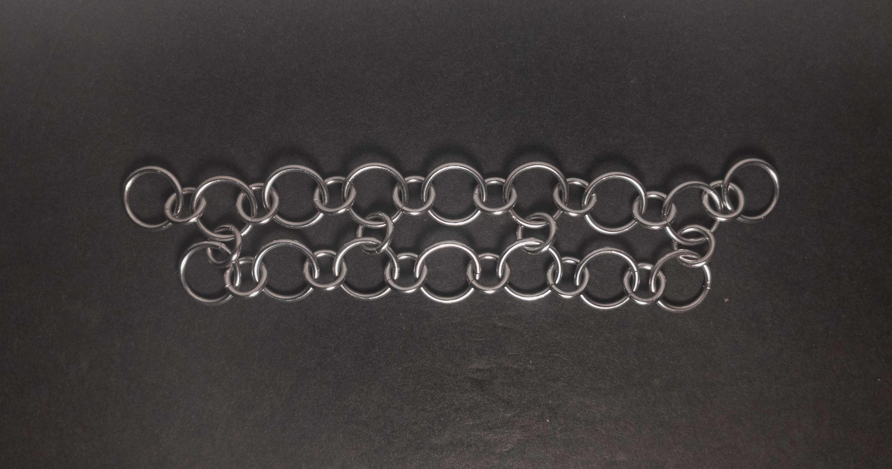
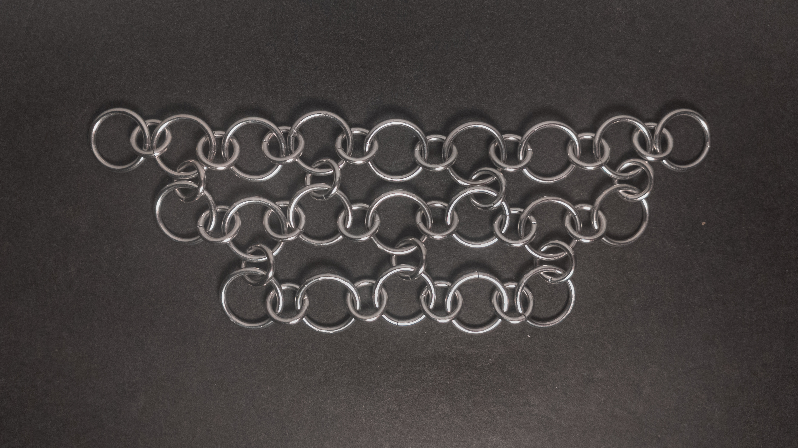
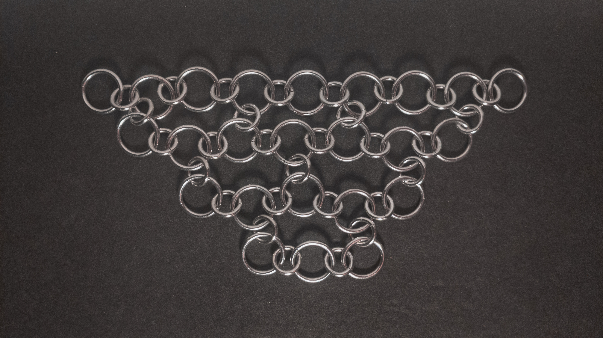

 posted: 2024-12-08 

## Japanese 3-in-1

### Overview

While crawling the internet looking for new weaves, I found the historic [Japanese 3-in-1](https://www.mailleartisans.org/weaves/weavedisplay.php?key=20) documented on [M.A.I.L.](https://www.mailleartisans.org/). Japanese 3-in-1 is a unique member of the Japanese family and is great for quickly making large net fabric items. I found this [tutorial](https://www.mailleartisans.org/articles/articledisplay.php?key=48) by [Aderamelech](https://www.mailleartisans.org/members/memberdisplay.php?key=7) invaluable when trying to make this myself.

### Materials

For the sample piece showcased in this post, I used two sizes of rings made by hand(bonus post coming soon) from 16 SWG Bright Aluminum wire purchased from [The Ring Lord](https://theringlord.com/). The smaller rings have an ID(Inner Diameter) of 6mm for an AR(Aspect Ratio) of 3.7. The larger rings have an ID of 10mm for an AR of 6.15.

### Notes

The Japanese 3-in-1 weave is conceptually quite simple, though it can be challenging to create due to its loose nature, which makes it harder to see the pattern while working on it. You can reduce the difficulty of creation by using two ring sizes, one for the flat rings and another for the vertical rings, which I highly recommend, especially for beginners. The weave appears somewhat loose and disorganized, though still somewhat aesthetically pleasing. Bracelets, chokers, and fabric are the most applicable uses for it as it is a sheet weave. Once mastered, this weave is relatively easy to use for larger projects, though the resulting fabric tends to be quite loose and doesn't provide much coverage. Due to its somewhat mediocre aesthetic and suitability for fast, large projects, I would only recommend learning this weave if you need to complete a large project quickly; otherwise, it's not worth prioritizing.

### Pictures

#### Flat

#### Flat: Angled

#### Flat: Profile

#### Vertical

#### Vertical: Profile

#### In Process

 

 

 

