 posted: 2024-06-09 

## Japanese 6-in-1

### Overview

Continuing my exploration of the Japanese weave family led me to the historic [Japanese 6-in-1](https://www.mailleartisans.org/weaves/weavedisplay.php?key=16) as documented on [M.A.I.L.](https://www.mailleartisans.org/). Japanese 6-in-1, also historically known as Hana Gusari, is a denser and heavier weave used in Samurai armour found mainly on the forearms and hands. If you want to make it yourself, I suggest this great [tutorial](https://www.mailleartisans.org/articles/articledisplay.php?key=190) by [Bative](https://www.mailleartisans.org/members/memberdisplay.php?key=349).

### Materials

For the sample piece showcased in this post, I used two sizes of rings made by hand(bonus post coming soon) from 16 SWG Bright Aluminum wire purchased from [The Ring Lord](https://theringlord.com/). The smaller rings have an ID(Inner Diameter) of 5mm for an AR(Aspect Ratio) of 3.1. The larger rings have an ID of 10mm for an AR of 6.15.

### Notes

The Japanese 6-in-1 weave is both simple to craft and comprehend. Despite its straightforward nature, it yields a visually appealing result, although maintaining tension is essential to prevent it from crumpling and appearing messy. Due to its sheet-like structure, this weave offers versatility in its applications, suitable for use in bracelets, necklaces, or even as fabric, offering a wide range of creative possibilities. Given its simplicity, versatility, and attractive appearance, I highly recommend learning how to make this weave.

### Pictures

#### Flat

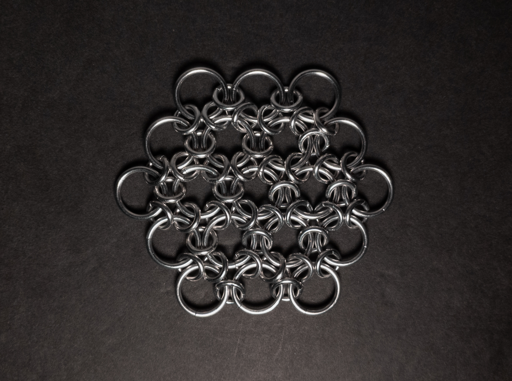

#### Flat: Angled

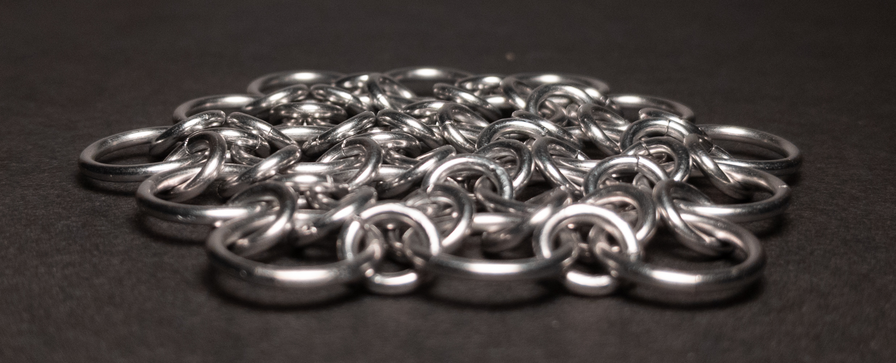

#### Flat: Profile

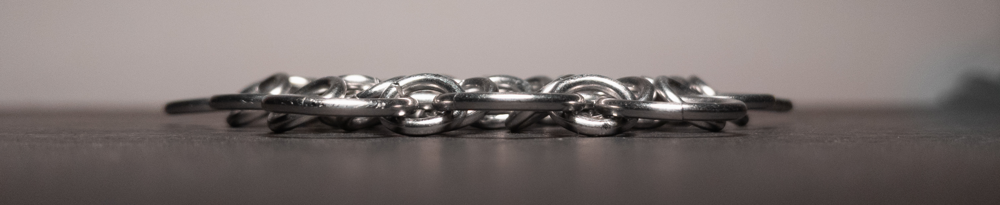

#### Vertical

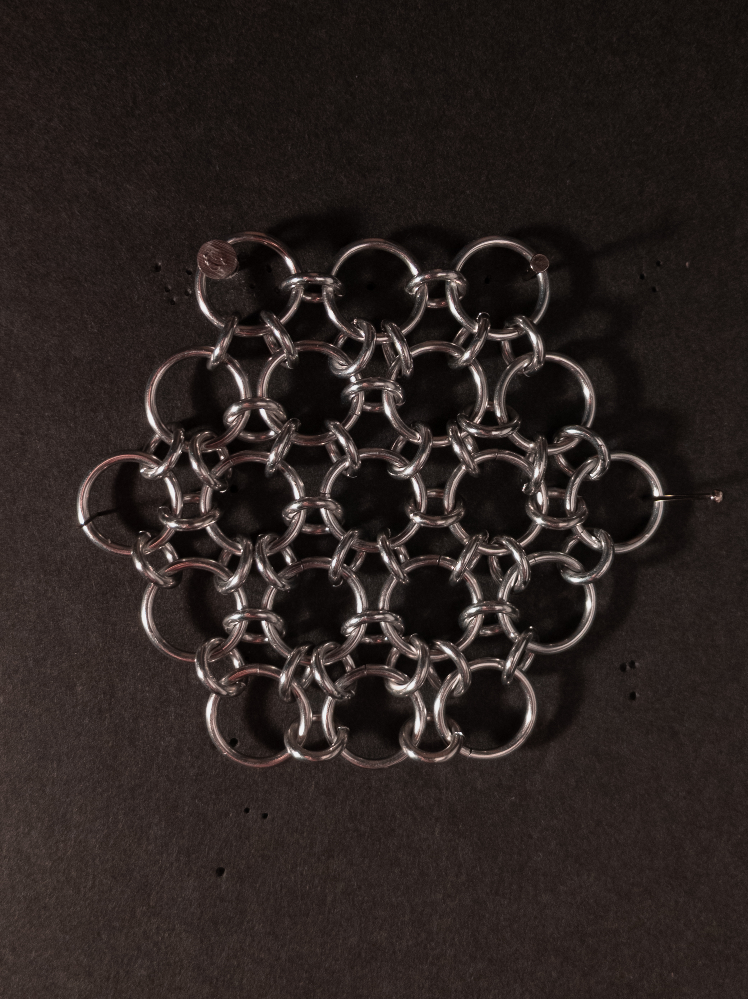

#### Vertical: Profile

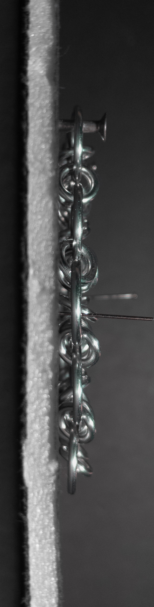

#### In Process

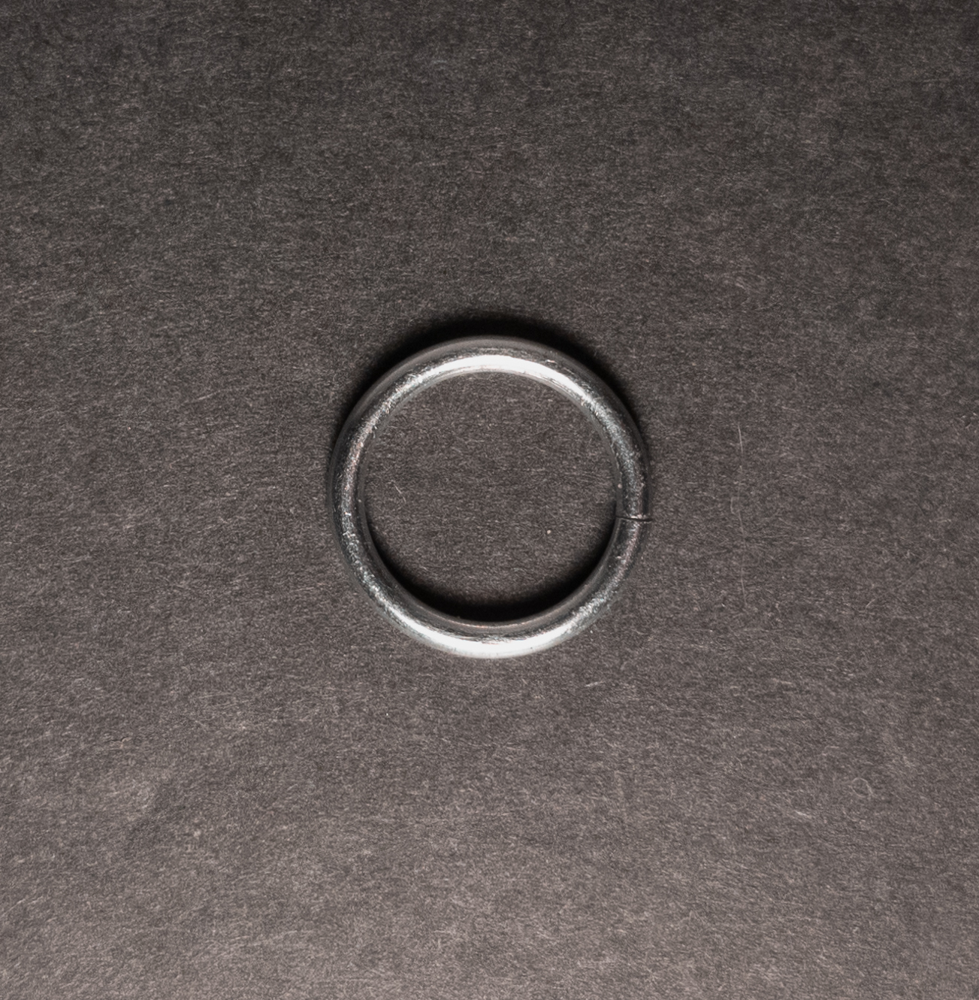

 

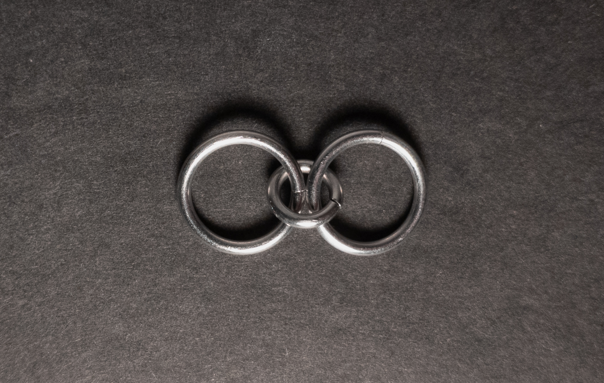

 

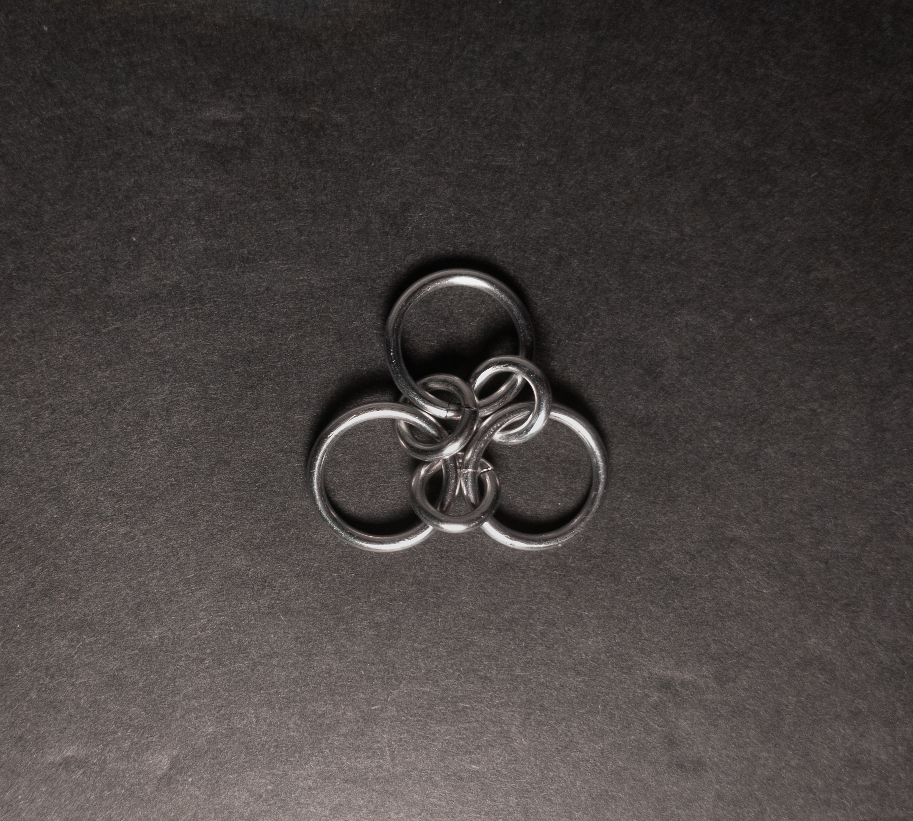

 

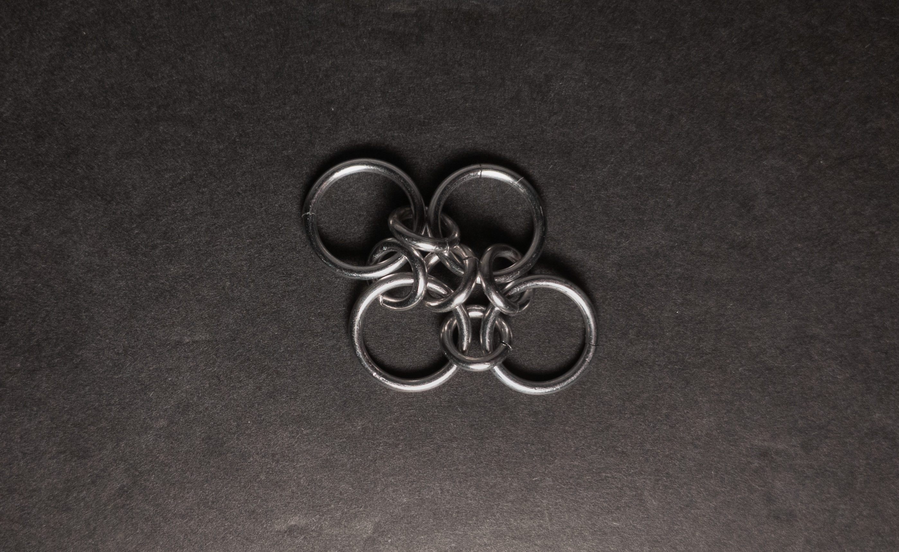

 

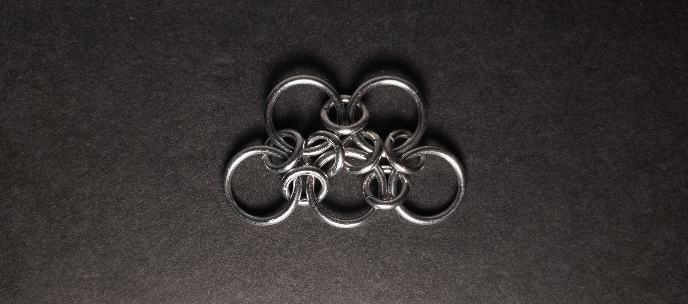

 

 

 

 

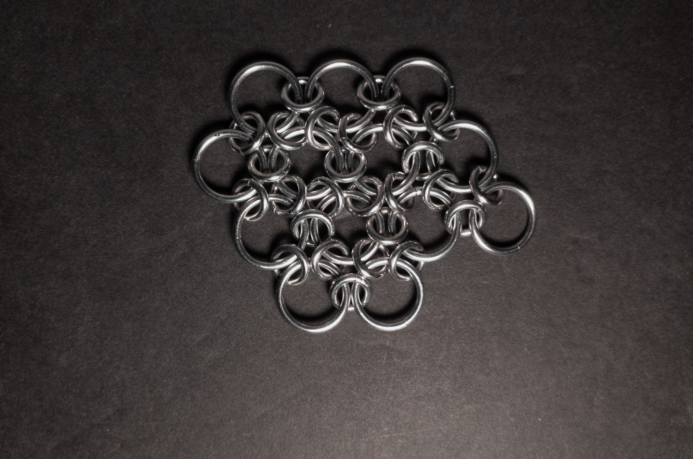

 

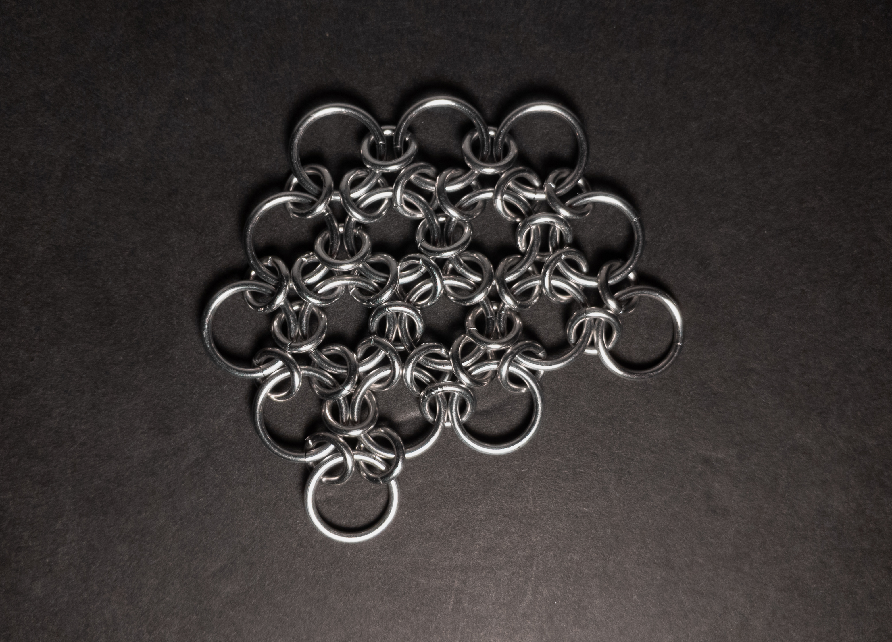
