 posted: 2024-06-02 

## Japanese 8-in-2

### Overview

After making [Japanese 4-in-1](japanese_4_in_1.md), I wanted to try making more weaves in the Japanese family. While looking for those weaves on [M.A.I.L.](https://www.mailleartisans.org/), I found documentation of the historic [Japanese 8-in-2](https://www.mailleartisans.org/weaves/weavedisplay.php?key=1154) weave. Japanese 8-in-2 is a simple progression from Japanese 4-in-1 created by doubling each ring, vastly increasing the stability of the weave. Unfortunately, I could not find any tutorials, so I have written the included [tutorial](#tutorial).

### Materials

For the sample piece showcased in this post, I used two sizes of rings made by hand(bonus post coming soon) from 16 SWG Bright Aluminum wire purchased from [The Ring Lord](https://theringlord.com/). The smaller rings have an ID(Inner Diameter) of 5mm for an AR(Aspect Ratio) of 3.1. The larger rings have an ID of 10mm for an AR of 6.15.

### Tutorial

1. Start with 2 large rings stacked on each other as shown below.

    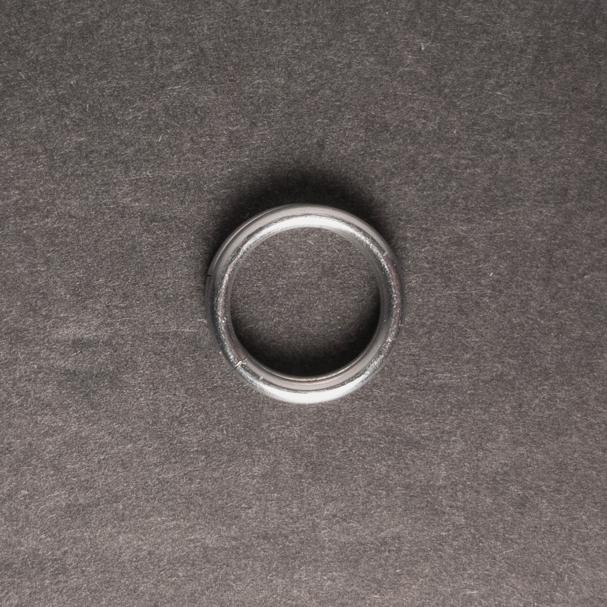

2. Pick a direction to expand in and place 2 more large rings(green in the image below) stacked on top of each other in that direction. When done, it should look something like this:

    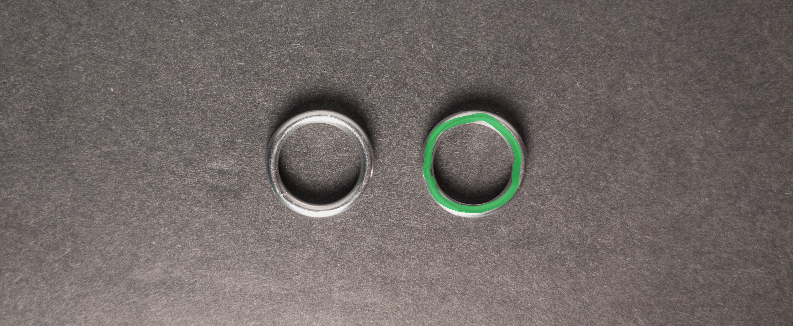

3. Join the stacks of large rings from step 1 and step 2 using 2 small rings(green in the image below). When done, it should look something like this:

    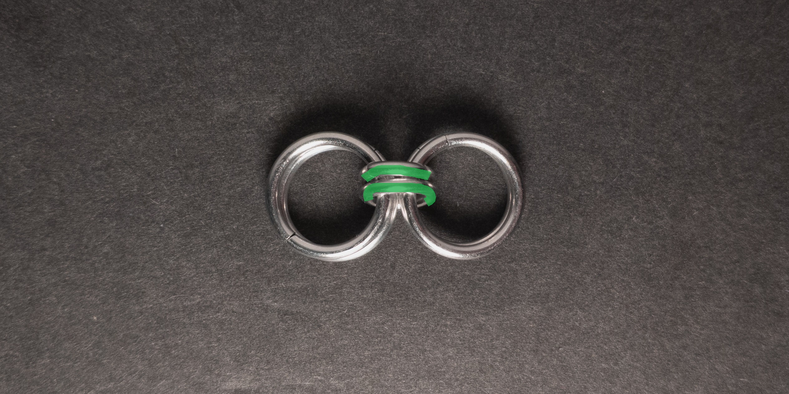

4. Pick a direction to expand the weave and place stacks of 2 large rings(green in the image below) in front of each pair of large rings on that side of the weave. When done, it should look something like this:

    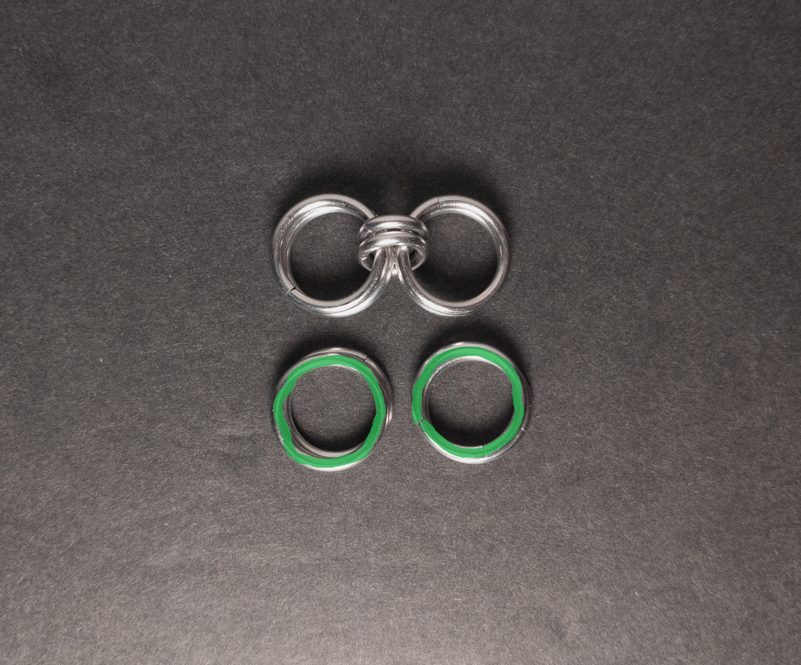

5. Join each pair of rings on the edge of the weave to the stacks of large rings placed in front of them in step 4 using 2 small rings(green in the image below). When done, it should look something like this:

    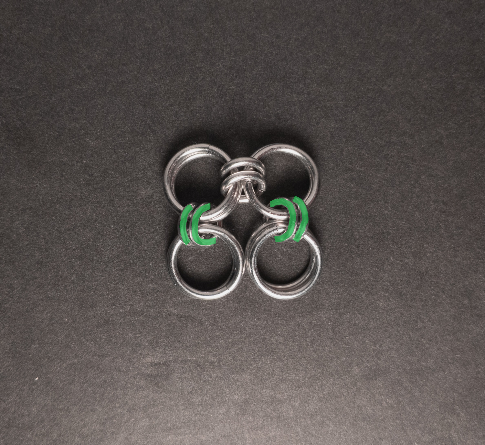

6. Join each pair of large rings from step 4 to the pair next to it using 2 small rings(green in the image below). When done, it should look something like this:

    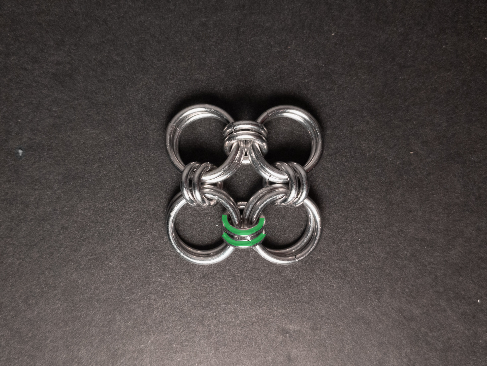

7. Keep following steps 4 through 6 to expand your sheet, stopping when you are happy with the size.

### Notes

The Japanese 8-in-2 weave stands out for its simplicity in understanding and creation. Its appearance is quite appealing, and as a sheet weave, it offers remarkable flexibility, making it suitable for various fabric-like applications. While not mandatory, using two sizes of rings enhances structural clarity and stability, especially when the vertical/joining rings are sufficiently small. In fact, when crafted with small enough rings, it can even serve structural purposes and be used in sculptures. Overall, I highly recommend mastering this weave due to its ease of learning and creation, aesthetic appeal, and versatility.

### Pictures

#### Flat

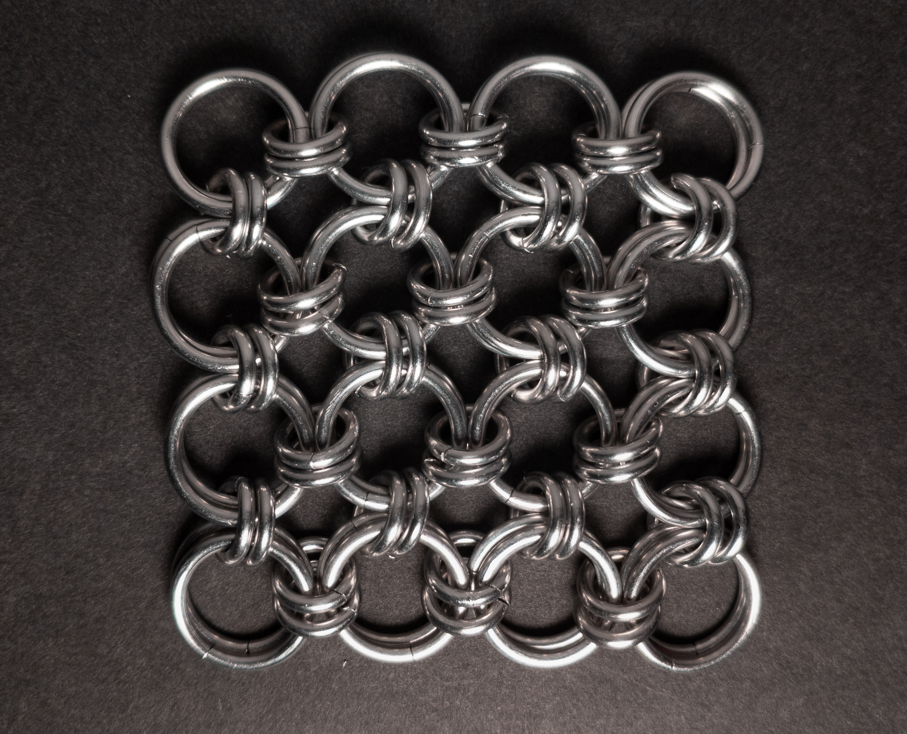

#### Flat: Profile

#### Vertical

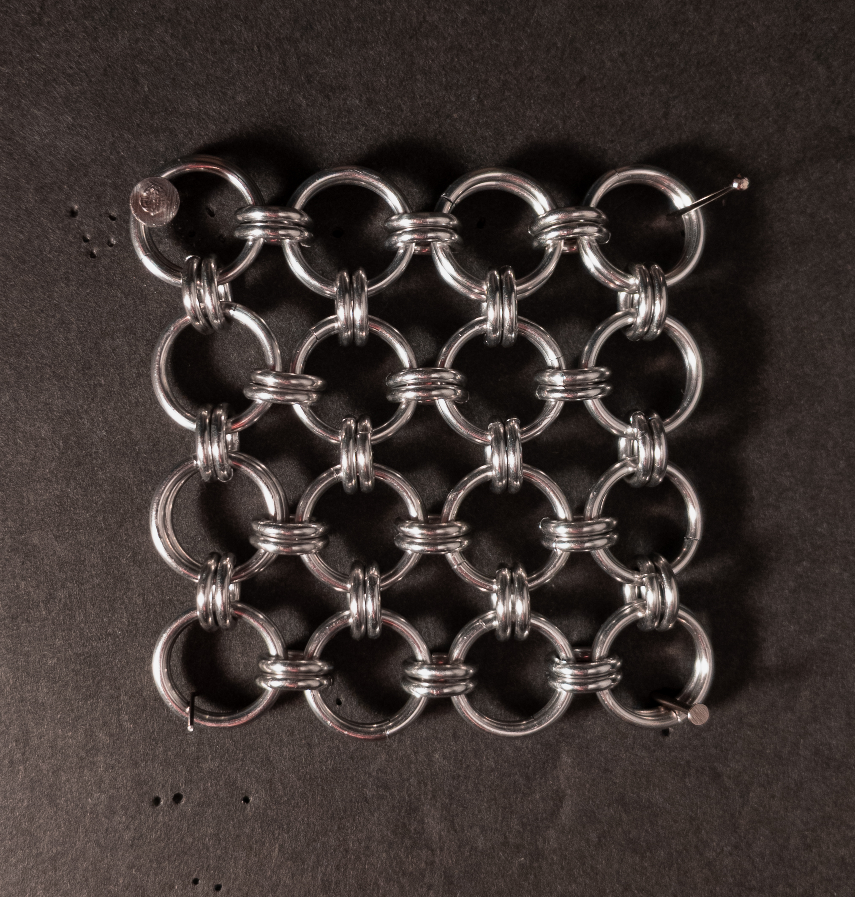

#### Vertical: Profile

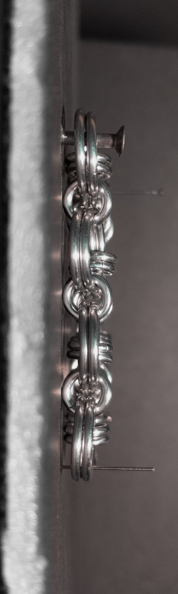

#### In Process

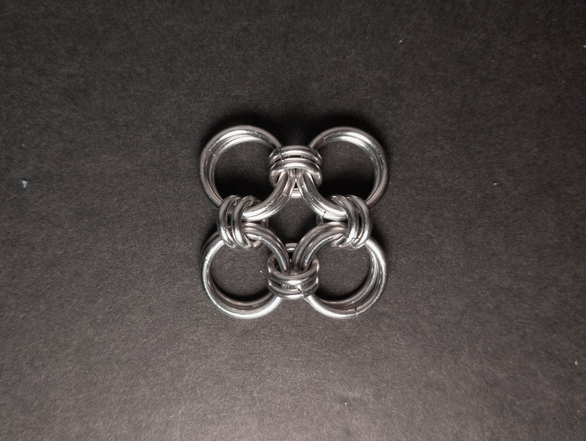

 

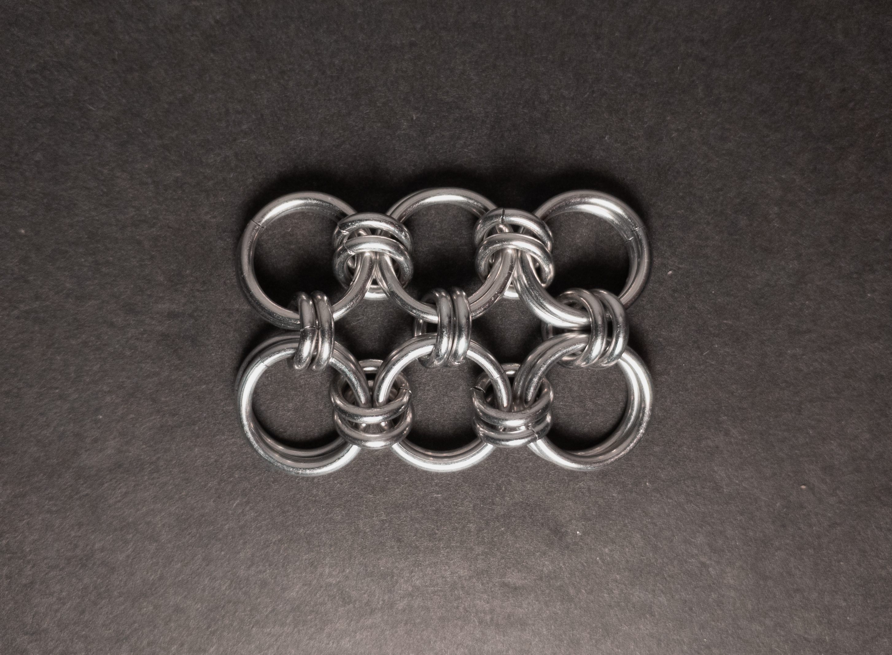

 

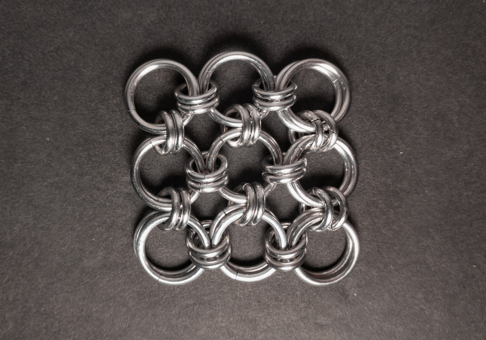

 

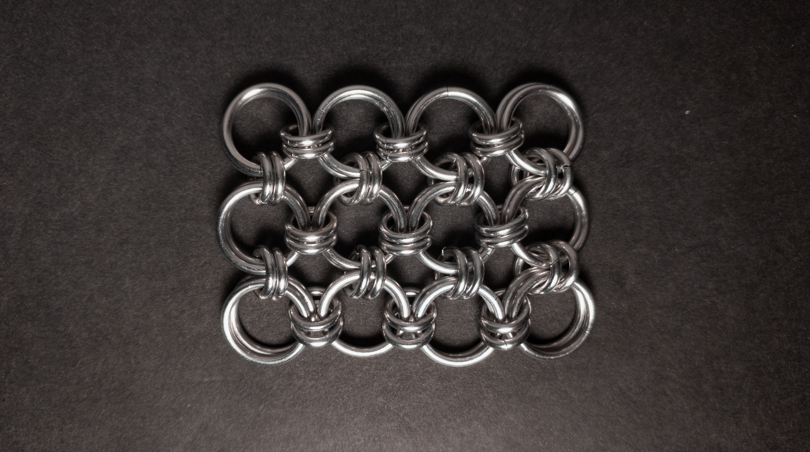
