 posted: 2024-02-04 

## Jellybeans on Parade

### Overview

While looking through [M.A.I.L.](https://www.mailleartisans.org/) for a new weave to try out, I came across [Jellybeans on Parade](https://www.mailleartisans.org/weaves/weavedisplay.php?key=139) by [ELvenleaf](https://www.mailleartisans.org/members/memberdisplay.php?key=53). Jellybeans on Parade is a variant of [Rhinos Snorting Drano](rhinos_snorting_drano.md), with the difference being the direct connection of the core 3-ring units instead of using an extra ring. I have included a tutorial for those interested in trying this weave at home, as I could not find any free tutorials.

### Materials

For the sample piece showcased in this post, I made the rings myself (bonus post coming soon if you are interested). I used 16 SWG Bright Aluminum wire from [The Ring Lord](https://theringlord.com/) coiled around a 7mm mandrel for an approximate aspect ratio of 4.3.

### Tutorial

1. Start with a 1-2-1 chain as shown below:

    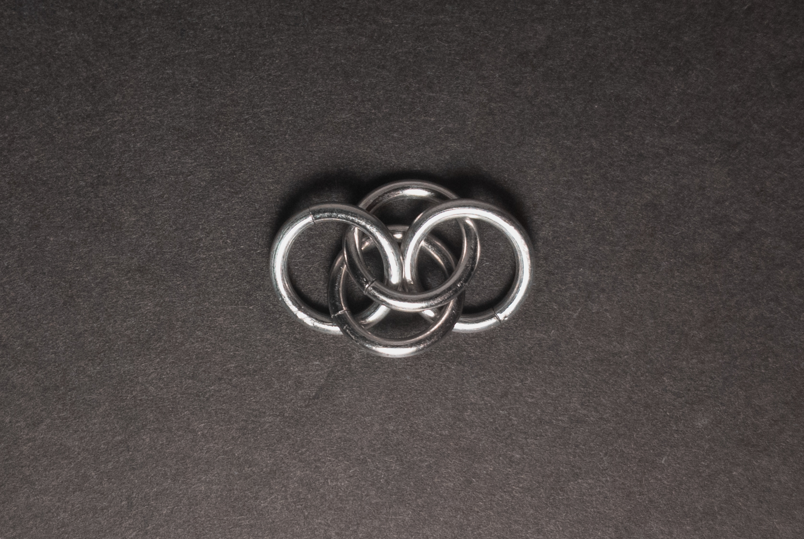

2. Add 1 new ring(green in the image below) through the center 2 rings from step 1(yellow in the image below). When done, it should look something like this:

    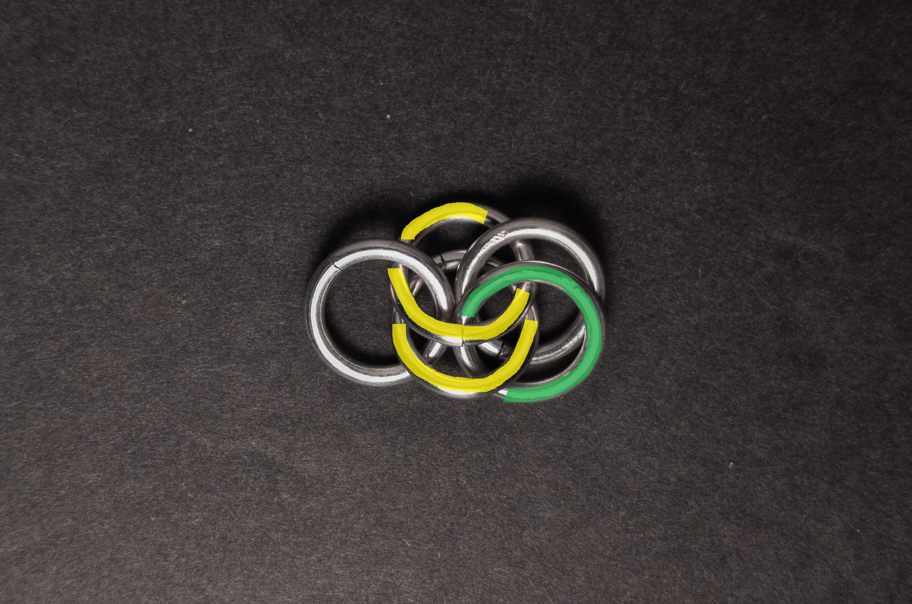

3. Add 1 new ring(green in the image below) around the eye formed by the center 2 rings from step 2(yellow in the image below). When done, it should look something like this:

    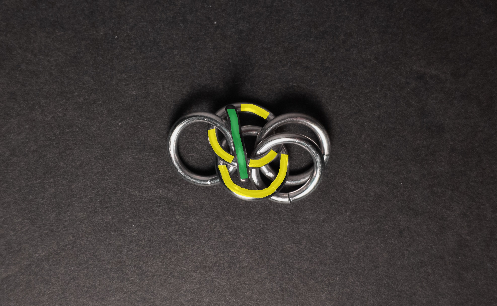

4. Add 1 new ring(green in the image below) around the eye formed by the rightmost 2 rings from step 2(yellow in the image below). When done, it should look something like this:

    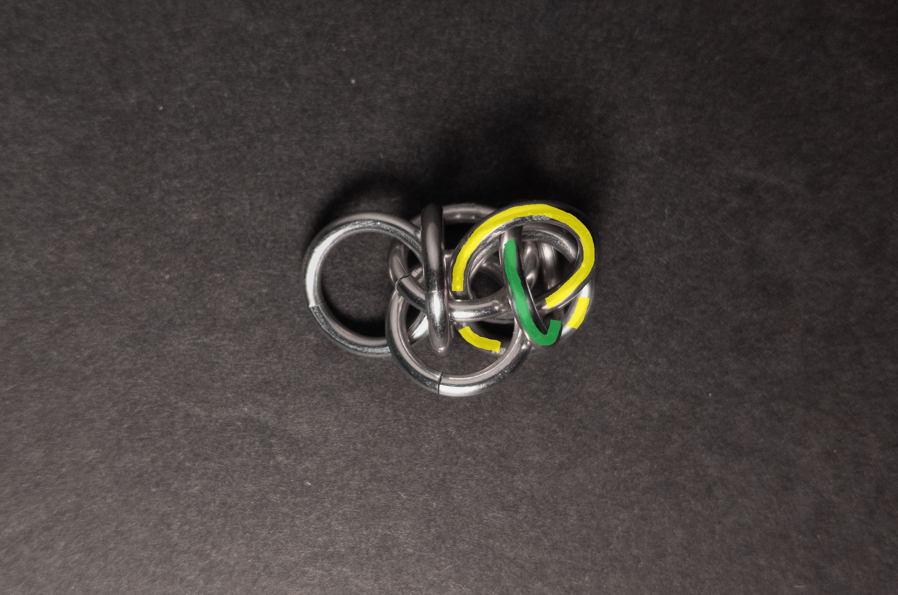

5. Add 1 new ring(green in the image below) through the eye of the rightmost 2 rings from step 2(yellow in the image below). When done, it should look something like this:

    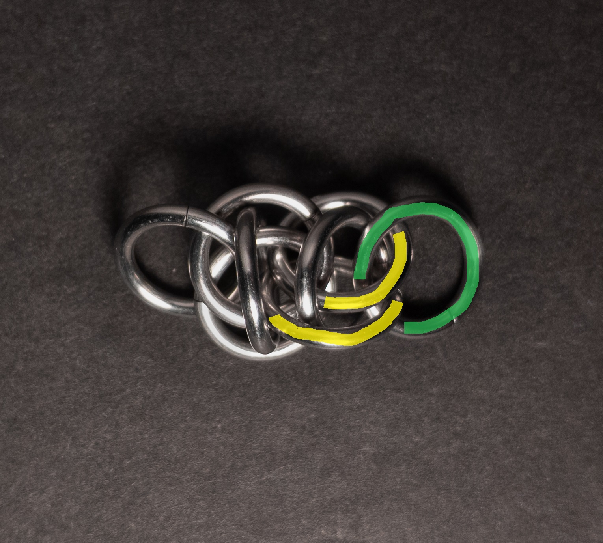

6. Repeat steps 2-5, targeting 2 on the same target as your last step 5 and steps 3-5 on the now doubled end ring pair.

### Notes

Jellybeans on Parade as a weave is somewhat simple to understand and create. While it looks best in a vertical orientation, it still maintains a decent appearance when laid flat. With its cylindrical cross-section, the weave proves versatile for crafting bracelets, necklaces, chokers, and cords. The combination of its playful nature and ease of creation makes Jellybeans on Parade a recommended weave to add to your skill set.

### Pictures

#### Vertical

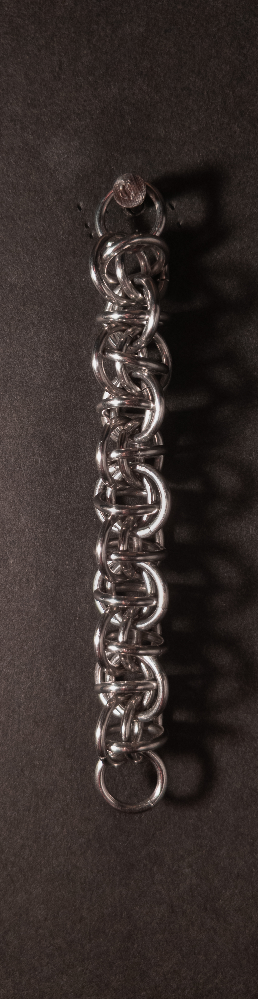

#### Vertical: Profile

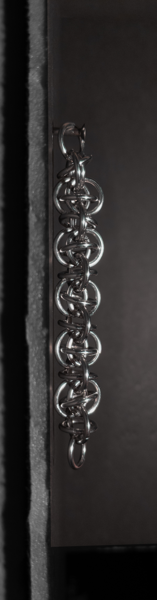

#### Flat

#### Flat: Profile

#### In Process

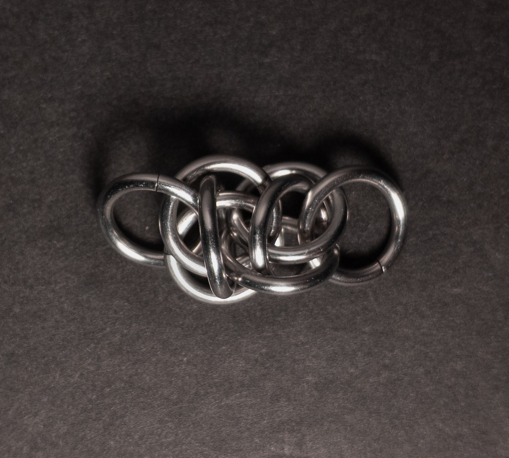

 

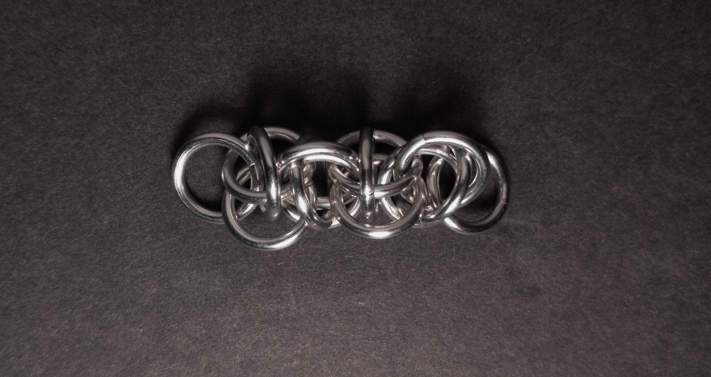

 

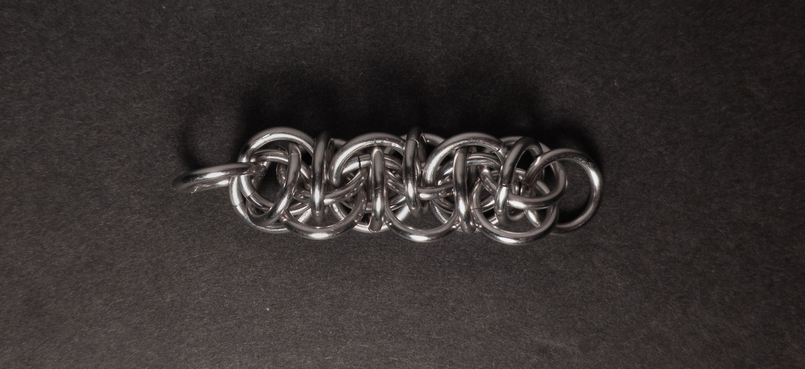

 

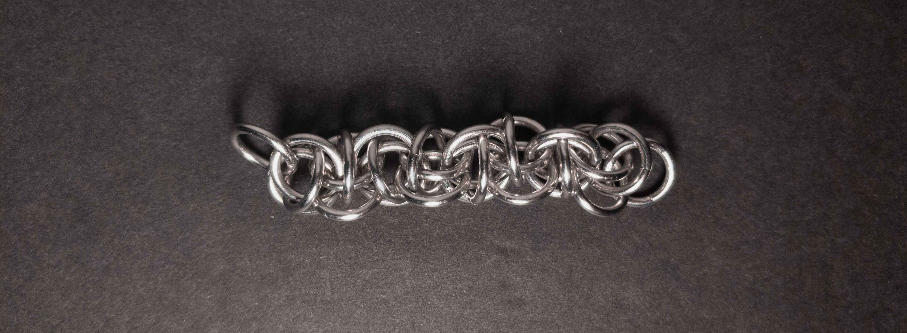

 

