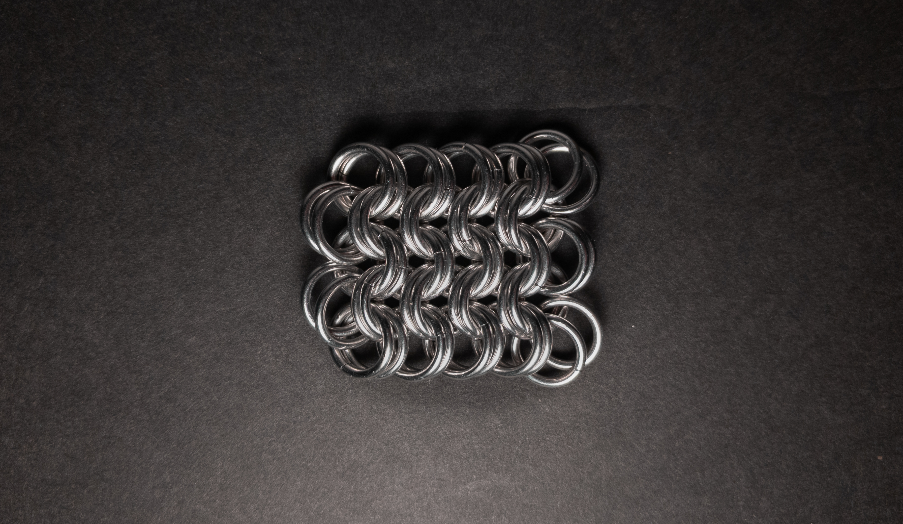
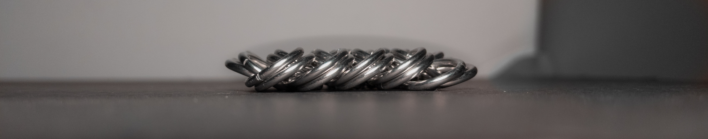
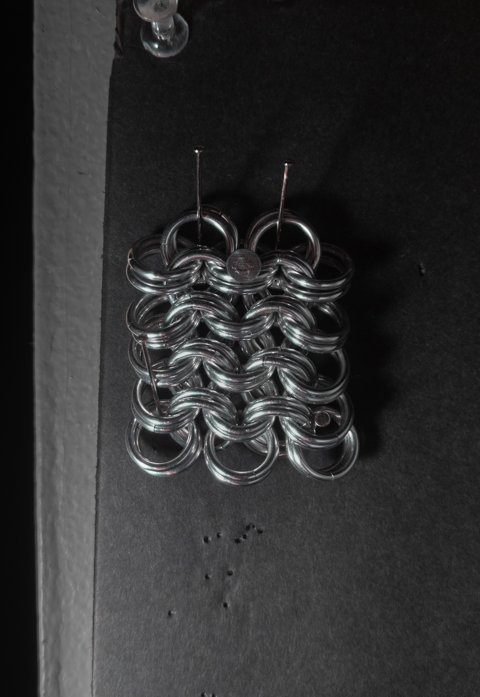
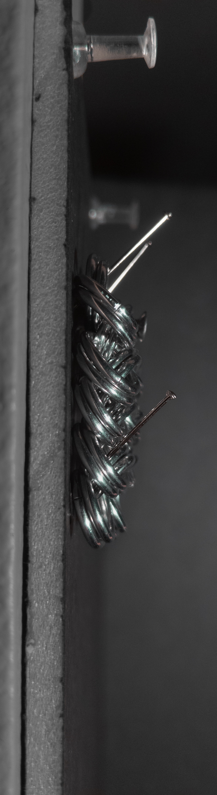

 posted: 2023-11-19 

## Kingsmail/European 8-in-2

### Overview

While looking for a new weave, I came across [Kingsmail](https://www.mailleartisans.org/weaves/weavedisplay.php?key=8), also known as European 8-in-2, on [M.A.I.L.](https://www.mailleartisans.org/) uploaded by Antiquity. Kingsmail is a variant of [European 4-in-1](european_4_in_1.md) created by doubling each ring, which can lead to a more dense and interesting weave. If you want to join me and try to make it yourself, I found this [tutorial](https://www.mailleartisans.org/articles/articledisplay.php?key=123) by [Aderamelech](https://www.mailleartisans.org/members/memberdisplay.php?key=7) helpful.

### Materials

For the sample piece showcased in this post, I made the rings myself (bonus post coming soon if you are interested). I used 16 SWG Bright Aluminum wire from [The Ring Lord](https://theringlord.com/) coiled around an 8mm mandrel for an approximate aspect ratio of 4.9.

### Notes

Kingsmail is a weave known for its straightforward conceptual understanding, though some closures can be challenging due to its tightness. The resulting appearance of Kingsmail exudes a sense of density and structure, which I personally find appealing. In my experience, using the same material and gauge and following the recommended aspect ratio for each weave, Kingsmail is less flexible but tougher than European 4-in-1. As a sheet weave, Kingsmail offers versatility akin to fabric; additionally, bracelets, necklaces, and chokers can be made from it thanks to its relatively flat profile. To "King" a weave is to replace each ring with two rings; additionally, many people associate chainmail with European 4-in-1. These factors explain why people refer to Kinged European 4-in-1 as Kingsmail. The core concept of doubling each ring from European 4-in-1 may be extended further by tripling, quadrupling, or beyond. If you're a fan of European 4-in-1 and are seeking a similar weave with distinct characteristics, I highly recommend learning Kingsmail.

### Pictures

#### Flat

#### Flat: Profile

#### Vertical

#### Vertical: Profile

