 posted: 2024-04-07 

## Magemaille

### Overview

While checking [M.A.I.L.](https://www.mailleartisans.org/) for new weaves to try, I came across [Magemaille](https://www.mailleartisans.org/weaves/weavedisplay.php?key=549) by [KendallNightblade](https://www.mailleartisans.org/members/memberdisplay.php?key=3560). Magemaille is a simple sheet made of [2-in-1 Chains](2_in_1_chain.md), joined incredibly simply. I have included a [tutorial](#tutorial) below for those who want to follow along at home, as I could not find any currently existing tutorial.

### Materials

For the sample piece showcased in this post, I used two sizes of rings made from 16 SWG Bright Aluminum wire. The smaller rings, which I made myself(bonus post coming soon), have an ID(Inner Diameter) of 5mm for an AR(Aspect Ratio) of 3.1. The larger rings have an ID of .25in for an AR of 4, purchased from [The Ring Lord](https://theringlord.com/).

### Tutorial

1. Make a 2-in-1 chain out of large rings the length you want for one of the dimensions of the finished sheet. Note which rings are up(blue in the image below) and which are down(yellow in the image below).

    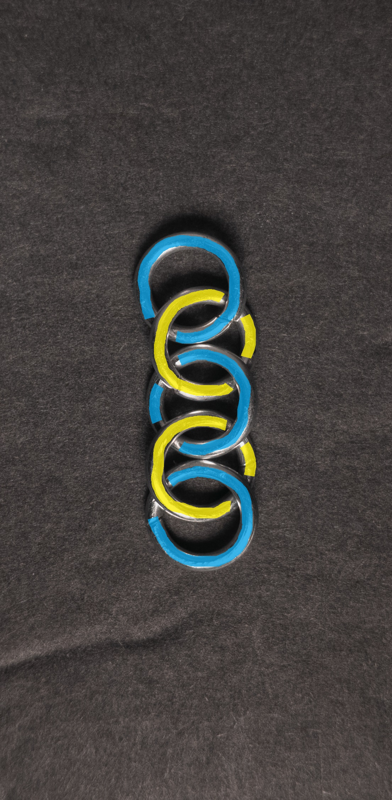

2. Make another 2-in-1 chain out of large rings and place it beside the chain from the previous step. Make sure to align the new down rings(orange in the image below) next to the old up rings(blue in the image below) and the new up rings(red in the image below) next to the old down rings(yellow in the image below). When done, it should look like something like this:

    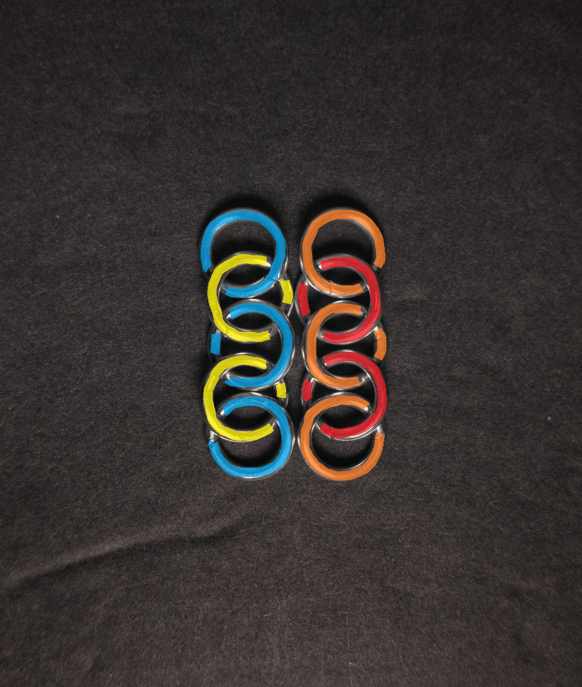

3. Join the two chains by adding new small rings(green in the image below) through each pair of rings from the two chains(blue/orange and yellow/red in the image below). When done, it should look something like this:

    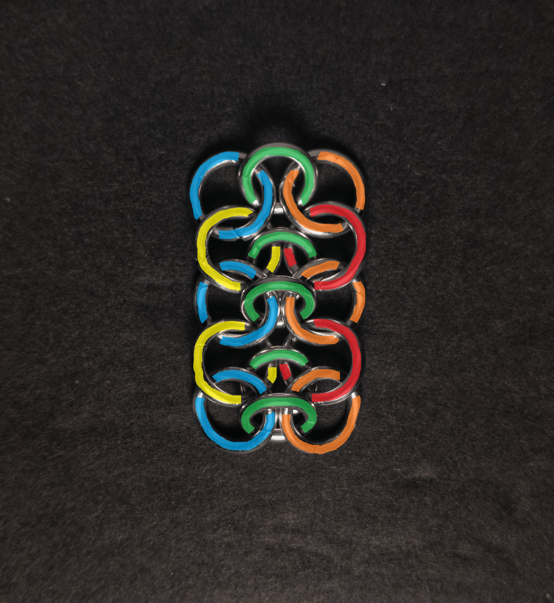

4. Repeat steps 2 and 3 until you are happy with the size of the sheet.

### Notes

The Magemaille weave is quite simple to understand and create. The weave can look nice; however, with the rings I used, the weave appeared very busy and complex. For maximal aesthetic appeal, the small rings should be small enough to leave almost no extra space when they join two large rings; it would be best if they were a smaller gauge than the larger rings. As a sheet weave, you can make bracelets, chokers, or even fabric with it. Given its simplicity and ease of creation, I recommend learning how to make this weave.

### Pictures

#### Flat

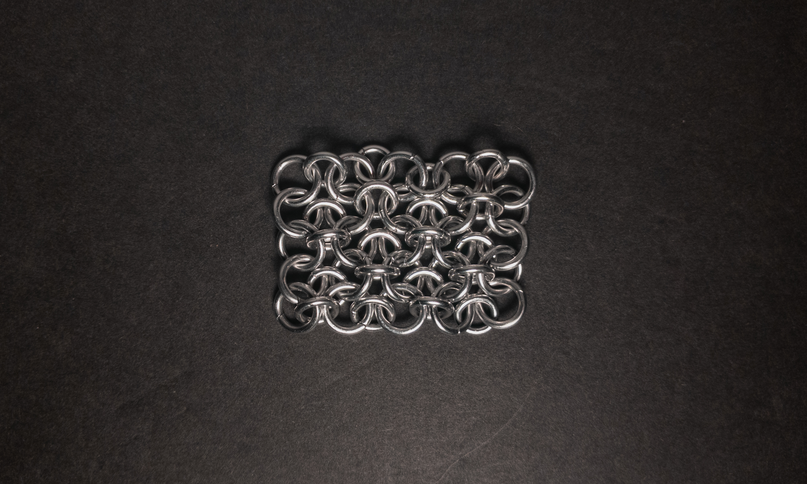

#### Flat: Angled

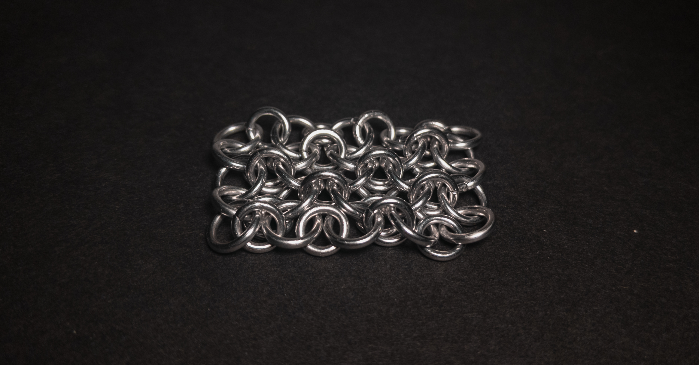

#### Flat: Profile

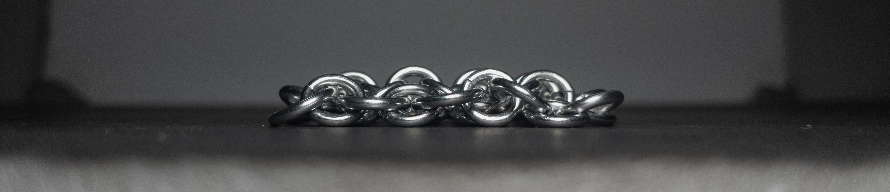

#### Vertical

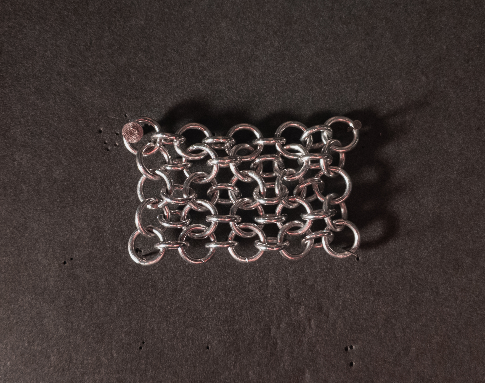

#### Vertical: Profile

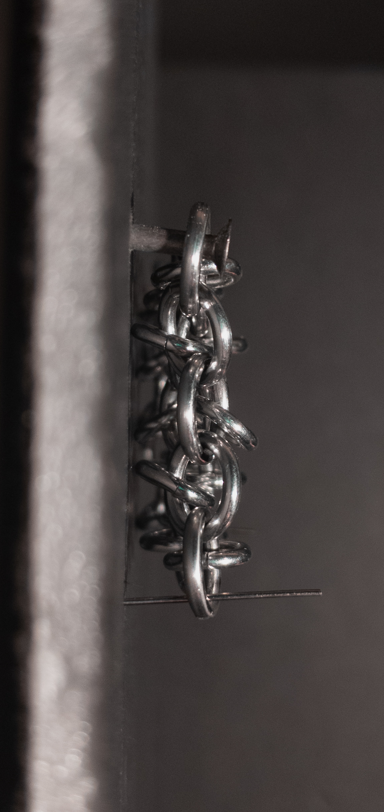

#### In Process

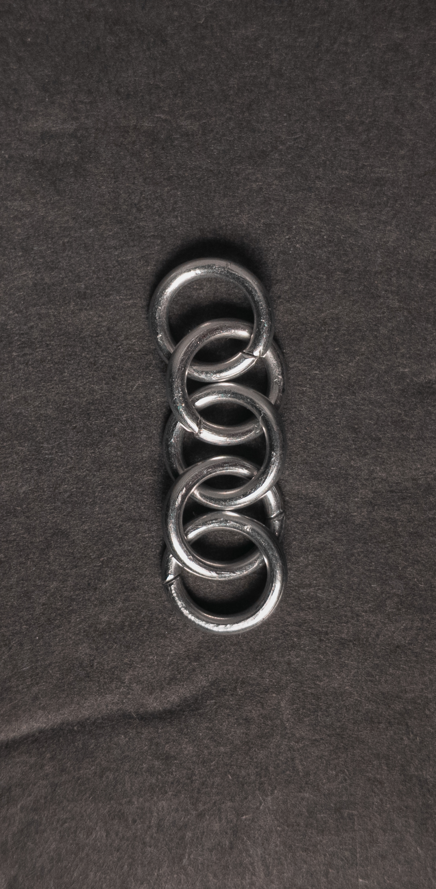

 

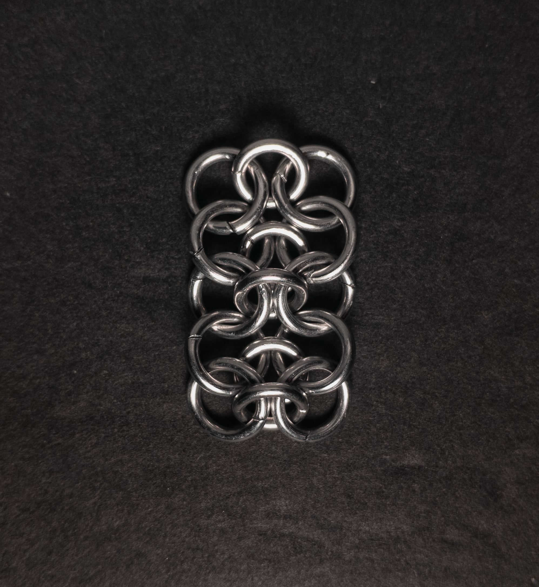

 

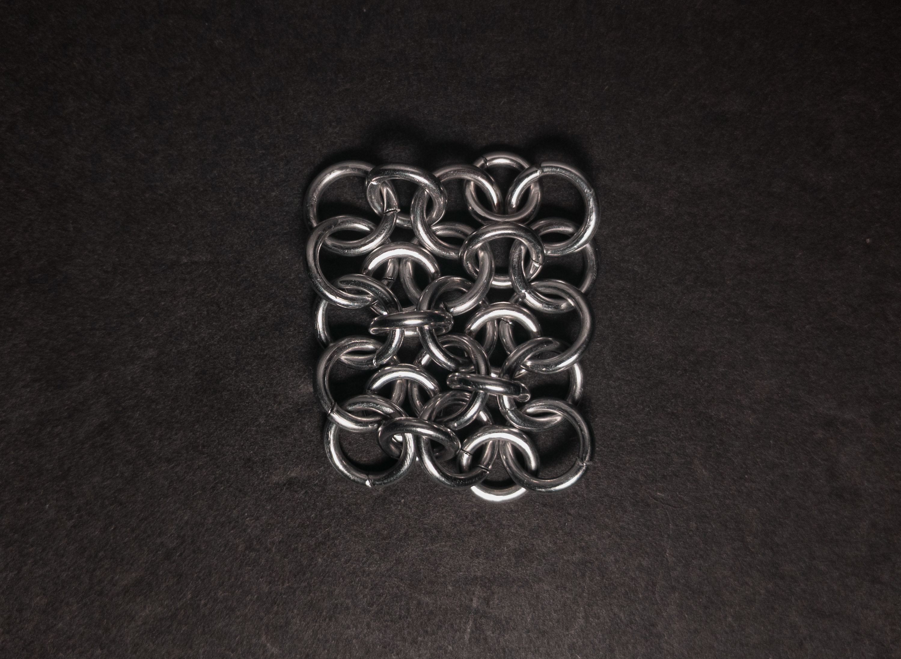

 

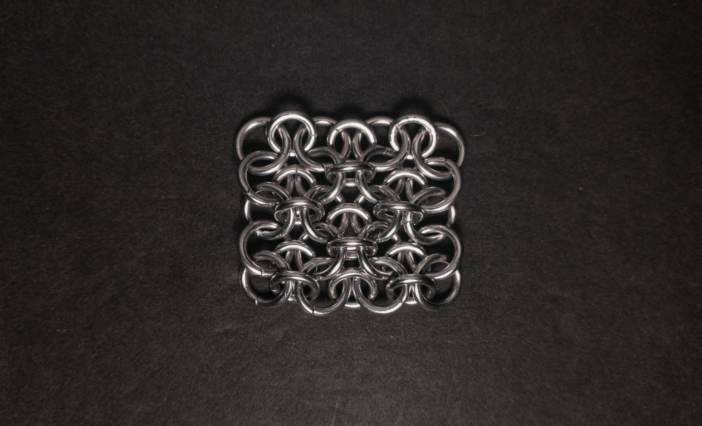
