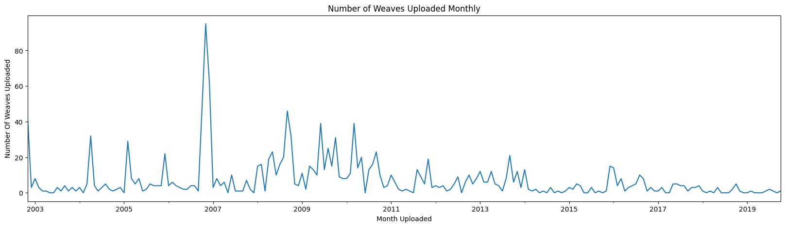

posted: 2023-04-16

## M.A.I.L. Weave Analysis

### **Overview**

Lately, I've been running low on chainmail rings and I wanted to ensure that I purchase the right sizes that would allow me to create the largest number of weaves. To achieve this, I decided to scrape data from [M.A.I.L.](https://www.mailleartisans.org/), which has nearly 1500 unique recorded weaves.

As I began designing my scraper, I realized that there was additional data available that could answer other questions. As a result, I expanded my goal to include answering the following questions: "What are the most commonly used aspect ratios?", "What are the most popular tags?", and "What is the frequency of weave releases?"

If you're interested, you can find the analysis and the generated dataset on this [GitHub repository](https://github.com/moaatt2/chainmail_stats). Please feel free to fork it and suggest any improvements.

### **Most Commonly Used Aspect Ratios**

When discussing the aspect ratio(AR) of the rings used in a weave there are a few key points to bear in mind.

The first key point is that most weaves can be created using rings within their AR range. For example [Inverse Magus Chain](https://www.mailleartisans.org/weaves/weavedisplay.php?key=1199) can be created using rings with an AR from $4.0$ to $4.4$. This is recorded on M.A.I.L. by listing the **Maximum**, **Minimum**, and **Ideal** AR to create a weave with. For this analysis I used each weave's **Ideal** AR value to represent the weave; however, not all weaves have an **Ideal** AR value listed. For those cases, I used the weave's **Minimum** AR value as that was always the only other available AR value. Additionally, some weaves have no recorded AR information. Those weaves have been excluded from the AR visualizations.

The second key point is that some weaves are made using rings with different ARs. For my analysis, I decided to treat each unique AR that a weave is composed of as one record. This means that the counts for each AR are the number of weaves that use that AR.

The following graph shows the number of weaves that include the AR on the x-axis in their **Ideal** AR(or **Minimum** if there is no **Ideal**).

From this graph, it is clear that the most popular ARs for use in weaves are $4.0$, $5.0$, $6.0$, and $5.5$.

 

When making a weave using rings with different ARs you also need to know the ratio of the sizes of the rings. Unfortunately, this is not recorded on M.A.I.L. in a standard fashion. This is why I took the data, filtered out weaves that require multiple ARs, and created the following graph.

Looking at this graph it becomes clear that for single AR weaves the most used ARs are $5.0$, $4.0$, $6.0$, and $5.5$. The main change here is that $5.0$ trade rankings. $4.0$. This hints at rings with an AR of $4.0$ being very popular for use in single AR weaves.

 

Additionally, weave pages on M.A.I.L. can have tutorials that go over how to make the weave. I decided to see if the most popular ARs changed for those weaves with tutorials and created the following graph to answer that question.

Looking at the graph it can be determined that when restricted to weaves with tutorials the most commonly used ARs are $4.0$, $5.0$, $6.0$, and $3.3$. This distribution is fairly similar to the original unrestricted graph which shows that the AR of the rings used in a weave doesn't have much correlation with the likelihood of the weave having a tutorial.

 

I also wanted to see what would happen if I only looked at weaves with a single AR that have tutorials available. This led to the creation of the following visualization.

Looking at the graph it can be determined that when restricted to weaves with tutorials the most commonly used ARs are $5.0$, $4.0$, $3.5$, and $5.4$. This does have a different distribution than the case of single AR weaves only which is an interesting difference between single AR weaves and un-restricted.

 

When thinking about weaves that require multiple ARs I became curious as to what the most common pairs were. To figure this out I took each combination of 2 ARs from all weaves that require 2 or more ARs and created the following heatmap to visualize the data.

Looking at the graph there is a very strong cluster around $4.0$, with weaker clusters between $2.4$ and $5.0$ which shows that they are very popular to pair with other rings. Additionally, there is a diagonal line indicating that a fair number of the weaves use rings with close ARs; the empty top right and bottom left emphasize that even further. 

### **Most Popular Tags**

In addition to AR information M.A.I.L. also allows for weaves to be assigned tags that provide information about weaves. I was curious to know what the most frequently used tags were so I took the tags from each weave and counted how many of them there were compared to the other tags.

As there are 32 unique tags with many of them showing up fairly rarely I could not fit them all in one visualization. The graph below shows the 14 most common tags and the proportion of the other 18 tags labeled as **Other**.

Looking at the graph above the most commonly used tags are **Variant**, **European**, **Chain**, and **Sheet**. As these are mostly some of the highest-level concepts it makes sense that these would be some of the most common tags. However, **European** is a type of weave, and its frequency of occurrence is quite interesting.

 

Additionally, I wanted to see how the proportion of tags changed depending on the release year of the weave. I was able to do this by taking the upload date of the weave in addition to its tags. From there I took the yearly data for the top 10 tags and created the following graph.

Looking at the graph shows that generally, the overall most common tags tended to remain as the most common tag each year. However, some years had a large increase in the proportion of a single tag such as **Japanese** in 2018 or **Progression** in 2019. 

### **Number of Weaves Released Over Time**

Additionally, I was also curious to see part of the history of M.A.I.L. and to get a sense of how active it was over time. To this end, I decided to create the following graph showing the number of weaves uploaded each year.

Looking at the graph above it is fairly clear that M.A.I.L. was most active from 2005 to 2009 with the exception of 2007.

 

Looking at the results from the first graph made me interested in seeing the data in more detail. For this reason, I created the following graph where I looked at the submissions by month instead of year.

Looking at the graph above what really sticks out to me is the large spike in late 2006 that is responsible for a large number of submissions in 2006.