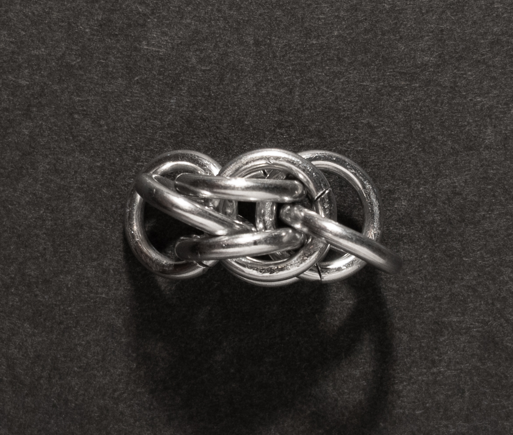

 posted: 2023-06-18 

## Medo-Persian

### Overview

While looking into the [Sweetpea](sweetpea.md) and [Fieldstone](fieldstone.md) weaves on [M.A.I.L.](https://www.mailleartisans.org/) I came across this weave, [Medo-Persian](https://www.mailleartisans.org/weaves/weavedisplay.php?key=721), uploaded by [Nárrína](https://www.mailleartisans.org/members/memberdisplay.php?key=6120). As Medo-Persian looks good and is related to two other weaves I like, Sweetpea and Fieldstone, I decided to try and make it myself. Unfortunately, no tutorial was available on M.A.I.L., so I needed to search elsewhere. After some time searching, I found this helpful [video tutorial](https://www.youtube.com/watch?v=kbCiLuxC9wE) by Deb of [Aussie Maille](https://www.aussiemaille.com/), which enabled me to try the weave myself and make this post.

### Materials

For the sample piece showcased in this post, I used Bright Aluminum rings purchased from [The Ring Lord](https://theringlord.com/). The rings are 16 SWG with a 1/4" internal diameter, resulting in an aspect ratio of 4.03.

### Notes

The Medo-Persian chainmail weave is moderately complex to grasp initially, though it can be made easier by using multiple ring colours. Once you have learned how to create the weave, executing it is not very challenging. This weave offers flexibility and features a square cross-section, making it highly suitable for various jewelry applications such as necklaces of any length, bracelets, and even as a cord. The name "Medo-Persian" is likely chosen to emphasize its connection to the Persian family of weaves. Interestingly, this weave bears so much resemblance to Fieldstone and Sweetpea that an [article](https://www.mailleartisans.org/articles/articledisplay.php?key=752) was published on M.A.I.L. specifically discussing their differences. Overall, I highly recommend learning how to make the Medo-Persian weave due to its intriguing nature and the creative possibilities it offers.

### Pictures

#### Flat

#### Flat: Profile

#### Vertical

#### Vertical: Profile

#### In Process

 

 

 

