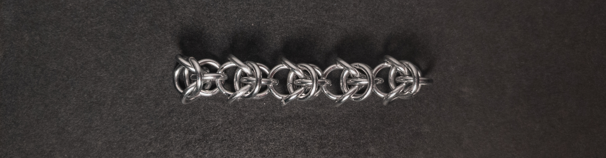
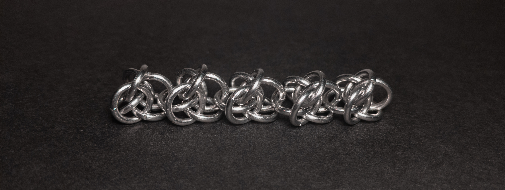
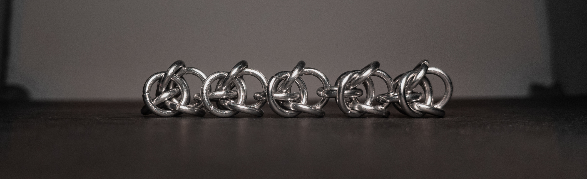
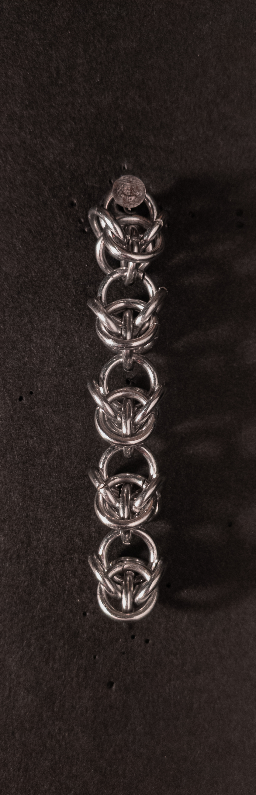
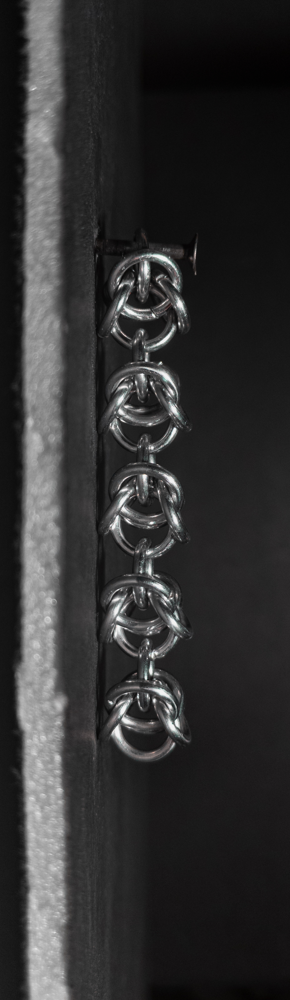
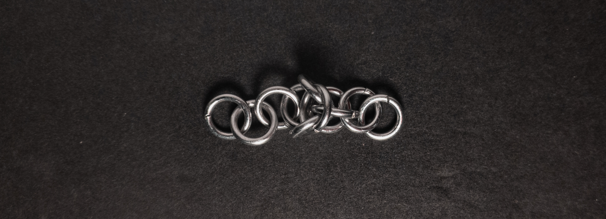
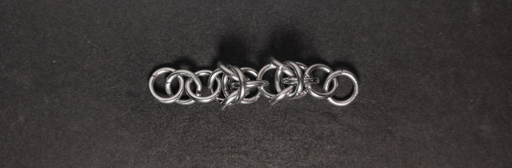
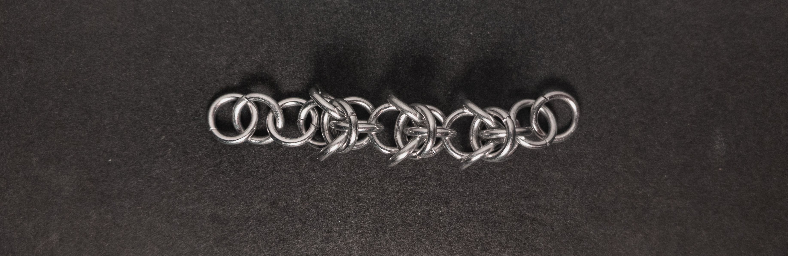
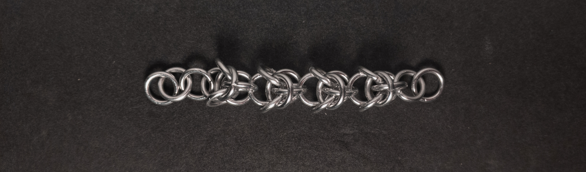
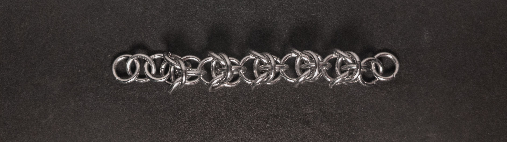

 posted: 2024-12-29 

## Mercury

### Overview

While checking [M.A.I.L.](https://www.mailleartisans.org/) for interesting new weaves to make, I came across [Mercury](https://www.mailleartisans.org/weaves/weavedisplay.php?key=1131) by [ZiLi](https://www.mailleartisans.org/members/memberdisplay.php?key=10488). Mercury is a neat member of the European family of weaves; it is essentially a [2-in-1 Chain](2_in_1_chain.md) with a unit of [Box Chain](box_chain.md) orbiting every other ring connection. If you wish to try making it yourself, I found this [tutorial](https://www.youtube.com/watch?v=40p9sAGDBPk) by [Bead Me A Story](https://www.youtube.com/@beadmeastory722) very helpful.

### Materials

For the sample piece showcased in this post, I used Bright Aluminum rings purchased from [The Ring Lord](https://theringlord.com/). The rings are 16 SWG with a 1/4" internal diameter, resulting in an aspect ratio of 4.03.

### Notes

The Mercury weave is easy to understand. However, it can be tricky to make when adding the orbital Box Chain units; thankfully, adding them becomes easier with practice. You can make it even easier by making the 2-in-1 Chain longer than necessary and trimming it later. Aesthetically, the weave is quite pleasing. If the 2-in-1 Chain and Box Chain units use contrasting colours, it can become more straightforward to create, and the result can look much nicer. With its roughly square cross-section, bracelets, necklaces, and string/cord are great uses for it. While the weave looks pretty and has a variety of uses, I recommend learning it with the caveat that you should either have patience, prior experience, or access to differently coloured rings to reduce the difficulty.

### Pictures

#### Flat

#### Flat: Angled

#### Flat: Profile

#### Vertical

#### Vertical: Profile

#### In Process

 

 

 

 

