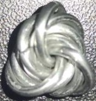

 posted: 2023-03-19 

## Mobius Ball

### Overview

I found a neat [M.A.I.L.](https://www.mailleartisans.org/) page going over the unqiue [Mobius Ball](https://www.mailleartisans.org/weaves/weavedisplay.php?key=23) weave which has a great [tutorial](https://www.mailleartisans.org/articles/articledisplay.php?key=244) by [Big Vs Armory](https://www.mailleartisans.org/members/memberdisplay.php?key=1620). Large mobius balls tightly packed with many rings are commonly used as stress toys and their use in such applications has been pattented. It is a unique weave that I suggest trying out and experimenting with.

### Materials

The rings used for the sample piece shown in this post are 16 SWG with a 1/4" internal diameter for an aspect ratio of 4.03 made of Bright Aluminum that I bought from the [Ring Lord](https://theringlord.com/).

### Notes

Making Mobius Balls is a straightforward process, but it may become difficult if you use many rings with a low aspect ratio. Though arranging the rings may require some effort, it is not a challenging task. Mobius Balls can be used as units in many different ways, in addition to their standalone usage, making them highly versatile. I highly recommend learning how to make Mobius Balls as it is easy to learn, has a wide variety of use cases, and looks aesthetically pleasing.

### Pictures

