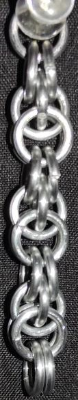
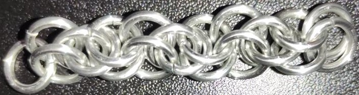
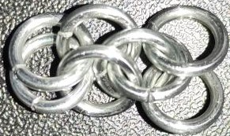
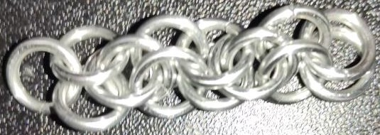

 posted: 2023-03-12 

## Moon42

### Overview

Recently I found a [tutorial](https://www.mailleartisans.org/articles/articledisplay.php?key=652) by [Jadelyn](https://www.mailleartisans.org/members/memberdisplay.php?key=19519) on [M.A.I.L.](https://www.mailleartisans.org/) that shows how to create a [Moon42](https://www.mailleartisans.org/weaves/weavedisplay.php?key=1119) weave. Moon42 is an interesting weave with ties to weaves in both the [Byzantine](Byzantine.md) and [Persian](https://www.mailleartisans.org/weaves/weavedisplay.php?key=44) families. If you are curious and have the right sized rings on hand I recomend trying it out.

### Materials

The rings used for the sample piece shown in this post are 16 SWG with a 1/4" internal diameter for an aspect ratio of 4.03 made of Bright Aluminum that I bought from the [Ring Lord](https://theringlord.com/).

### Notes

Moon42 is a moderatly challenging chainmaille weave that becomes easier to create as it gets longer or if an additional starting ring is used. While using rings with an ideal aspect ratio, the weave may not look impressive unless proper tension is applied, resulting in a visually appealing piece. However, the requirement for tension limits the application of the Moon42 weave.  Nonetheless, Moon42 is a valuable weave to learn for chainmaille enthusiasts seeking to expand their repertoire.

### Pictures

#### Vertical

#### Flat

#### In Process

 

