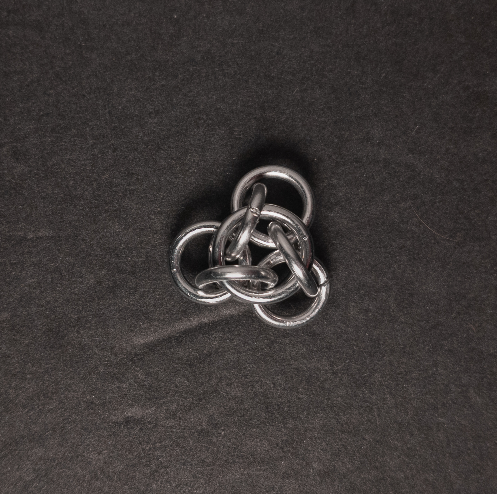
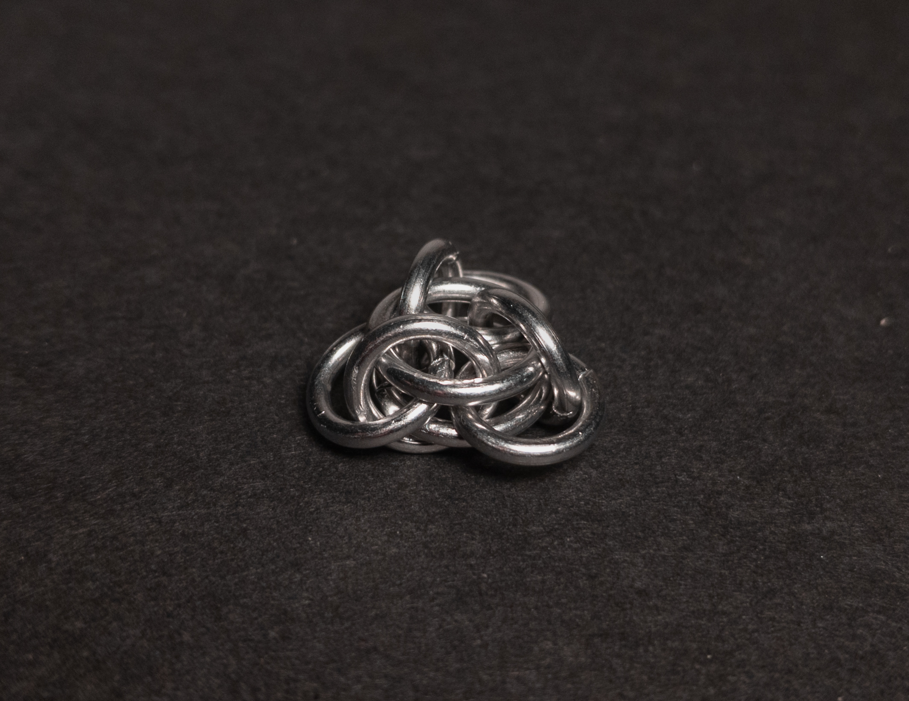
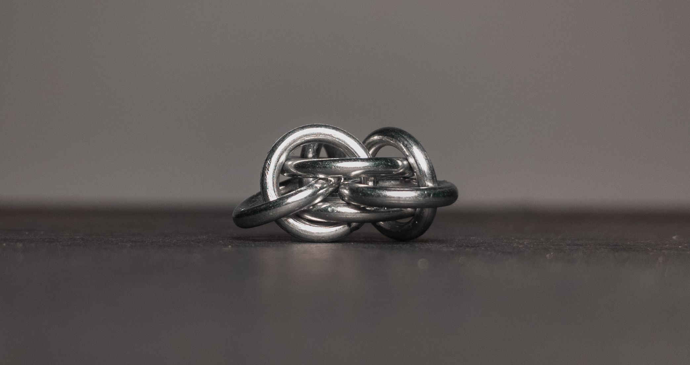
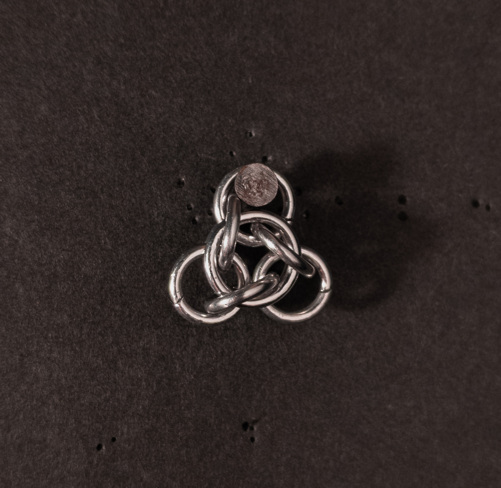
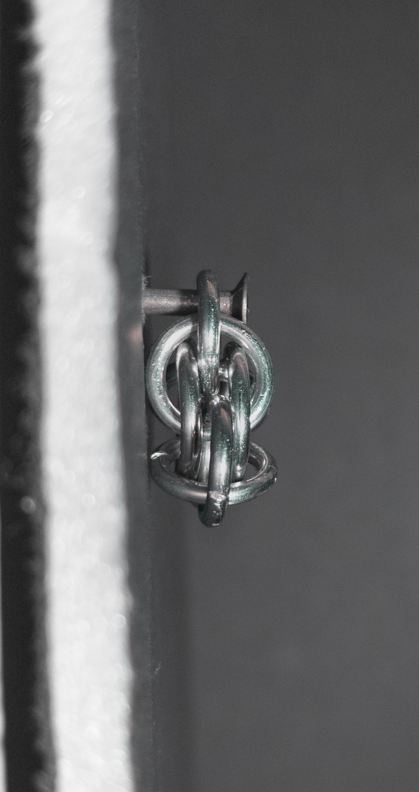
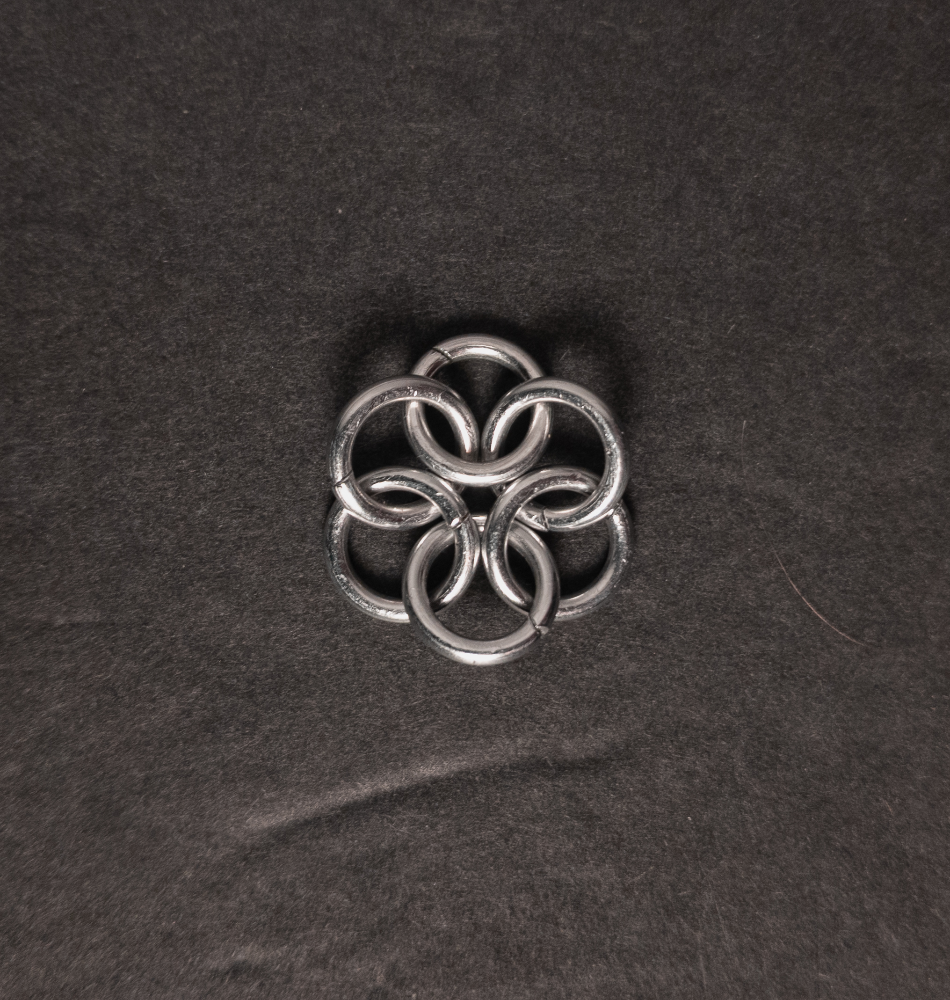
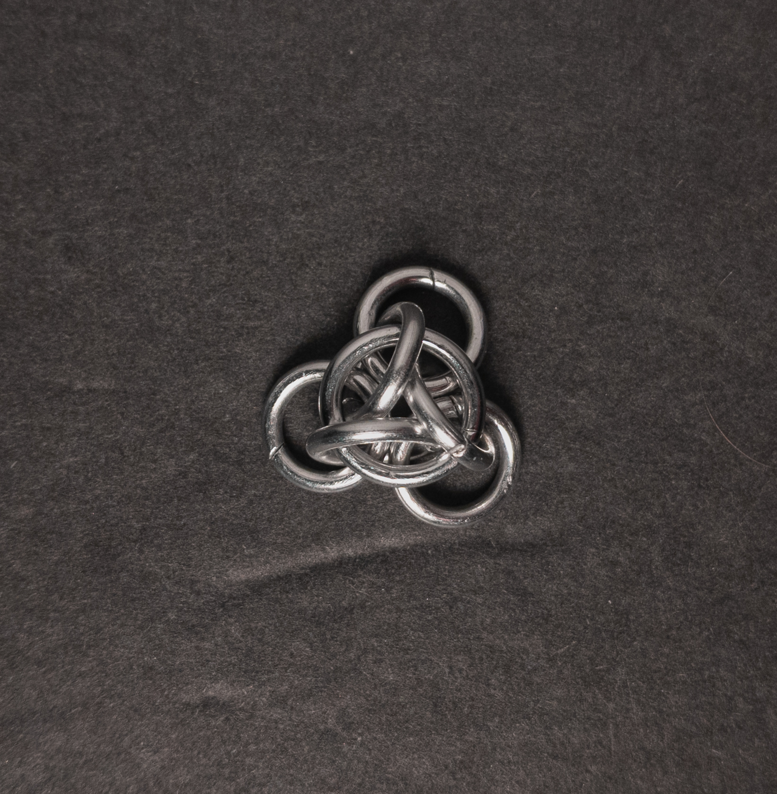

 posted: 2024-11-17 

## Not Tao 3

### Overview

While searching for new weaves to try making, I found [Not Tao 3](https://chainmaillers.com/maillepedia/not-tao-3.828/) on [ChainMailers](https://chainmaillers.com/), first credited to [Bative](https://www.mailleartisans.org/members/memberdisplay.php?key=349) on [M.A.I.L.](https://www.mailleartisans.org/) in 2008. Not Tao 3 is a variant of the [Tao 3 Unit](tao_3_unit.md) made while attempting to learn the Tao 3 Unit. If you wish to try making it yourself, I recommend this [tutorial](https://www.mailleartisans.org/articles/articledisplay.php?key=162) by [Zlosk](https://www.mailleartisans.org/members/memberdisplay.php?key=9).

### Materials

For the sample piece showcased in this post, I used two sizes of rings made from 16 SWG Bright Aluminum wire. The larger rings, which I made myself(bonus post coming soon), have an ID(Inner Diameter) of 8mm for an AR(Aspect Ratio) of 4.9. The smaller rings have an ID of .25in for an AR of 4, purchased from [The Ring Lord](https://theringlord.com/).

### Notes

The Not Tao 3 weave is easy to understand and generally simple to create. However, adding the last ring can be challenging due to the tight space after passing through three other rings. Using bent nose pliers, or any pliers with small ends, makes it easier to close that final ring. Additionally, closing the ring as much as possible before going through the third vertical ring can help you close the final ring. The unit looks quite appealing and, as a unit weave, is well-suited for use in charms, pendants, or earrings. In Not Tao 3, each vertical ring goes through 4 different flat rings, while in Tao 3, each vertical ring goes through 3 different flat rings; this is the primary difference between the weaves. Given the balance between the difficulty of creation and its aesthetic appeal, I recommend learning this weave, especially for those with bent nose pliers or patience.

### Pictures

#### Flat

#### Flat: Angled

#### Flat: Profile

#### Vertical

#### Vertical: Profile

#### In Process

 

