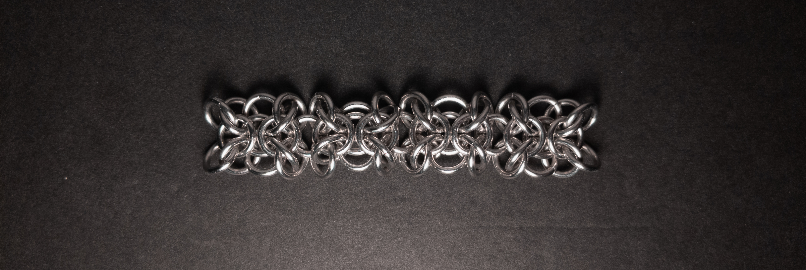
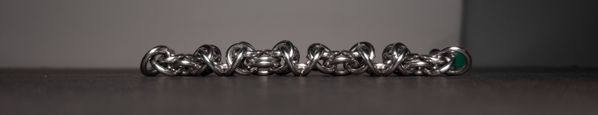
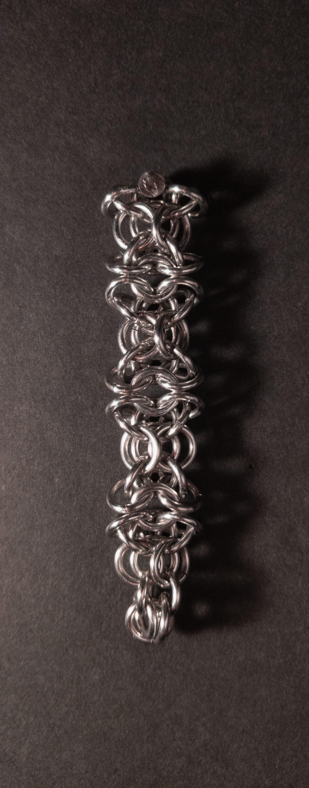
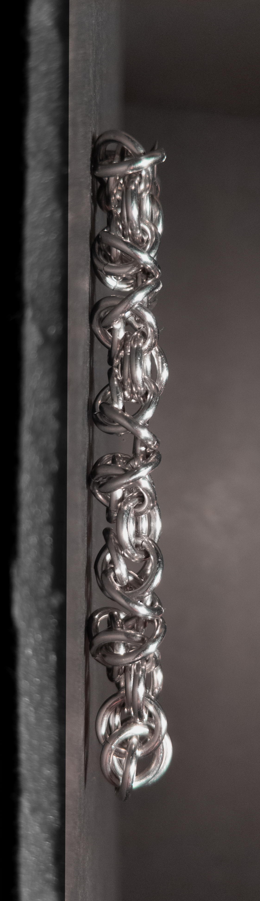
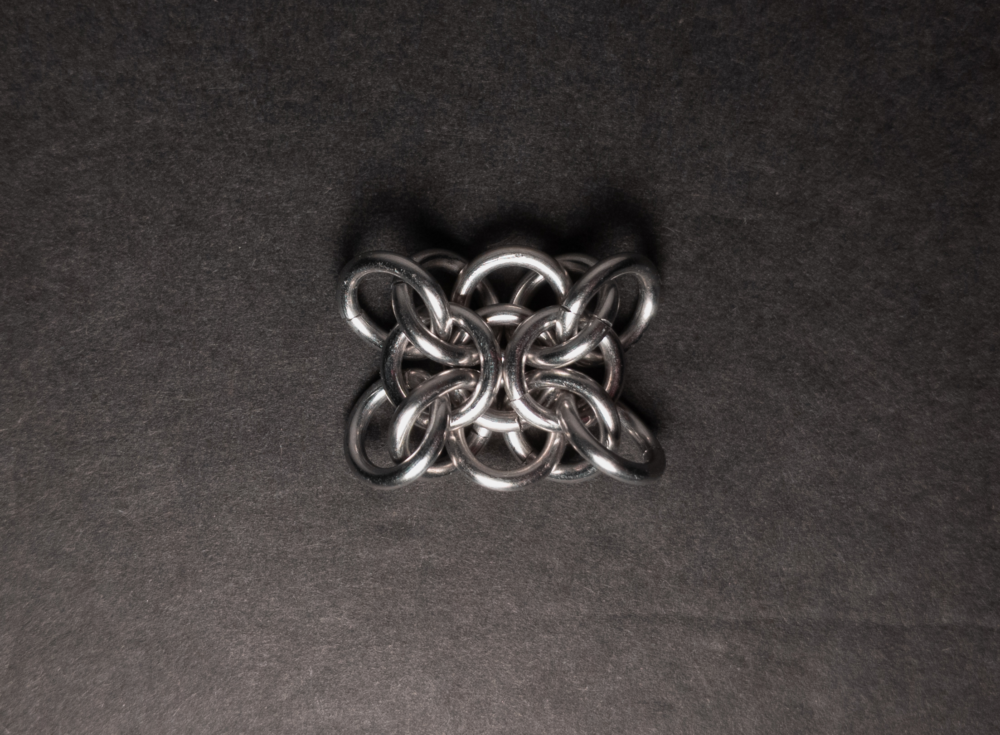
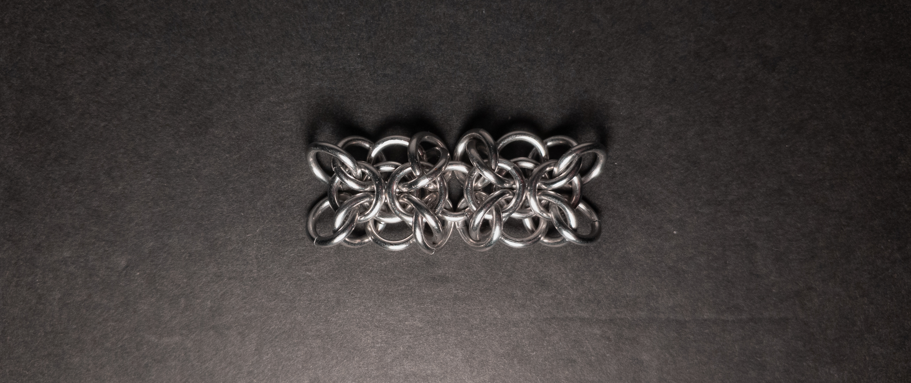
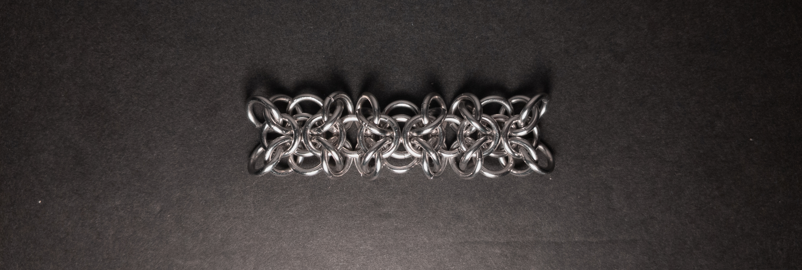

 posted: 2024-03-03 

## Orc Weave

### Overview

Expanding on last week's [Xenesthis](xenesthis_unit.md) unit, this post will cover [Orc Weave](https://www.mailleartisans.org/weaves/weavedisplay.php?key=950) by [Nárrína](https://www.mailleartisans.org/members/memberdisplay.php?key=6120) as published on [M.A.I.L.](https://www.mailleartisans.org/). Orc Weave is a descendant of [Elfweave](elfweave.md) and [Gridlock](gridlock.md), created in an attempt to make a stable chain of Xenesthis units. If you plan to try making this yourself at home, I recommend this [tutorial](https://www.mailleartisans.org/articles/articledisplay.php?key=607) by [lorraine](https://www.mailleartisans.org/members/memberdisplay.php?key=9915) as I found it incredibly helpful.

### Materials

For the sample piece showcased in this post, I made the rings myself (bonus post coming soon if you are interested). I used 16 SWG Bright Aluminum wire from [The Ring Lord](https://theringlord.com/) coiled around a 6mm mandrel for an approximate aspect ratio of 3.7.

### Notes

Orc Weave presents a moderate level of complexity in understanding its structure, but it is not overly challenging to create. However, joining individual units together can pose some difficulty. Despite its intricacies, the weave yields a visually appealing result, albeit with a somewhat busy appearance, and there's a risk of the ends unravelling if not connected to another unit. With its rectangular cross-section, Orc Weave finds suitability in bracelets, chokers, and straps. Maintaining stability and flatness in each unit while weaving can help prevent unravelling. Considering its attractive aesthetics and manageable complexity, I highly recommend you learn to create Orc Weave.

### Pictures

#### Flat

#### Flat: Profile

#### Vertical

#### Vertical: Profile

#### In Process

 

 

