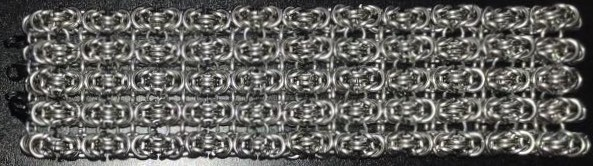
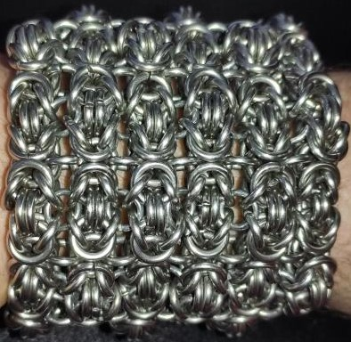
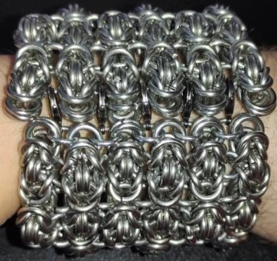
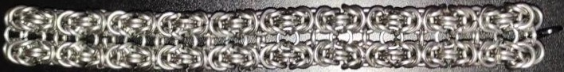
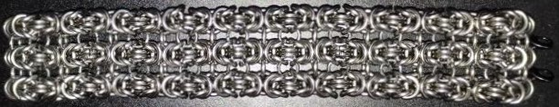
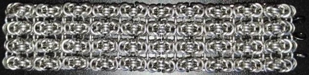

 posted: 2023-04-23 

## Parallel Byzantine Sheet

### Overview

A while ago, I came across a post on [M.A.I.L.](https://www.mailleartisans.org/) by [Scorpion](https://www.mailleartisans.org/members/memberdisplay.php?key=8478) regarding a fun variant of the [Byzantine](byzantine.md) weave called [Parallel Byzantine Sheet](https://www.mailleartisans.org/weaves/weavedisplay.php?key=731) that looked interesting; so I decided to make myself a bracelet from it. Parallel Byzantine Sheet is a very cool weave. I would recommend trying it out yourself if you have the time.

### Materials

I used two different types of rings for the sample piece shown in this post. The first type of rings used in this piece are 16 SWG Bright Aluminum rings with an internal diameter(ID) of 1/4" for an aspect ratio(AR) of 4.03. The second type of rings used in this piece are 14 SWG Stainless Steep rings with an ID of 1/4" for an AR of 3.2. The first type of ring is used to join the individual Byzantine lines together by their "wings" and to attach the clasps to the end. The second type of ring is used for the main Byzantine lines and the vertical rings joining the lines together(everything else). All the rings used in this project were bought from [The Ring Lord](https://theringlord.com/).

### Notes

Parallel Byzantine Weave is a simple weave to create as it is a natural extension of Byzantine. The sample bracelet shown in this post is quite tight and stiff. I attribute this to the primary rings having an AR of 3.2 compared to the ideal AR of 4.0. In fact, it is even tighter than the ideal AR of 3.5 for basic Byzantine. While the sample piece still looks nice the lower AR causes a unique texture of alternating raised and lowered byzantine units. This weave is unique compared to other sheet weaves I have made. The sheet has two clearly distinct orientations, as the Byzantine lines can be vertical or horizontal. Additionally, the flexibility differs if you bend with or against the individual Byzantine lines. As a sheet weave, it has plenty of possible use cases. Additionally, if you use the joining method for the individual Byzantine lines and join multiple layers of Parallel Byzantine Sheet together using rings with an appropriate AR it could be used for structural purposes. Overall I highly recommend trying this weave out for yourself as it is easy to make and looks good.

This was my first time working with stainless steel. While working on my bracelet I was surprised by how much harder the stainless steel was than aluminum. In fact, early on when working on the bracelet, I ended up overdoing it and hurting my wrist. I needed to rest it for 3 weeks before I could continue to work on the bracelet. I managed to avoid injuring myself again by working on it a bit at a time. It could also be worked around with better equipment or getting used to working with steel. However, stainless steel can still be worth working with as it is stronger, more durable, and has a look that some people may prefer. Due to this, I would recommend that if you will be working with stainless steel you should prepare by giving yourself plenty of time, starting slowly, and being careful(Also, I highly discourage starting with 14 SWG).

### Pictures

#### Flat

#### Worn

#### Worn(Clasp)

#### In Process

 

 

 

 

 

 

 

 

 

 

 

 

 

