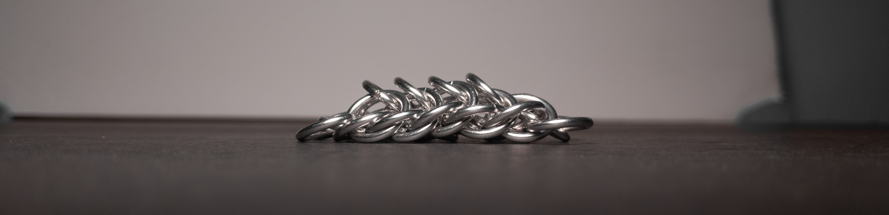
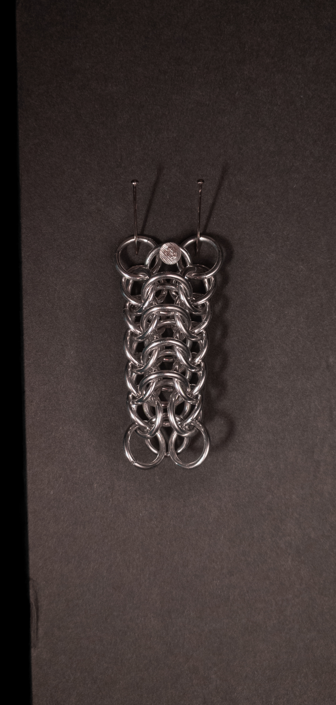
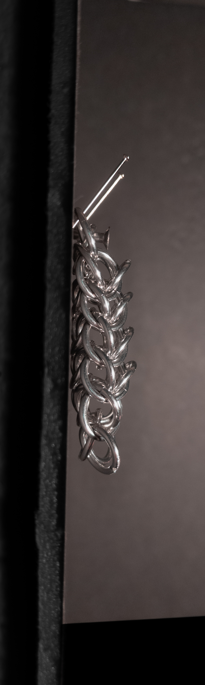
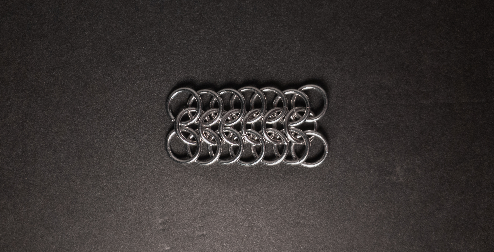
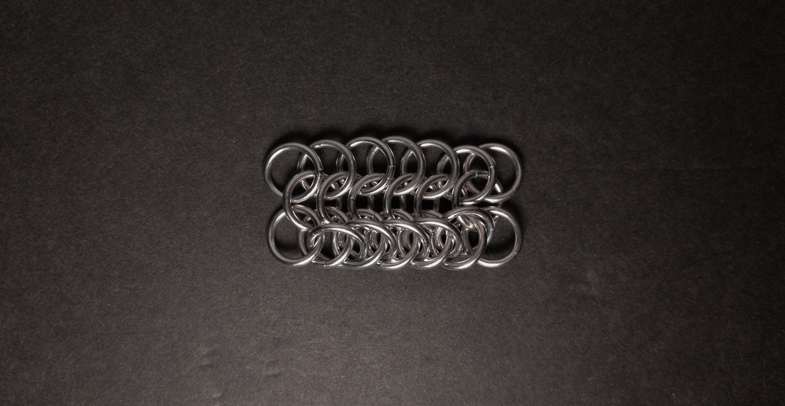

 posted: 2023-12-03 

## Persian Dragonscale

### Overview

While trawling [M.A.I.L.]() for a new weave to try out, I came across [Persian Dragonscale](https://www.mailleartisans.org/weaves/weavedisplay.php?key=85) by [lorenzo](https://www.mailleartisans.org/members/memberdisplay.php?key=17). Persian Dragonscale is a fun combination of [European 4-in-1](european_4_in_1.md) and [Half Persian 3-in-1](half_persian_3_in_1.md). If you want to make it yourself, I found this [tutorial](https://www.mailleartisans.org/articles/articledisplay.php?key=455) by [ChaosSeraphim](https://www.mailleartisans.org/members/memberdisplay.php?key=8611) very helpful.

### Materials

For the sample piece showcased in this post, I made the rings myself (bonus post coming soon if you are interested). I used 16 SWG Bright Aluminum wire from [The Ring Lord](https://theringlord.com/) coiled around an 8mm mandrel for an approximate aspect ratio of 4.9.

### Notes

Persian Dragonscale is a weave characterized by simplicity in understanding its structure and ease in the creation process. Its aesthetic appeal adds to its overall charm, providing a visually pleasing result. The rectangular cross-section of the weave makes it versatile, making it suitable for crafting bracelets and chokers. Moreover, the weave's width allows for its application as a band or strap, especially when made with the appropriate materials. Given these attributes, I highly recommend learning the Persian Dragonscale weave.

### Pictures

#### Flat

#### Flat: Profile

#### Vertical

#### Vertical: Profile

#### In Process

 

 

