 posted: 2024-01-07 

## Pragyan

### Overview

In this post, I will showcase [Pragyan](https://chainmaillers.com/maillepedia/pragyan.1656/), a weave of my construction. Pragyan is a variation of [Rover](rover.md) that I accidentally made when trying to make [Dolphin](dolphin.md). I have included a tutorial, as there are no available tutorials since this is a new weave.

### Materials

For the sample piece showcased in this post, I made the rings myself (bonus post coming soon if you are interested). I used 16 SWG Bright Aluminum wire from [The Ring Lord](https://theringlord.com/) coiled around a 7mm mandrel for an approximate aspect ratio of 4.3.

### Tutorial

1. Start with 1 ring through 2 rings as shown below:

    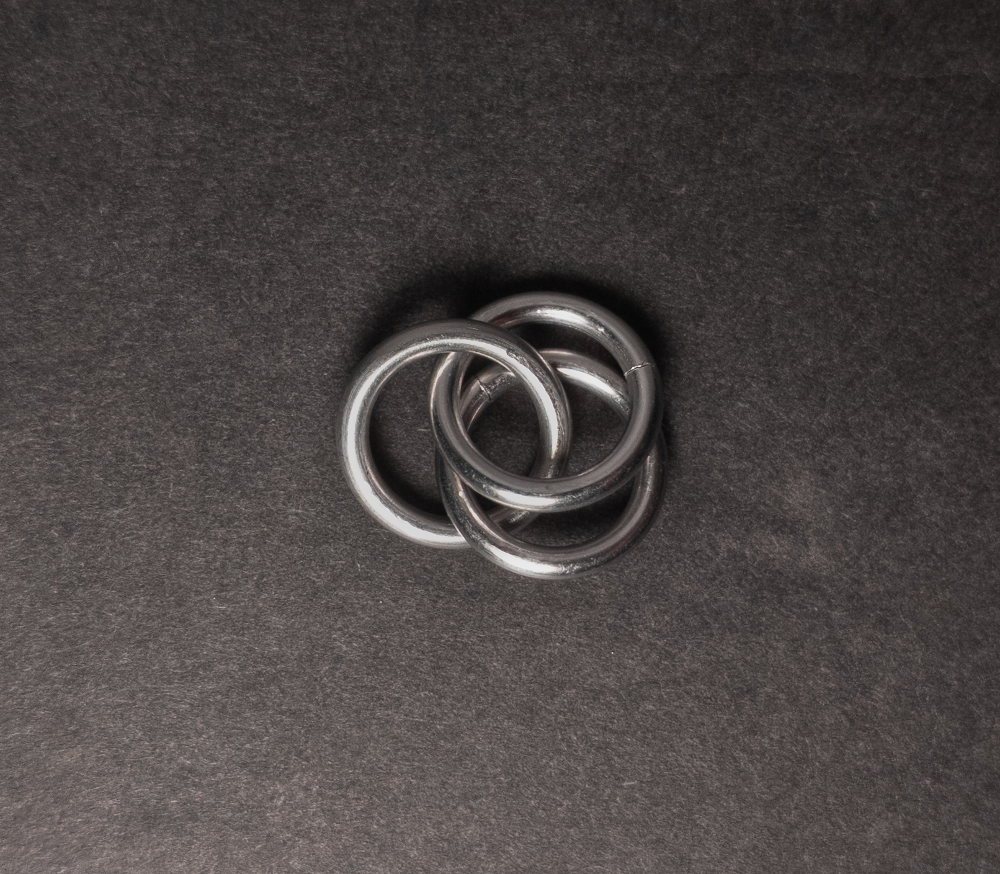

2. Add 2 new rings(green in the image below) through the 2 rings from step 1(yellow in the image below). When done, it should look something like this:

    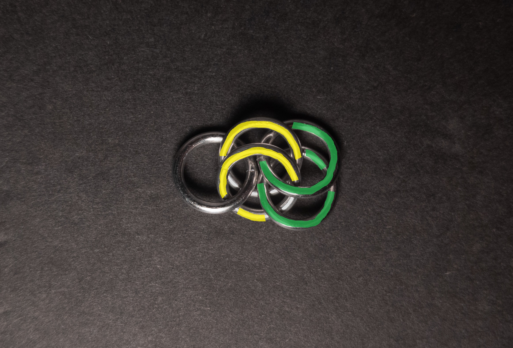

3. Add 1 new ring(green in the image below) around the eye formed by the 2 rings from step 2(yellow in the image below). This ring should go through the bottom of the bottom ring of the 2 two rings from step 1(blue in the image below). When done, it should look something like this:

    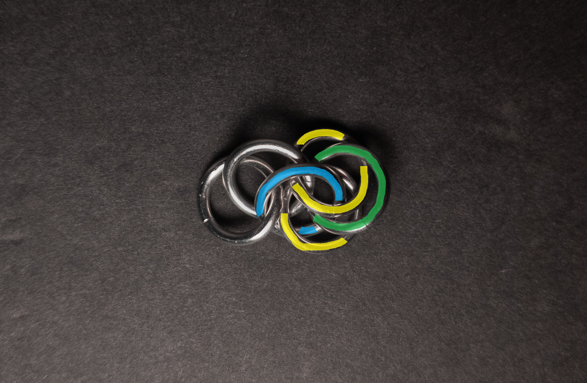

4. Add 2 new rings(green in the image below) through the eye formed by the 2 rings from step 2(yellow in the image below). The bottom new ring should only go through those rings(no dot), while the top new ring(purple dot in the image below) should also go through the ring added in step 3(blue in the image below). When done, it should look something like this:

    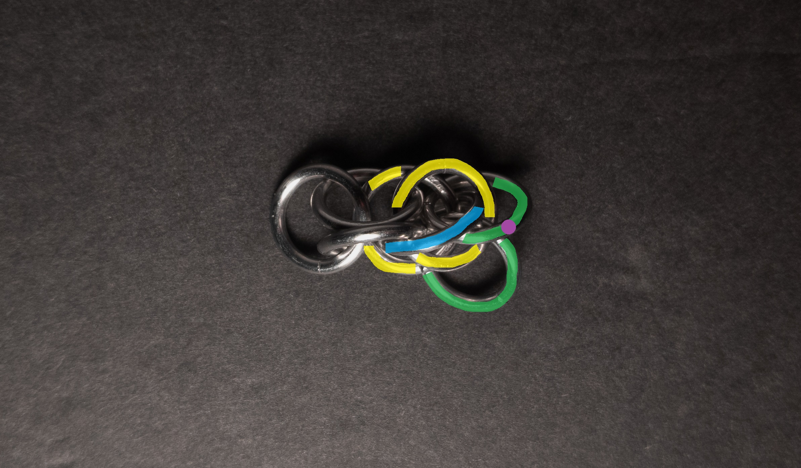

5. Repeat steps 2-4, starting from the last rings added to add new units until you are satisfied with the length of the weave.

6. Optionally, you can remove the single ring from step 1 to improve symmetry.

### Notes

The Pragyan weave presents a moderate level of complexity in comprehension, with the main challenge revolving around ensuring the ring around the eye correctly passes through the rings connecting the units. Assembly, however, is not overly challenging, provided the rings used are large enough. Through experimentation with different aspect ratios (AR), I observed that an AR of 4.0 resulted in a weave that was too tight; however, an AR of 4.3 worked well. Visually, the weave appears cluttered and messy, lacking significant appeal. With a cylindrical cross-section, Pragyan is suitable for bracelets, chokers, and cord applications. Notably, the primary distinction from Rover is the placement of the ring around the eye, which goes over instead of under. The primary distinction from Dolphin is the lack of horizontal rings between sections with rings around the eye. Pragyan's name comes from the lunar rover of the ISRO's Chandrayaan-2 and Chandrayaan-3 missions, paying homage to Rover referencing the Lunar Roving Vehicle used in NASA's Apollo missions. Unless you appreciate the visual aesthetics of the weave, I do not strongly recommend learning Pragyan.

### Pictures

#### Flat

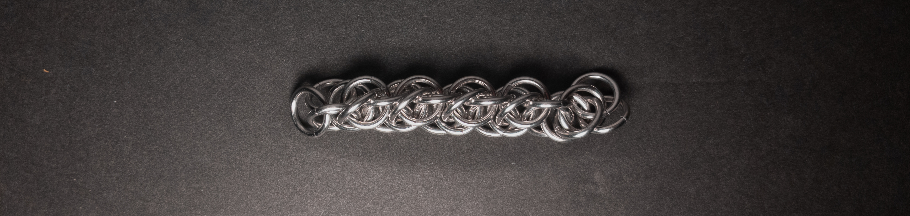

#### Flat: Profile

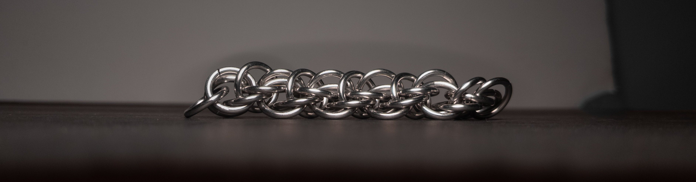

#### Vertical

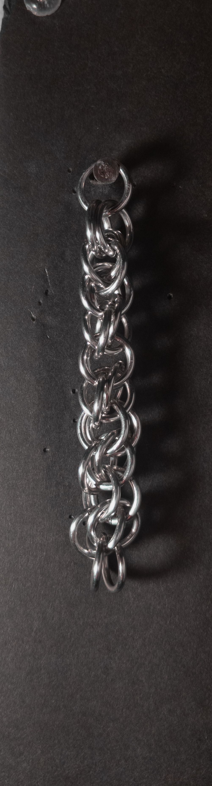

#### Vertical: Profile

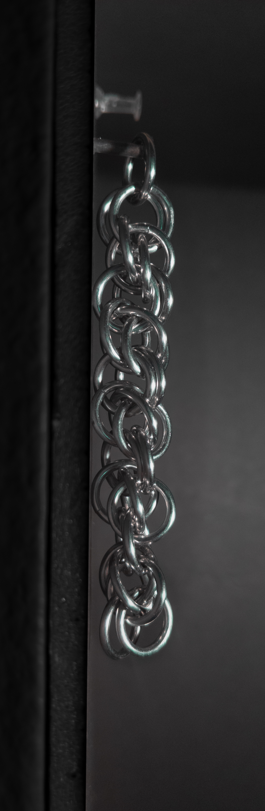

#### In Process

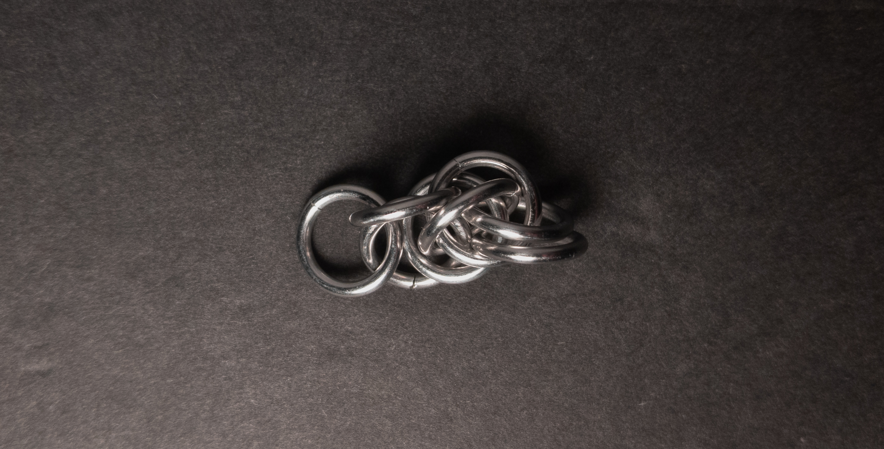

 

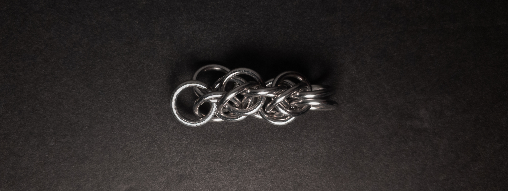

 

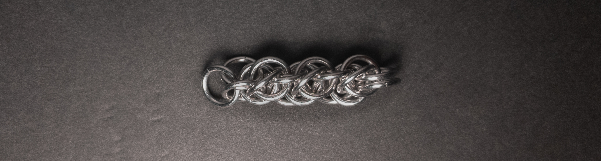

 

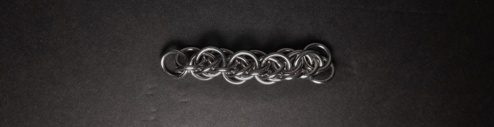
