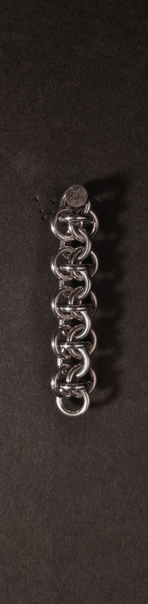
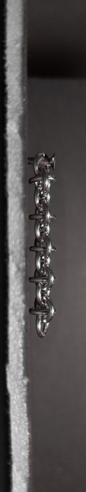
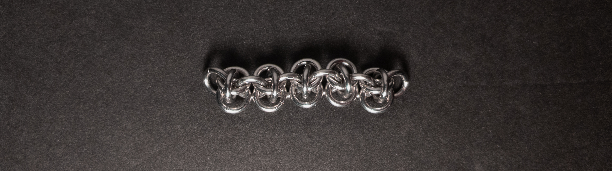
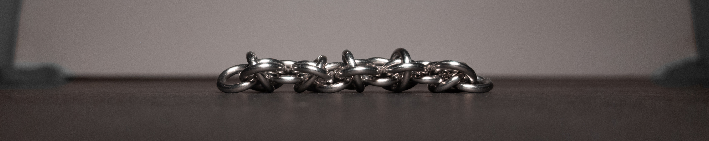
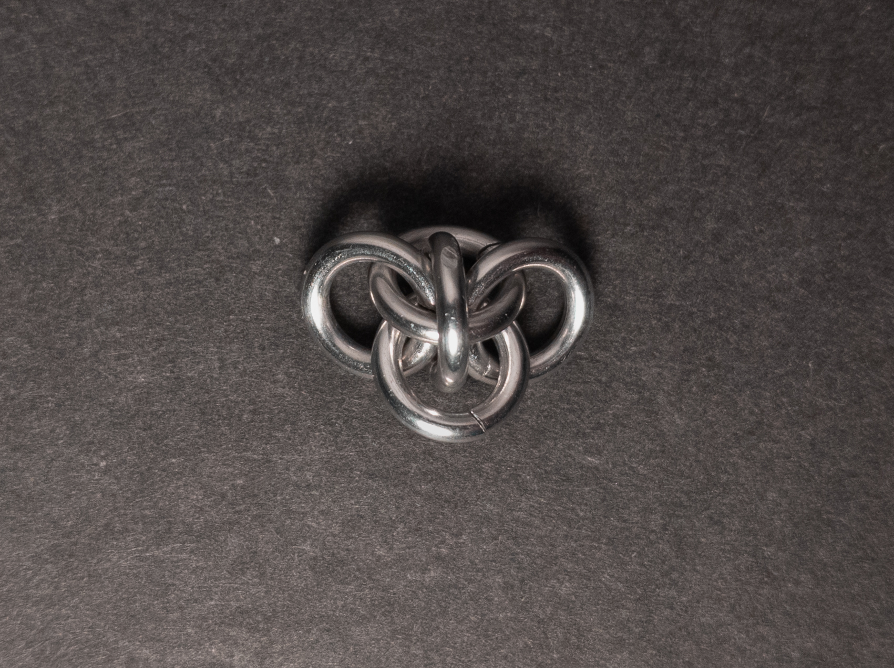
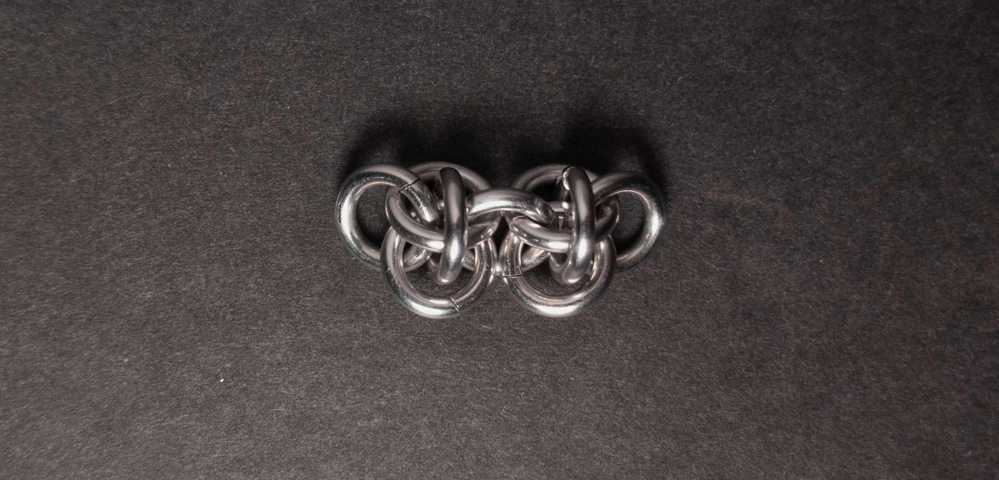
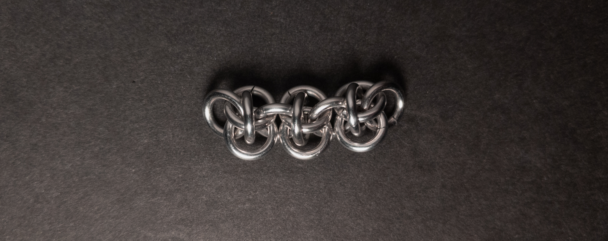
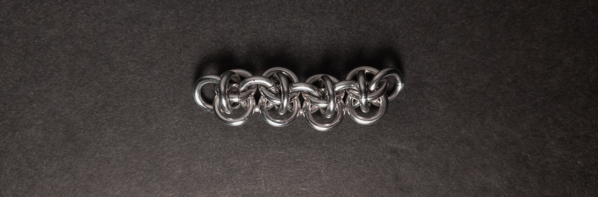

 posted: 2024-01-28 

## Rhinos Snorting Drano

### Overview

While pouring over [M.A.I.L.](https://www.mailleartisans.org/) for interesting weaves to try out, I came across [Rhinos Snorting Drano](https://www.mailleartisans.org/weaves/weavedisplay.php?key=27) by [sakredchao](https://www.mailleartisans.org/members/memberdisplay.php?key=21). Rhinos Snorting Drano is a fusion of Persian and European styles and the ancestor of the [Barrel Weave](barrel_weave.md) and [Rover](rover.md) weaves. If you are interested in trying out this unique and boldly named weave yourself, this [tutorial](https://www.mailleartisans.org/articles/articledisplay.php?key=736) by [Phong](https://www.mailleartisans.org/members/memberdisplay.php?key=1936) is very well made and helpful.

### Materials

For the sample piece showcased in this post, I made the rings myself (bonus post coming soon if you are interested). I used 16 SWG Bright Aluminum wire from [The Ring Lord](https://theringlord.com/) coiled around a 5mm mandrel for an approximate aspect ratio of 3.1.

### Notes

Rhinos Snorting Drano is a weave characterized by its simplicity in understanding and creation. Despite its small size, it possesses an appealing aesthetic. The weave's flat cross-section makes it ideal for crafting chokers and bracelets. Its consistent appearance from various angles also renders it suitable for longer necklaces. Given its simplicity, fun nature, and ease of learning, I highly recommend adding Rhinos Snorting Drano to your repertoire of weaves.

### Pictures

#### Vertical

#### Vertical: Profile

#### Flat

#### Flat: Profile

#### In Process

 

 

 

