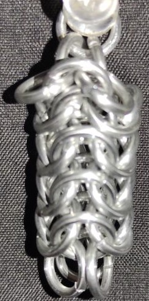
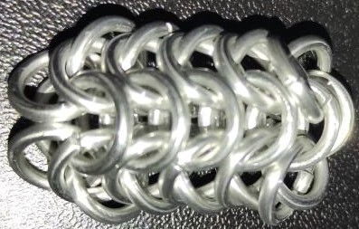
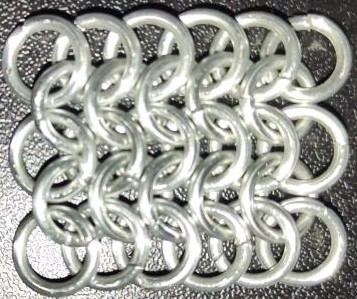
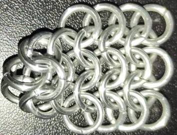
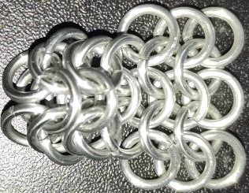
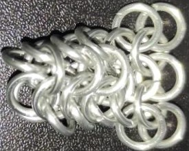
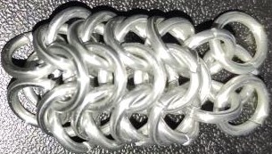

 posted: 2023-04-30 

## Roundmaille

### Overview

I found a [tutorial](https://www.mailleartisans.org/articles/articledisplay.php?key=193) by [Eli](https://www.mailleartisans.org/members/memberdisplay.php?key=1240) on [M.A.I.L.](https://www.mailleartisans.org/) that shows how to create the [Roundmaille](https://www.mailleartisans.org/weaves/weavedisplay.php?key=15) weave. Roundmaille is a variant of [European 4-in-1](european_4_in_1.md) that can be made by taking a 5-wide sheet European 4-in-1 and joining it together. If you are interested in round weaves I suggest trying it out.

### Materials

The rings used for the sample piece shown in this post are 16 SWG with a 1/4" internal diameter for an aspect ratio of 4.03 made of Bright Aluminum that I bought from the [Ring Lord](https://theringlord.com/).

### Notes

If you're interested in exploring different weaves, Roundmaille is worth checking out. It's a simple weave to make and can be used in a variety of projects, whether it's for bracelets, necklaces, or even structural use. The weave looks great in both flat and vertical orientations, but it's worth noting that it can be tricky to end without transitioning to another round weave or attaching it to a custom hook. Also, keep in mind the aspect ratio of the rings you use, as this can affect the final look of your piece. For example, the sample piece in this post uses rings with an AR of 4.03 compared to the recommended 3.5 and thus is quite loose. Overall, Roundmaille is a versatile and useful weave that's worth adding to your repertoire.

### Pictures

#### Vertical

#### Flat

#### In Process

 

 

 

 

