 posted: 2023-12-31 

## Rover

### Overview

When checking [M.A.I.L.](https://www.mailleartisans.org/) for interesting new weaves to try, I came across [Rover](https://www.mailleartisans.org/weaves/weavedisplay.php?key=1011) by [ZiLi](https://www.mailleartisans.org/members/memberdisplay.php?key=10488). Rover is a variant of [Rhinos Snorting Drano](rhinos_snorting_drano.md), where the rings around the eyes also go through additional rings rather than just around the eye. As I could not find any tutorials for this weave, I created and included one so you can follow along at home.

### Materials

For the sample piece showcased in this post, I made the rings myself (bonus post coming soon if you are interested). I used 16 SWG Bright Aluminum wire from [The Ring Lord](https://theringlord.com/) coiled around a 7mm mandrel for an approximate aspect ratio of 4.3.

### Tutorial

1. Start with a 2-2-2 chain as shown below:

    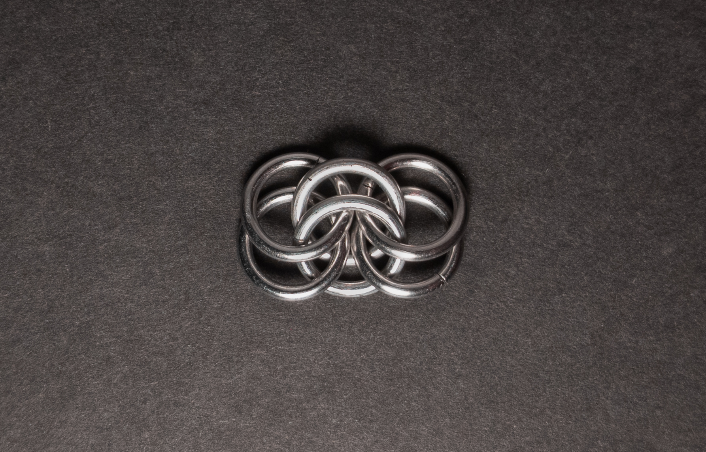

2. Add 1 new ring(green in the image below) around the eye formed by the center 2 rings from step 1(yellow in the image below). Ensure the new ring goes under the top of the rightmost ring from step 1(blue in the image below) and under the bottom ring of the leftmost rings from step 1(red in the image below). When done, it should look something like this:

    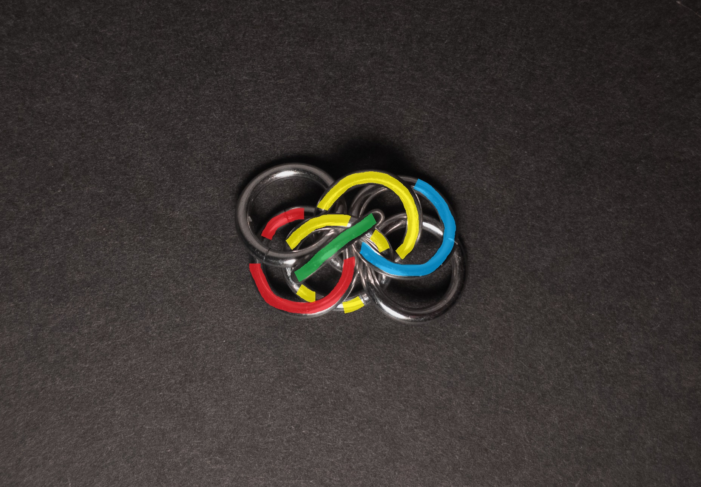

3. Add 2 new rings(green in the image below) through the rightmost 2 rings from step 1(yellow in the image below). When done, it should look something like this:

    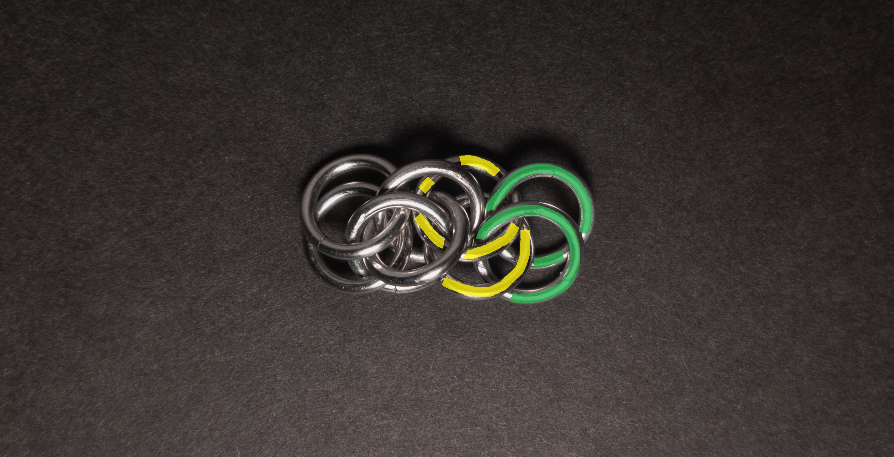

4. Add 2 new rings(green in the image below) through the rings from step 3(yellow in the image below). When done, it should look something like this:

    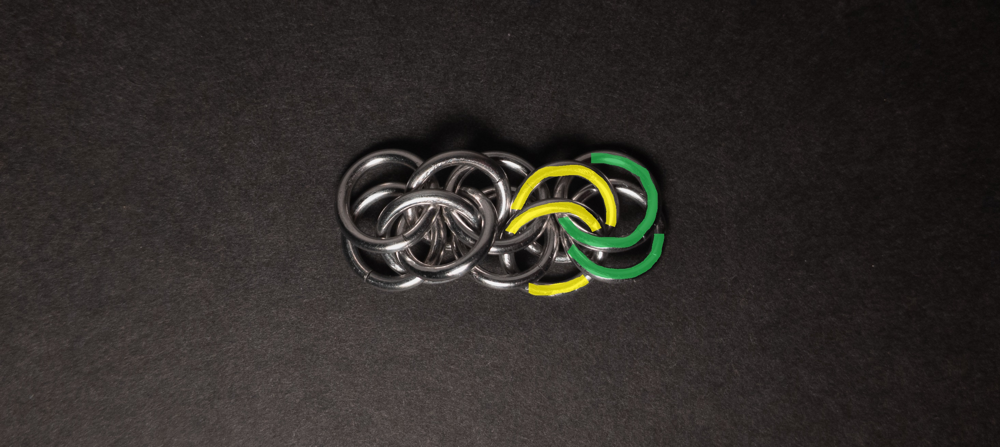

5. Add 1 new ring(green in the image below) around the eye of the two rings from step 3(yellow in the image below). Ensure the new ring goes under the top ring from step 4(blue in the image below) and under the bottom ring of the rightmost rings from step 1(red in the image below). When done, it should look something like this:

    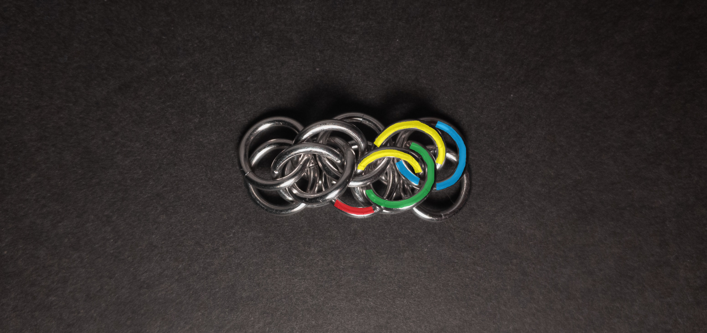

6. Repeat steps 3-5, starting from the last rings added to add new units until you are satisfied with the length of the weave.

### Notes

The Rover weave is somewhat simple to understand; however, its execution can present some challenges, especially when adding the rings around the eyes in steps 2 and 5. Visually, I find the weave quite appealing, especially in a vertical orientation, and it maintains a decent appearance when flat. The weave's characteristics, being somewhat thin and wide when flat and more rounded when vertical, make it usable for various applications such as bracelets, necklaces, chokers, and strapping or cord, depending on the desired orientation or use case. To ease the process of adding rings around the eyes in steps 2 and 5, I found it helpful to open the ring right-handed and start at the top right, guiding it through like a screw. Given its simplicity, visual appeal, and versatility, I highly recommend learning the Rover weave.

### Pictures

#### Vertical

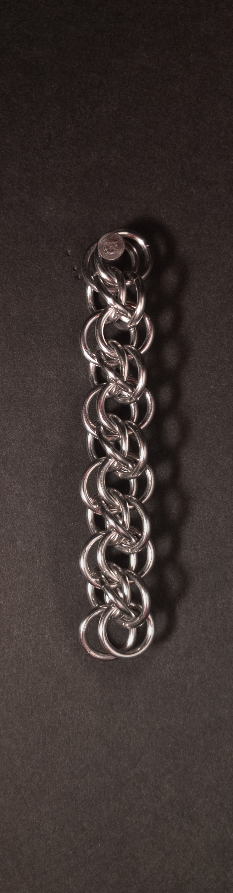

#### Vertical: Profile

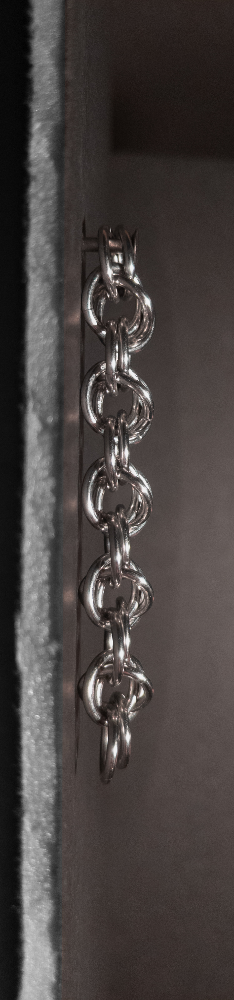

#### Flat

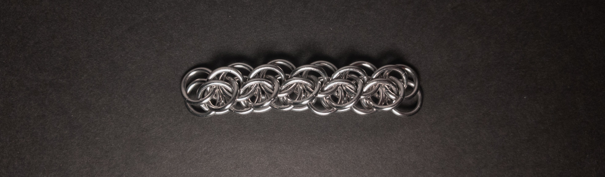

#### Flat: Profile

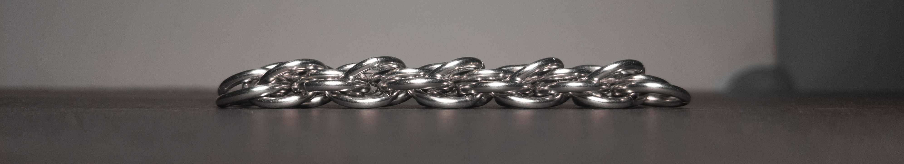

#### In Process

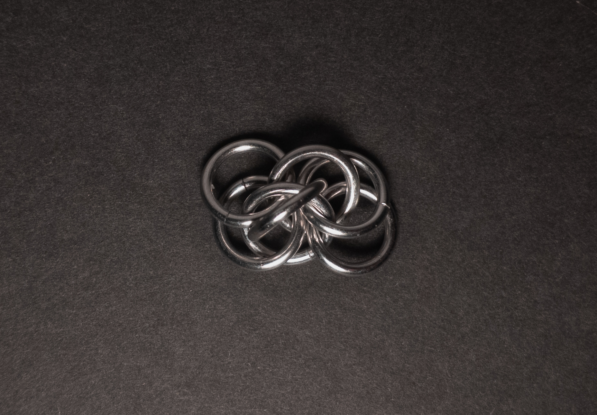

 

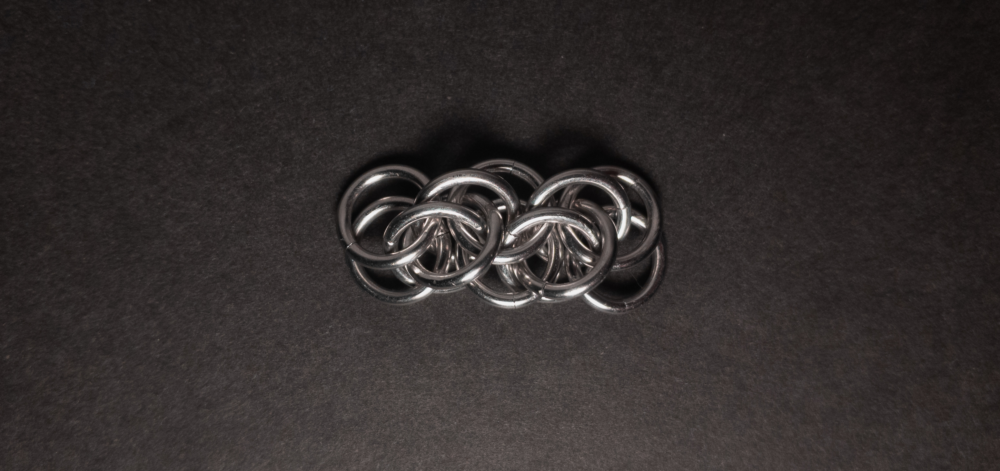

 

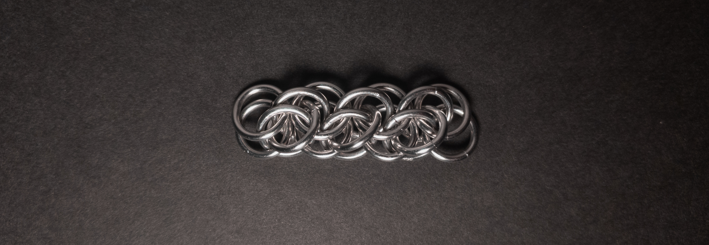

 

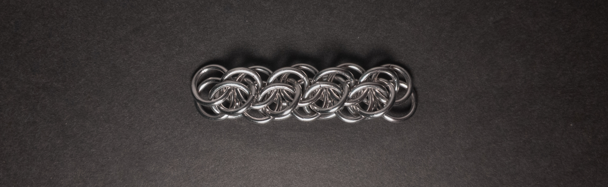
