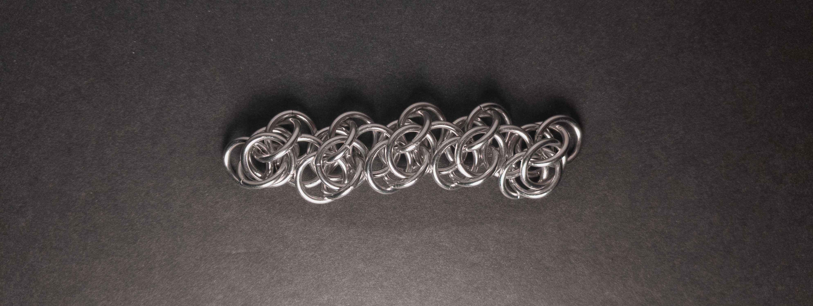
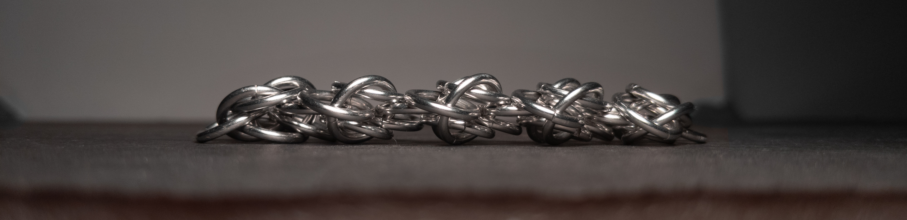
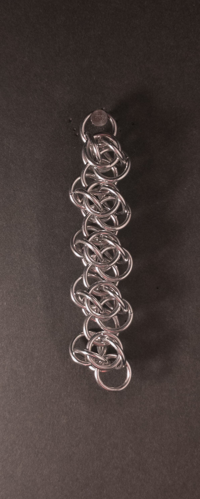
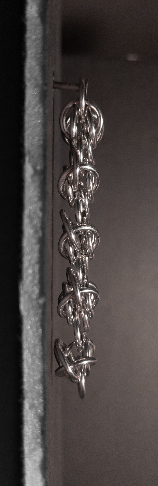
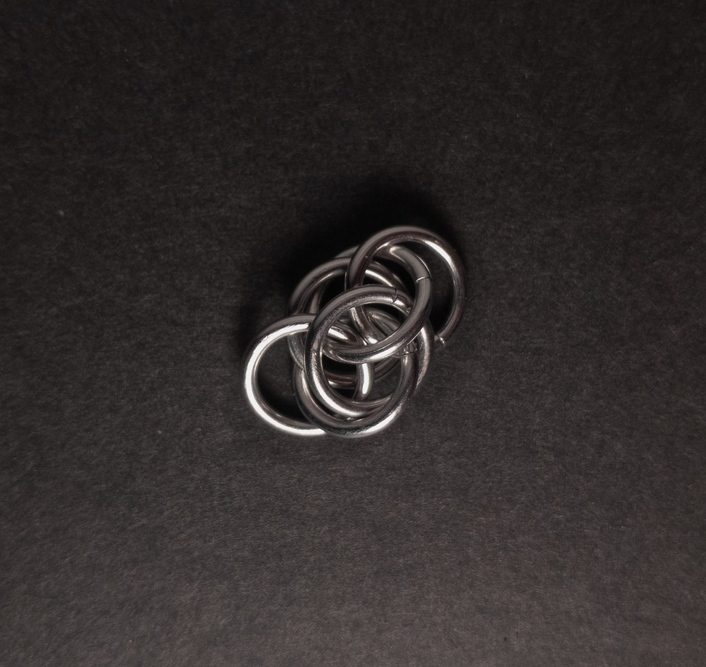
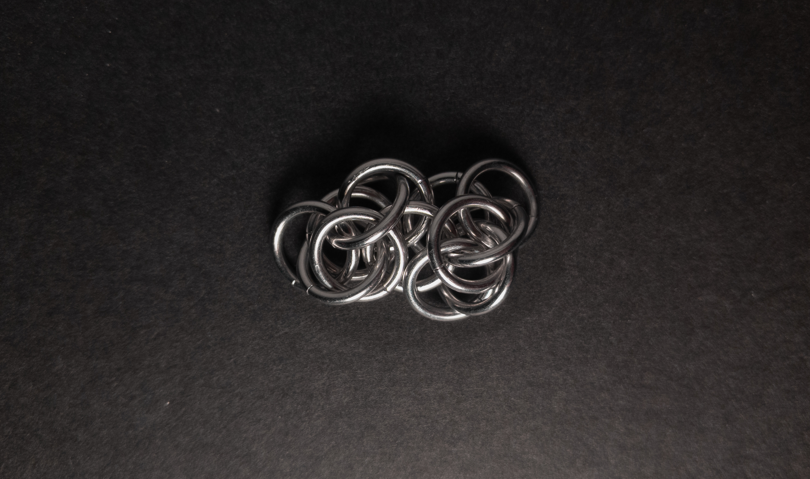
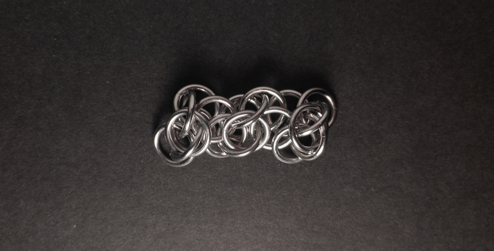
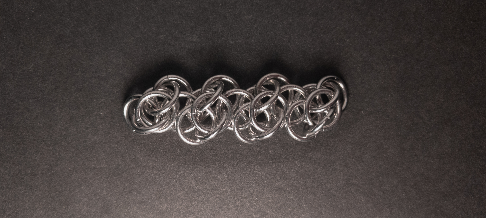

 posted: 2024-04-14 

## Scary Weave

### Overview

I found [Scary Weave](https://www.mailleartisans.org/weaves/weavedisplay.php?key=260) uploaded to [M.A.I.L.](https://www.mailleartisans.org/) by [childofdune](https://www.mailleartisans.org/members/memberdisplay.php?key=705) while trawling the web for new weaves to try out. Scary Weave is a fun member of the [Rhino](rhinos_snorting_drano.md) family with similar units and an inspiring way of joining units. If you want to follow along yourself, I recommend this [tutorial](https://www.mailleartisans.org/articles/articledisplay.php?key=469) by [MaxumX](https://www.mailleartisans.org/members/memberdisplay.php?key=949).

### Materials

For the sample piece showcased in this post, I made the rings myself (bonus post coming soon if you are interested). I used 16 SWG Bright Aluminum wire from [The Ring Lord](https://theringlord.com/) coiled around an 8mm mandrel for an approximate aspect ratio of 4.9.

### Notes

Scary Weave presents a moderate level of complexity, which is particularly evident while joining units. However, it is not overly challenging to create, although some difficulty arises from the tendency of end units to become partially undone and isolated units to become disorganized. Despite its intricate nature, the weave boasts a stunning appearance, though it may appear busy or complex to some observers. Due to its flat structure, the weave is suitable for the base of chokers and bracelets. Unfortunately, its lack of stability and width may limit its effectiveness as a strap. Careful handling during construction is essential to prevent units from unraveling, making it advisable to keep them at the edge of your workspace until ready for joining. While visually appealing, the weave's limited utility, lack of stability, and creation difficulties suggest that it may not be worth learning unless the weave inspires you.

### Pictures

#### Flat

#### Flat: Profile

#### Vertical

#### Vertical: Profile

#### In Process

 

 

 

