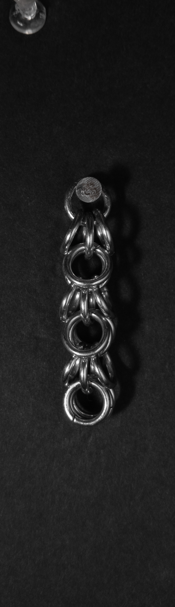
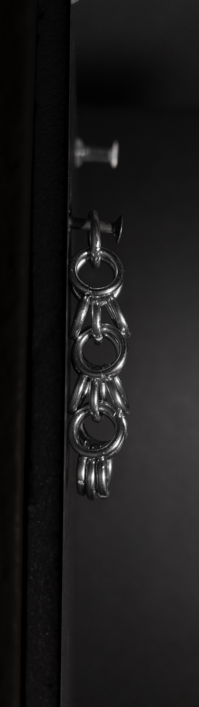
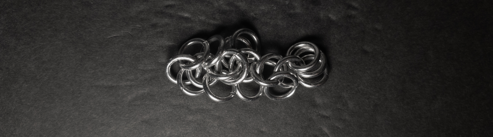
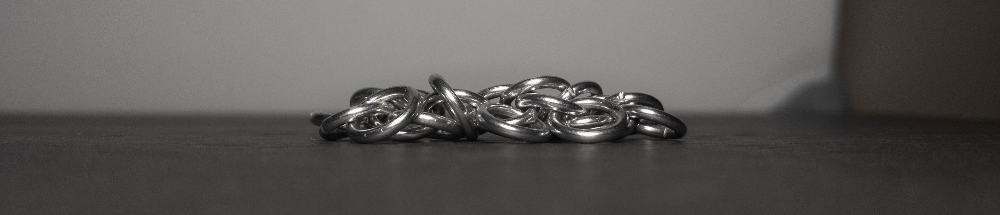
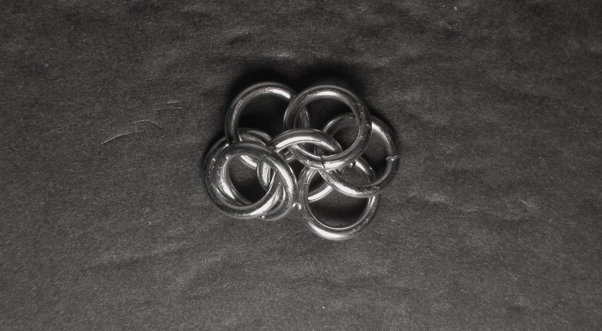
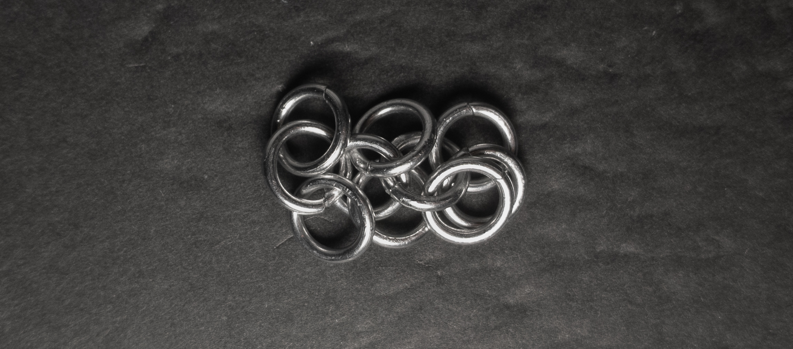
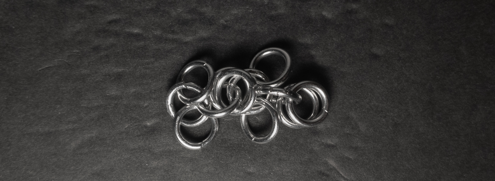
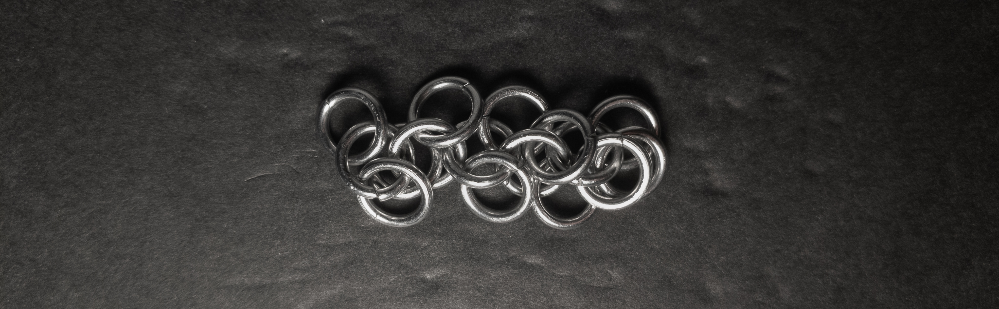

 posted: 2023-09-10 | updated: 2023-09-24 

## Shaggy Loops

### Overview

I found this [tutorial](https://www.mailleartisans.org/articles/articledisplay.php?key=317) for [Shaggy Loops](https://www.mailleartisans.org/weaves/weavedisplay.php?key=413) by [Vacacita](https://www.mailleartisans.org/members/memberdisplay.php?key=3136) while searching [M.A.I.L.](https://www.mailleartisans.org/) for an appropriate weave to follow [2 in 1 Chain](2_in_1_chain.md) in my journey of increasing complexity. This weave is a simple variant of 2 in 1 Chain, that looks quite nice in a vertical orientation. If you want a fun and easy weave, I suggest making Shaggy Loops.

### Materials

For the sample piece showcased in this post, I used Bright Aluminum rings purchased from [The Ring Lord](https://theringlord.com/). The rings are 16 SWG with a 1/4" internal diameter, resulting in an aspect ratio of 4.03.

### Notes

The Shaggy Loops weave is a relatively simple weave to understand and create. While the weave may look chaotic and messy when flat, its appearance transforms into a visually appealing and attractive pattern when oriented vertically. Although technically usable in bracelets and necklaces, the weave's true beauty is most pronounced when displayed vertically, which might limit its versatility in some jewelry applications. However, the weave works exceptionally well in earrings or pendants, as you can rely on it to stay vertical. Despite its limitations, I highly recommend learning the Shaggy Loops weave, as it offers a fun and easy learning experience while yielding pleasing results when applied with an appropriate design orientation.

### Pictures

#### Vertical

#### Vertical: Profile

#### Flat

#### Flat: Profile

#### In Process

 

 

 

