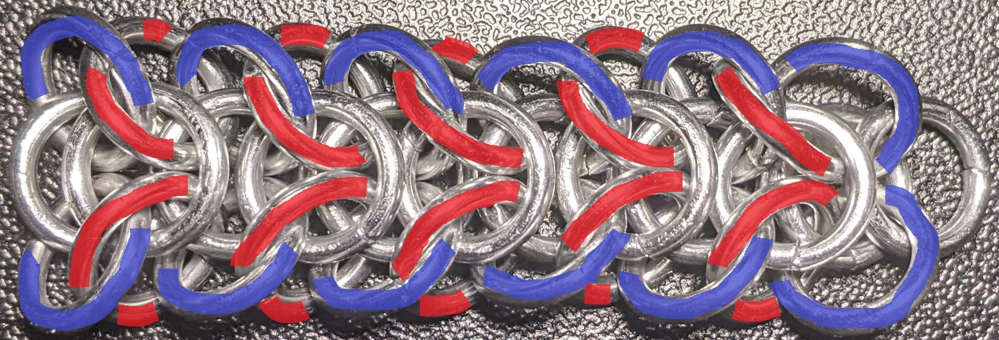
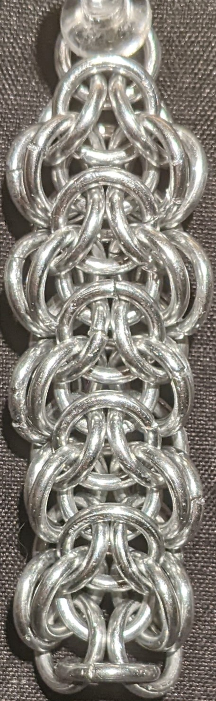
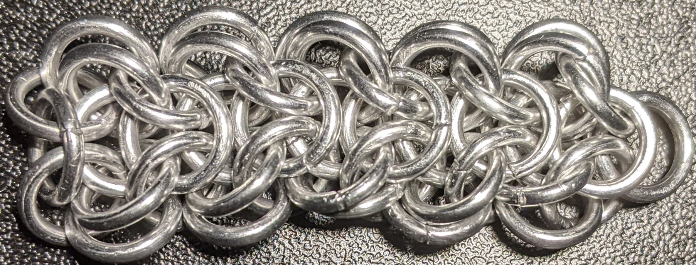
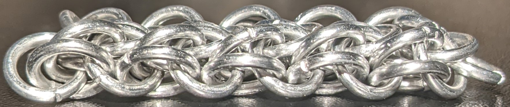

 posted: 2023-05-21 

## Spinal Elf

### Overview

When I first made [Elfweave](elfweave.md) I liked it very much; however, I found the folding issue kept me from wanting to use it in an application. I found an gallery image on [M.A.I.L.](https://www.mailleartisans.org/) called [Spinal Elf](https://www.mailleartisans.org/gallery/gallerydisplay.php?key=8744) by [Lisa_Ellis](https://www.mailleartisans.org/members/memberdisplay.php?key=25515). The rings Spinal Elf adds to prevent folding make the result look like stacked vertebrae hence the name. I really liked the look of it, so I tried making it.

### Materials

The rings used for the sample piece shown in this post are 16 SWG with a 1/4" internal diameter for an aspect ratio of 4.03 made of Bright Aluminum that I bought from [The Ring Lord](https://theringlord.com/).

### Tutorial

Since Spinal Elf was only posted to the image gallery, no tutorial was provided. However, all you need to do to make Spinal Elf is add rings to an existing Elfweave chain. First, designate one side as the bottom and place that side up. Then add rings between each pair of rings highlighted in blue in the image below on one side of the chain. Make sure the rings you add only go through the two blue rings, unlike the rings highlighted in red.

### Notes

Spinal Elf is a chainmail weave derived from Elfweave and is relatively simple to make once you have learned to make Elfweave. The additional complexity of Spinal Elf comes from adding the necessary rings to convert a chain of Elfweave to Spinal Elf. The difficulty of making the weave is gatekept by the challenge of making Elfweave. The instability of Spinal Elf comes from making the necessary Elfweave chain rather than adding the new rings. Fortunately, the additional rings on the "bottom" prevent the weave from folding when held vertically, making it well-suited for bracelets and necklaces. Although this is a simple extension of Elfweave, it is not recommended for beginners as it requires Elfweave to start. While Spinal Elf does not have a listed ideal AR, I expect it to be at or near 4.2 due to its connection to Elfweave. The sample piece shown in the pictures was made with rings whose AR is 4.03, but the weave was not too tight. If you know how to make Elfweave and are looking for a new chainmail weave to try out, I highly recommend giving Spinal Elf a shot.

### Pictures

#### Vertical

#### Flat

#### Flat: Profile

