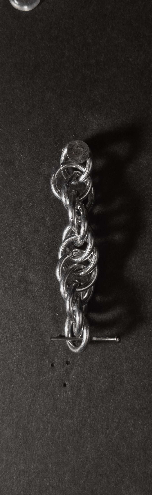

 posted: 2023-09-24 

## Spiral 4-in-1

### Overview

When working on [2-in-1 Chain](2_in_1_chain.md), I came across [Spiral 4-in-1](https://www.mailleartisans.org/weaves/weavedisplay.php?key=21) on [M.A.I.L.](https://www.mailleartisans.org/), a fun and simple spiral weave. Due to how much I liked how the weave looked, I needed to try it out for myself. With this [tutorial](https://www.mailleartisans.org/articles/articledisplay.php?key=184) by [Bative](https://www.mailleartisans.org/members/memberdisplay.php?key=349), you can follow along and make it yourself.

### Materials

For the sample piece showcased in this post, I used Bright Aluminum rings purchased from [The Ring Lord](https://theringlord.com/). The rings are 16 SWG with a 1/4" internal diameter, resulting in an aspect ratio of 4.03.

### Notes

The Spiral 4-in-1 weave is both easy to comprehend and straightforward to craft. Its visual appeal is most prominent under torsion, creating a stunning effect; otherwise, its appearance can seem chaotic. Despite this limitation, you can still incorporate the weave into bracelets and necklaces. If not constructed as a closed loop, some effort may be required to achieve the desired level of torsion when wearing it. Moreover, the weave's structure makes it suitable for use as string so long as the ends keep the chain twisted or you like the chaotic look. Due to its simplicity and the captivating spiral pattern it forms, I highly recommend learning this weave.

### Pictures

#### Vertical

#### Vertical: Profile

#### Flat

#### Flat: Profile

#### In Process

 

 

 

