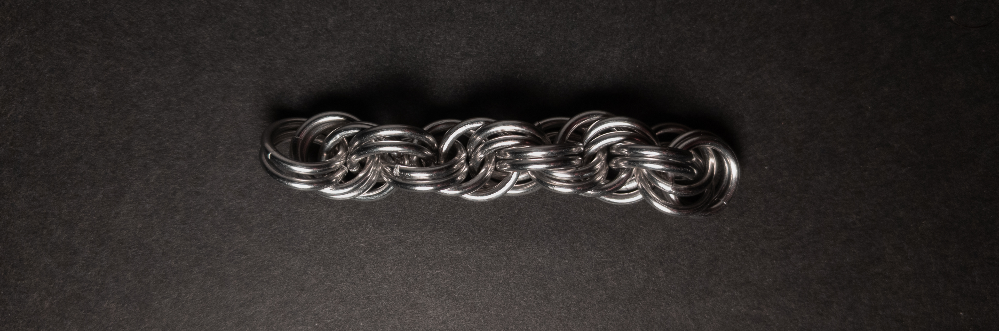
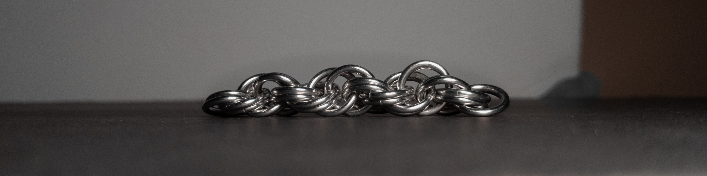
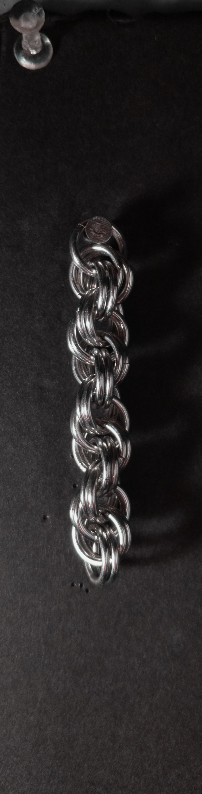
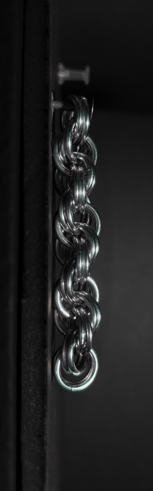
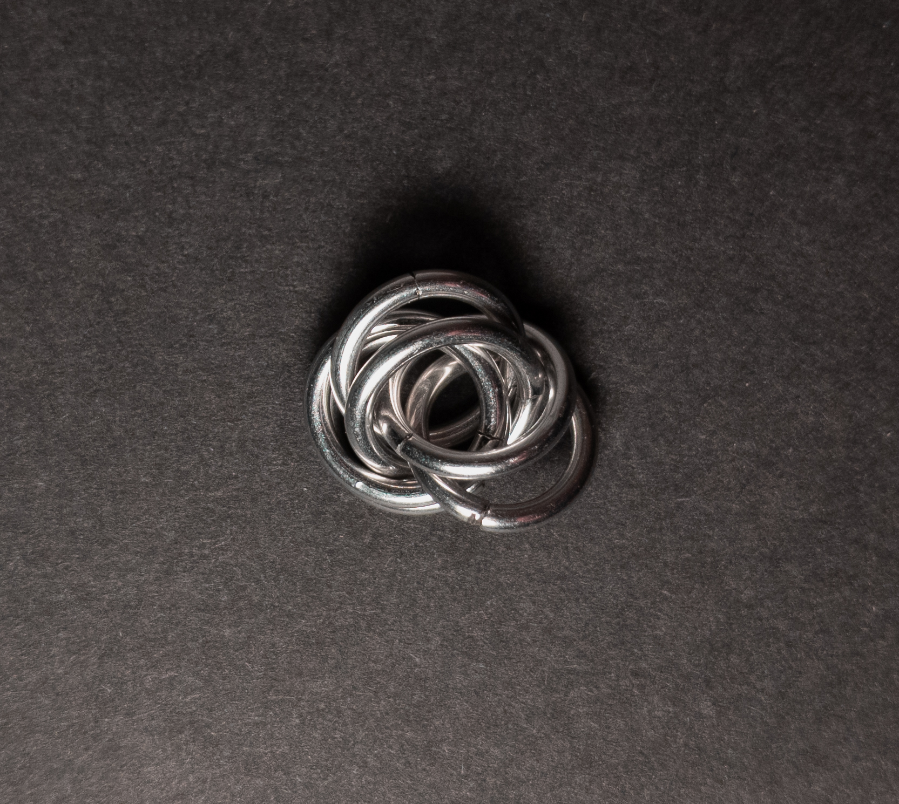
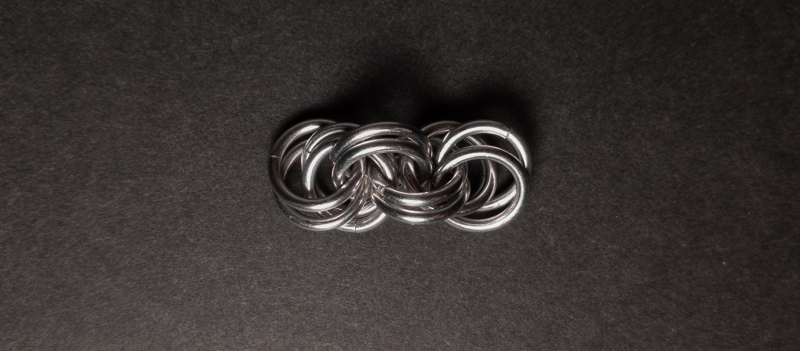

 posted: 2023-11-05 

## Spiral 8-in-2

### Overview

After seeing how visually appealing spiral weaves can be from [Spiral 4-in-1](spiral_4_in_1.md), I wanted to try making another spiral weave. When searching [M.A.I.L.](https://www.mailleartisans.org/), I found [Spiral 8-in-2](https://www.mailleartisans.org/weaves/weavedisplay.php?key=22) by Antiquity, a basic variation of Spiral 4-in-1 that gains the ability to stay spiralled without constant torsion. If you want to make it yourself, this [tutorial](https://youtu.be/TZzFZyFbacI?si=YZYYusgFOZb_jtUq&t=140) by [Aussie Maille](https://www.youtube.com/@AussieMaillers) should be helpful.

### Materials

For the sample piece showcased in this post, I made the rings myself (bonus post coming soon if you are interested). I used 16 SWG Bright Aluminum wire from [The Ring Lord](https://theringlord.com/) coiled around an 8mm mandrel for an approximate aspect ratio of 4.9.

### Notes

The Spiral 8-in-2 weave is simple, both to create and understand. While it may appear cluttered compared to the Spiral 4-in-1, it possesses the unique advantage of maintaining its spiral pattern without torsion, resulting in an overall pleasing aesthetic. This weave's versatility is noteworthy, making it suitable for various applications such as bracelets, necklaces, and cords, thanks to its circular cross-section. Additionally, due to its locked spiral nature, it can also serve as a pendant. This weave is essentially a progression from the Spiral 4-in-1, achieved by doubling each ring, and theoretically, its pattern could continue by increasing the number of rings used. With its neat and intriguing spiral design, I highly recommend adding this weave to your arsenal of chainmail techniques.

### Pictures

#### Flat

#### Flat: Profile

#### Vertical

#### Vertical: Profile

#### In Process

 

 

 

