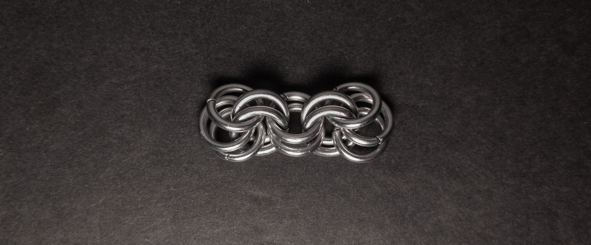
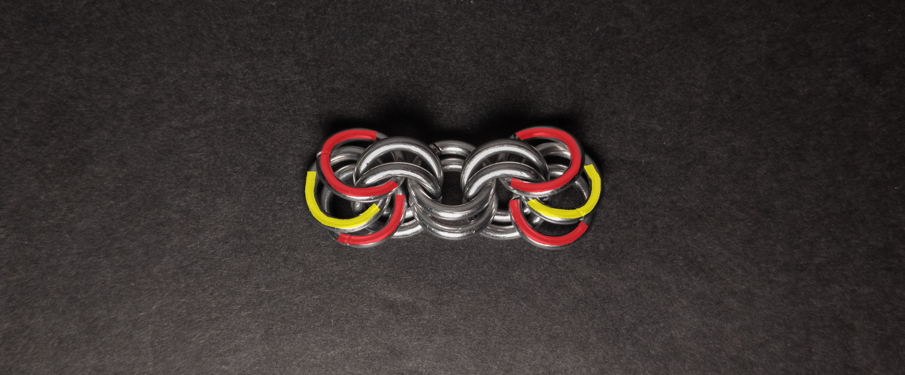
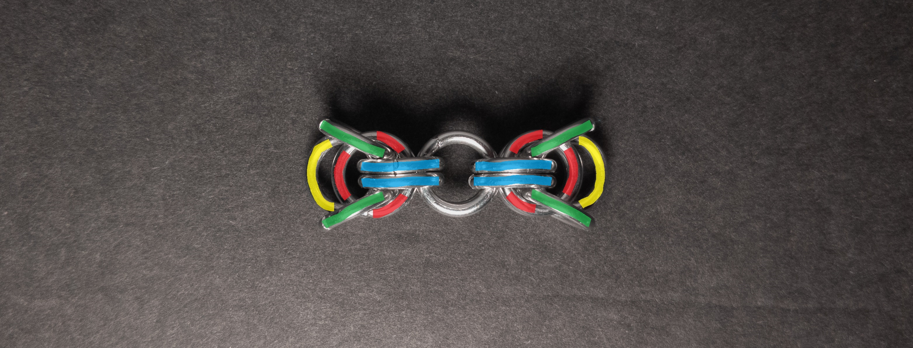
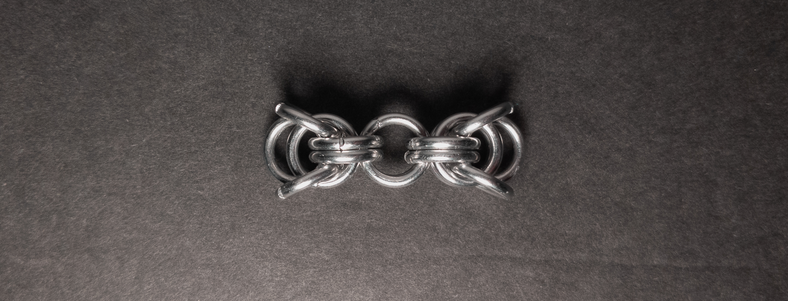
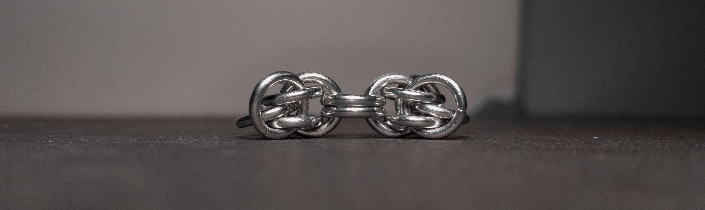
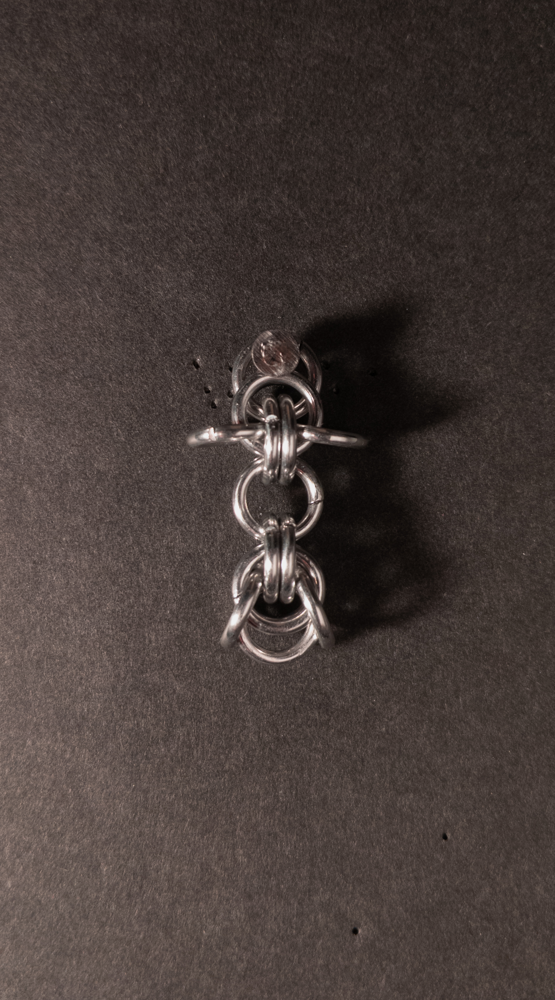
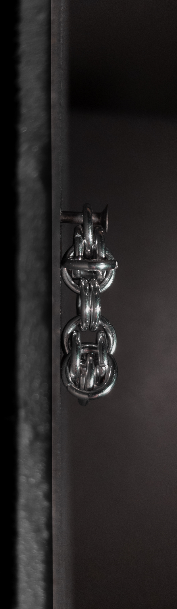

 posted: 2024-03-17 

## Sunburst

### Overview

While looking for a new weave to try out, I came across [Sunburst](https://www.mailleartisans.org/weaves/weavedisplay.php?key=694) by [Troko22](https://www.mailleartisans.org/members/memberdisplay.php?key=8780) on [M.A.I.L.](https://www.mailleartisans.org/). Sunburst is a fascinating and nice-looking unit in the European family of weaves. I have written and included a tutorial, as I could not find any other tutorials.

### Materials

For the sample piece showcased in this post, I used Bright Aluminum rings purchased from [The Ring Lord](https://theringlord.com/). The rings are 16 SWG with a 1/4" internal diameter, resulting in an aspect ratio of 4.03.

### Tutorial

1. Start with a 3-2-2-2-3 chain as shown below:

    

2. To simplify the next step, I have included this coloured version of the above result.

    

3. Now we add the 4 edge rings(green in the image below), 1 in each corner. These rings should only go through the 2 outermost rings of the side(red in the images above and below) and not the innermost ring(yellow in the images above and below). Additionally, only 1 ring should go on each side of the other vertical rings(blue in the image below). When done, it should look something like this:

    

### Notes

The Sunburst weave is characterized by its simplicity in understanding its structure and construction. Despite its straightforward nature, the weave offers an aesthetically pleasing appearance. As a unit weave, it finds its optimal use in earrings or as a charm/pendant. Given its intriguing design and ease of construction, I highly recommend acquiring the skills to create this weave.

### Pictures

#### Flat

#### Flat: Profile

#### Vertical

#### Vertical: Profile

