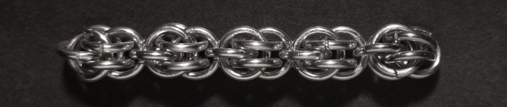
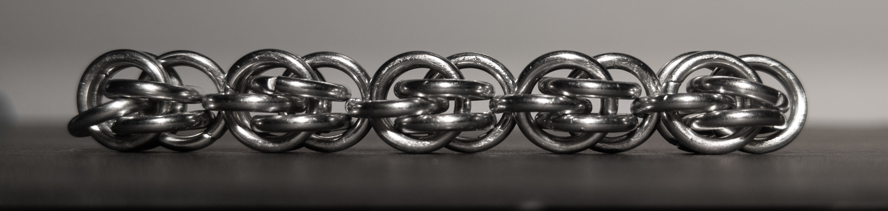
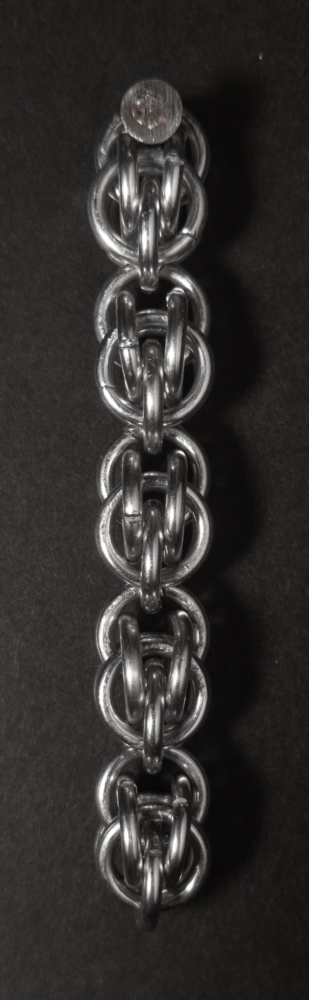
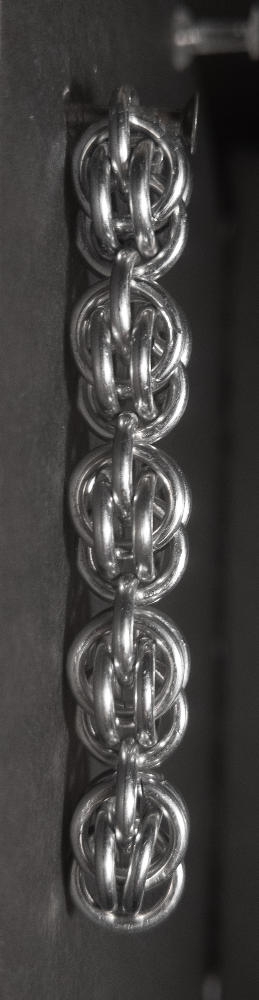
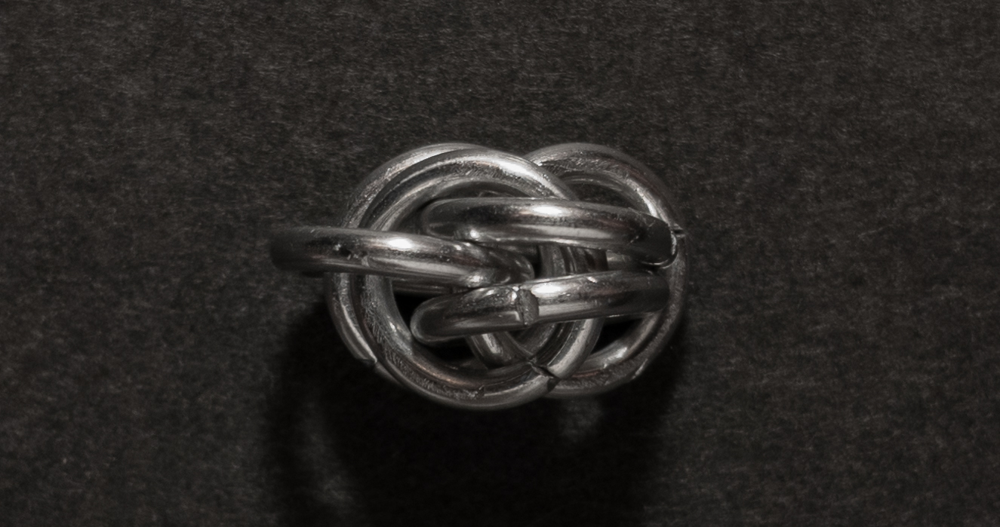
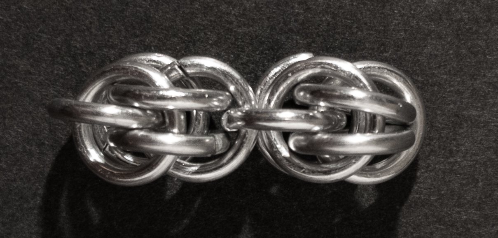
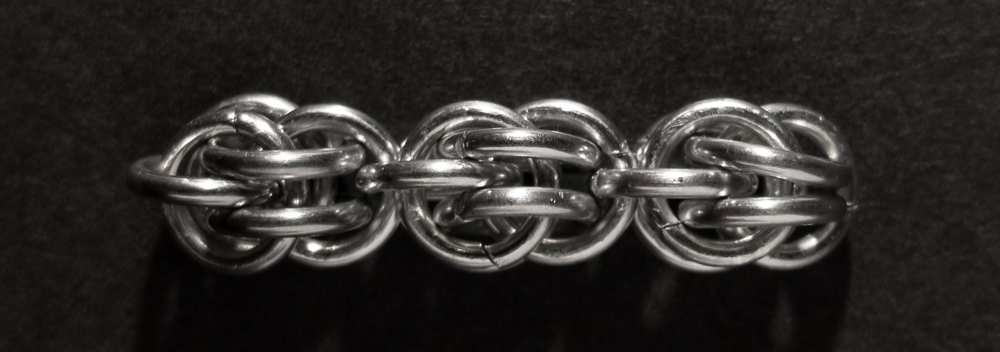
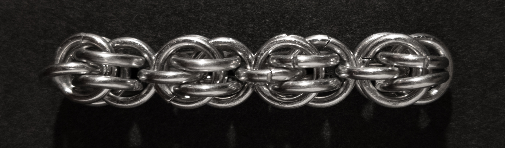

 posted: 2023-06-04 

## Sweetpea

### Overview

Quite some time ago, I came across a [tutorial](https://www.mailleartisans.org/) on [M.A.I.L.](https://www.mailleartisans.org/) for the intriguing [Sweetpea](https://www.mailleartisans.org/weaves/weavedisplay.php?key=852) weave, submitted by [Corvus](https://www.mailleartisans.org/members/memberdisplay.php?key=4033) (who also contributed the weave to M.A.I.L.). Sweetpea is a captivating weave from the Persian family, named after its unique appearance. I highly recommend exploring this weave once you have gained some experience working with chainmail.

### Materials

For the sample piece showcased in this post, I used Bright Aluminum rings purchased from [The Ring Lord](https://theringlord.com/). The rings are 16 SWG with a 1/4" internal diameter, resulting in an aspect ratio of 4.03.

### Notes

The Sweetpea chainmail weave offers both versatility and fascination. While the overall concept is not overly complex, one challenge lies in adding the last ring of each unit. However, this weave boasts remarkable flexibility and a relatively square cross-section, making it adaptable for various applications. Notably, by joining a long strand of Sweetpea to itself, you can create a solid loop, showcasing its versatility. The distinct and visually pleasing units of Sweetpea inspired its name. I highly recommend mastering this captivating weave, as it combines aesthetic appeal with practical functionality. Give Sweetpea a try and discover its beauty and versatility for yourself.

Personally, I have a history with the Sweetpea weave, as it was one of the first patterns I attempted when exploring chainmail. Just after discovering weaves beyond the classic [European 4-in-1](european_4_in_1.md), I eagerly delved into Sweetpea. However, due to my limited experience with chainmail at that time, I found it challenging to consistently create the weave. Now, with increased proficiency, I decided to revisit Sweetpea and was pleasantly surprised to find the process much more accessible and enjoyable.

### Pictures

#### Flat

#### Flat: Profile

#### Vertical

#### Vertical: Profile

#### In Process

 

 

 

