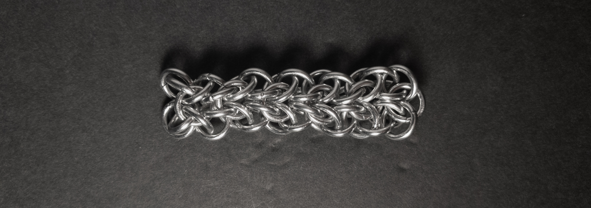

 posted: 2023-08-20 

## Symmetrical Allure Sheet

### Overview

While checking [M.A.I.L.](https://www.mailleartisans.org/) for new weaves to try, I came across an interesting [tutorial](https://www.mailleartisans.org/articles/articledisplay.php?key=626) by [lorraine](https://www.mailleartisans.org/members/memberdisplay.php?key=9915) for Symmetrical Allure Sheet. With how nice the weave looked, I decided to try and make it myself.

### Materials

For the sample piece showcased in this post, I used Bright Aluminum rings purchased from [The Ring Lord](https://theringlord.com/). The rings are 16 SWG with a 1/4" internal diameter, resulting in an aspect ratio of 4.03.

### Notes

The Symmetrical Allure Sheet weave is relatively straightforward to understand. However, it can be somewhat challenging for the first few units due to its initial instability, though it becomes easier after the first few units. When I made the weave, it had tightness issues with the rings I used; for better results, I highly recommend using rings closer to the recommended aspect ratio (AR) of 4.3. Despite these initial difficulties, the Symmetrical Allure Sheet weave looks wonderful in all orientations. Interestingly, while the weave is labelled as a sheet, the tutorial only provides instructions to expand it in one direction, essentially making it a tutorial for a chain. However, as a chain, this weave offers great versatility allowing it to be used in various ways, such as bracelets, necklaces, earring pendants, and clothing straps. Given its beauty and versatility, I highly recommend learning this weave to explore its creative potential fully.

### Pictures

#### Vertical

#### Vertical: Profile

#### Flat

#### Flat: Profile

#### In Process

 

 

 

