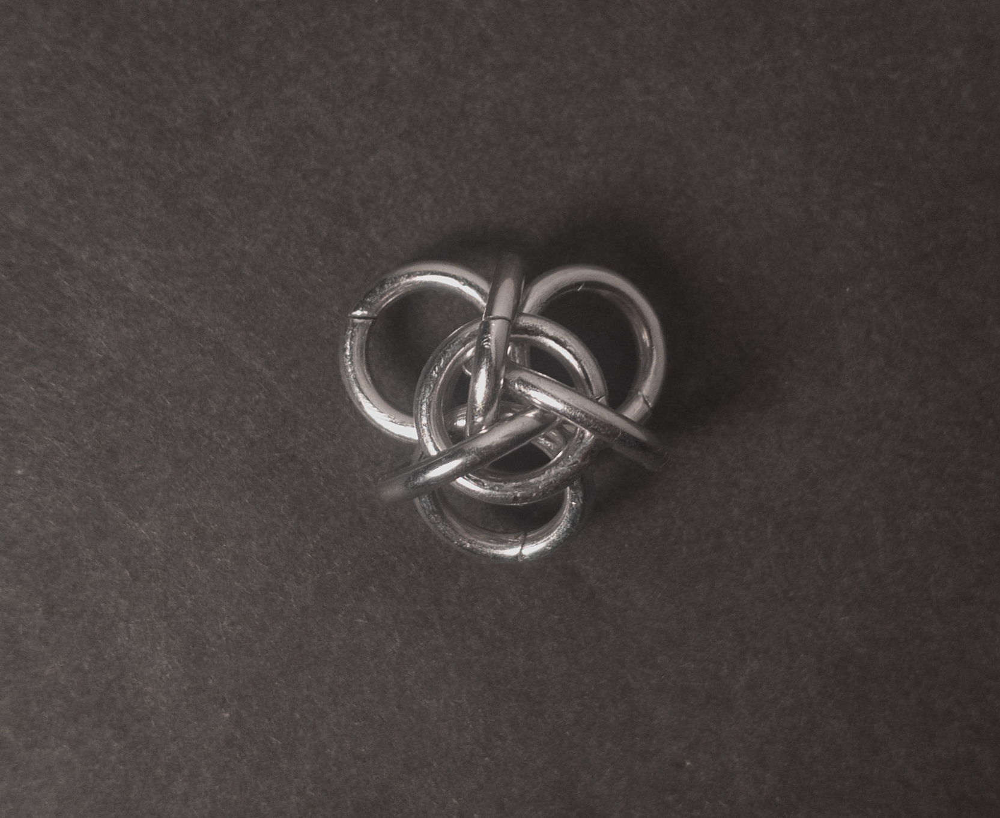
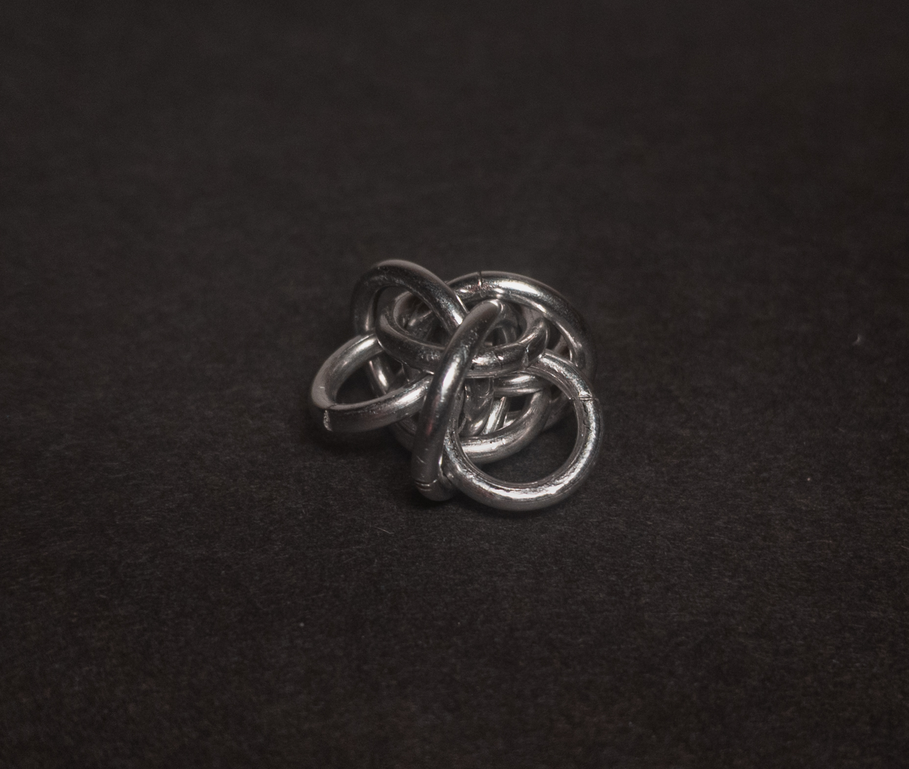
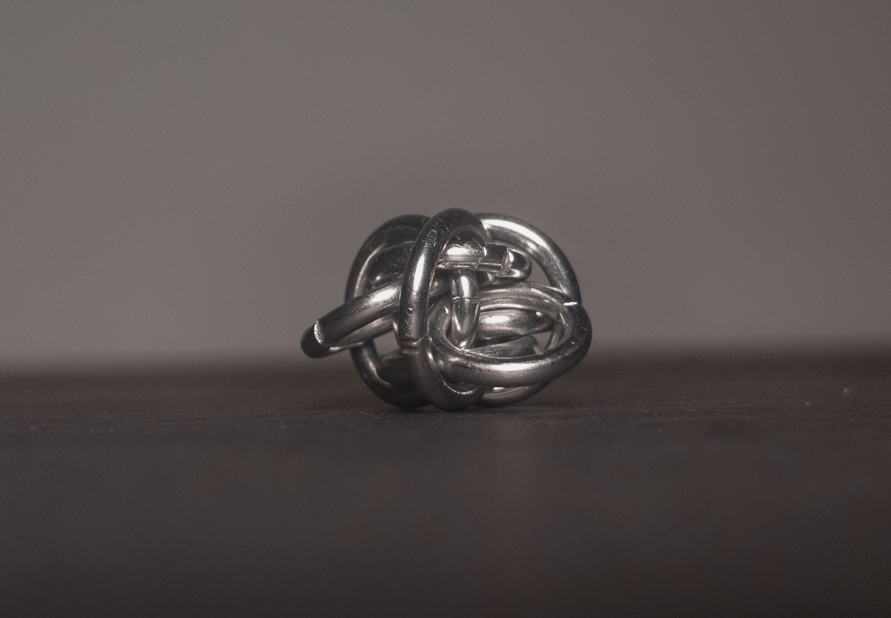
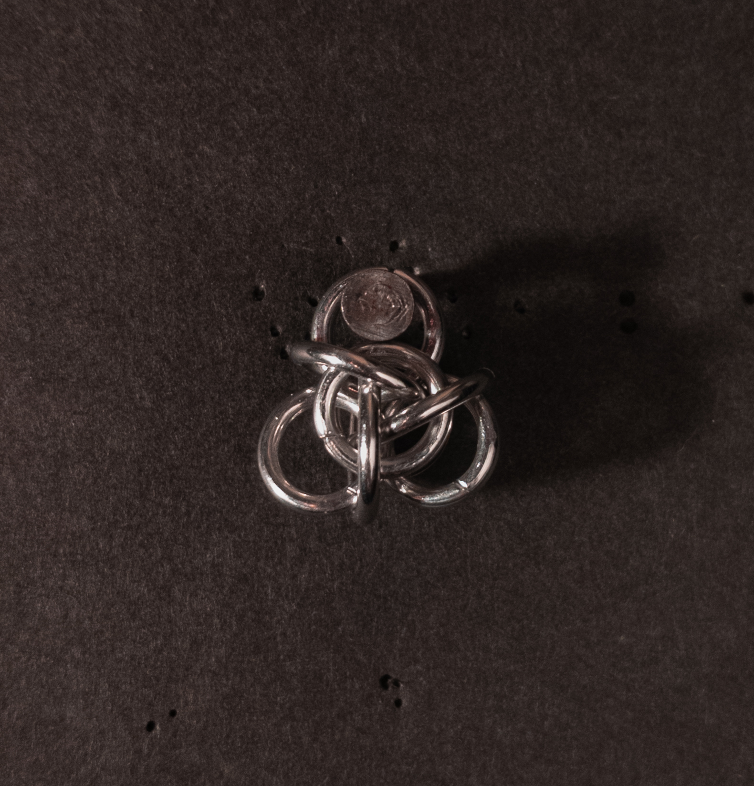
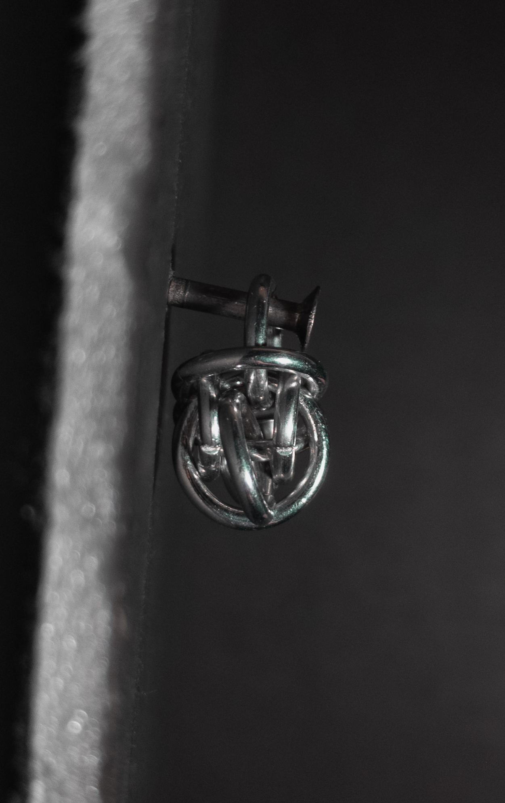
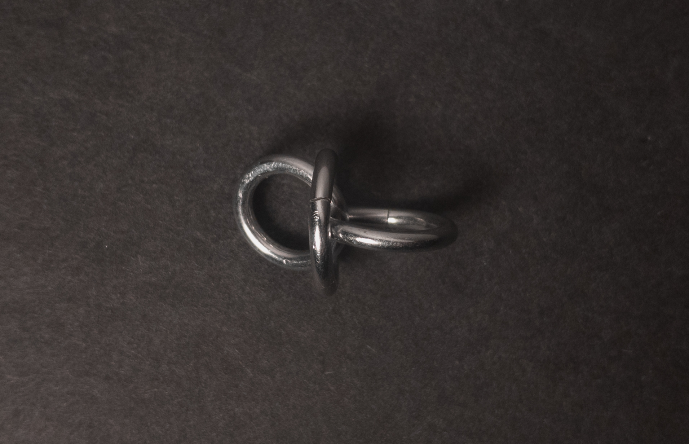
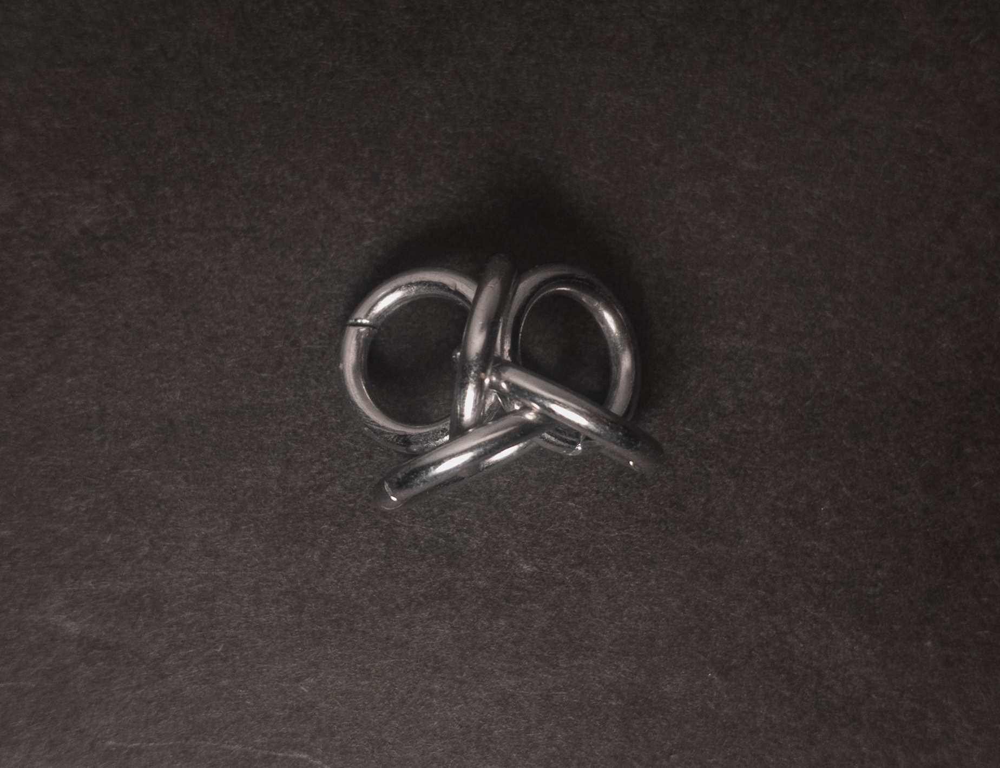
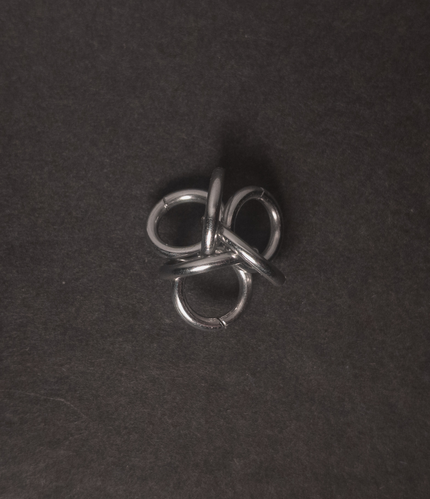

 posted: 2024-11-09 

## Tao 3 Unit

### Overview

While searching [M.A.I.L.](https://www.mailleartisans.org/) for new weaves to try, I came across [Tao 3](https://www.mailleartisans.org/weaves/weavedisplay.php?key=236) by [Bative](https://www.mailleartisans.org/members/memberdisplay.php?key=349). Tao 3 is a chain of complex units joined simply, so this post focuses only on a single Tao 3 unit. M.A.I.L. classifies the unit as a member of the Japanese weave family. If you want to make some units at home, I recommend this [tutorial](https://www.mailleartisans.org/articles/articledisplay.php?key=161) by [Zlosk](https://www.mailleartisans.org/members/memberdisplay.php?key=9).

### Materials

For the sample piece showcased in this post, I used two sizes of rings made from 16 SWG Bright Aluminum wire. The larger rings, which I made myself(bonus post coming soon), have an ID(Inner Diameter) of 8mm for an AR(Aspect Ratio) of 4.9. The smaller rings have an ID of .25in for an AR of 4, purchased from [The Ring Lord](https://theringlord.com/).

<!-- Try again in 4.3/5.5? -->

### Notes

The Tao 3 Unit is moderately complex to understand and somewhat tricky to create if using small rings. Overall, it looks striking, but it can look odd from a profile view. As a unit weave, it works well as a charm, pendant, or in earrings. Additionally, you can make a chain variant by joining pairs of units with small rings connected at the outermost rings. Given the difficulty in making the weave and its unreliable aesthetic appeal, it is hard to recommend you learn it; however, it’s still worth considering.

### Pictures

#### Flat

#### Flat: Angled

#### Flat: Profile

#### Vertical

#### Vertical: Profile

#### In Process

 

 

