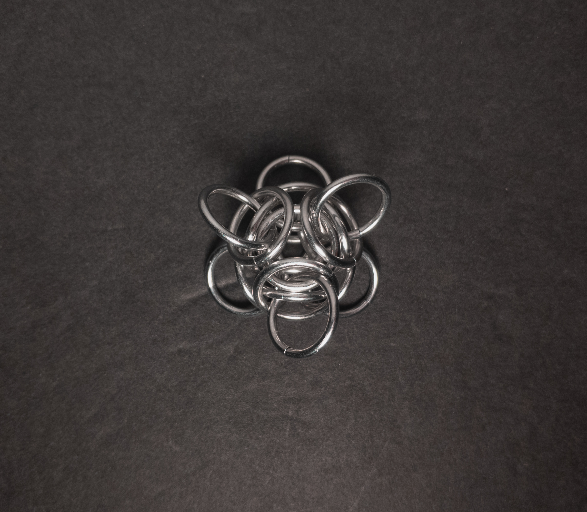
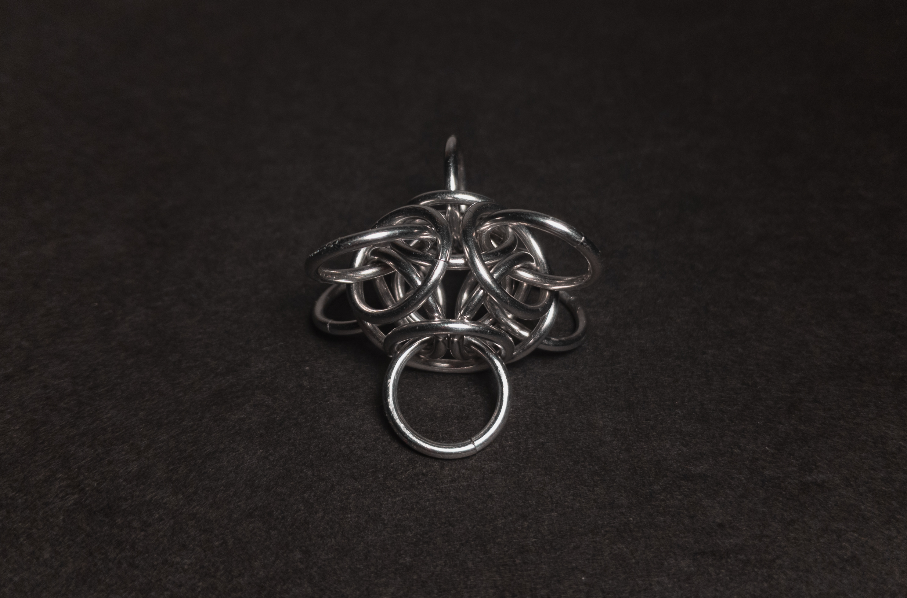
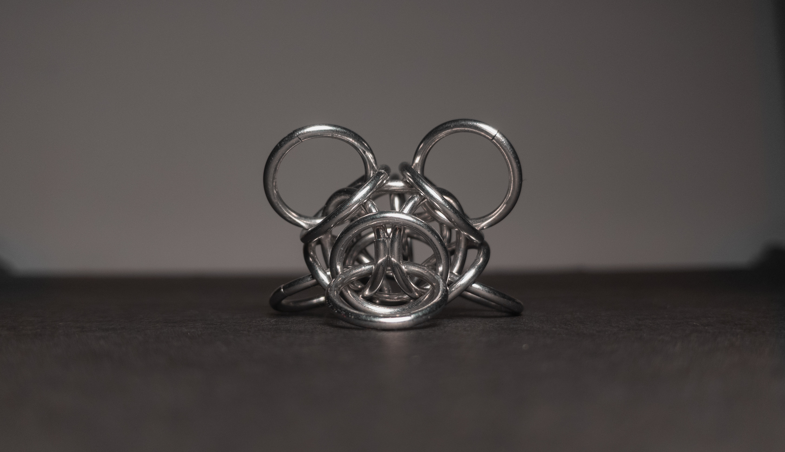
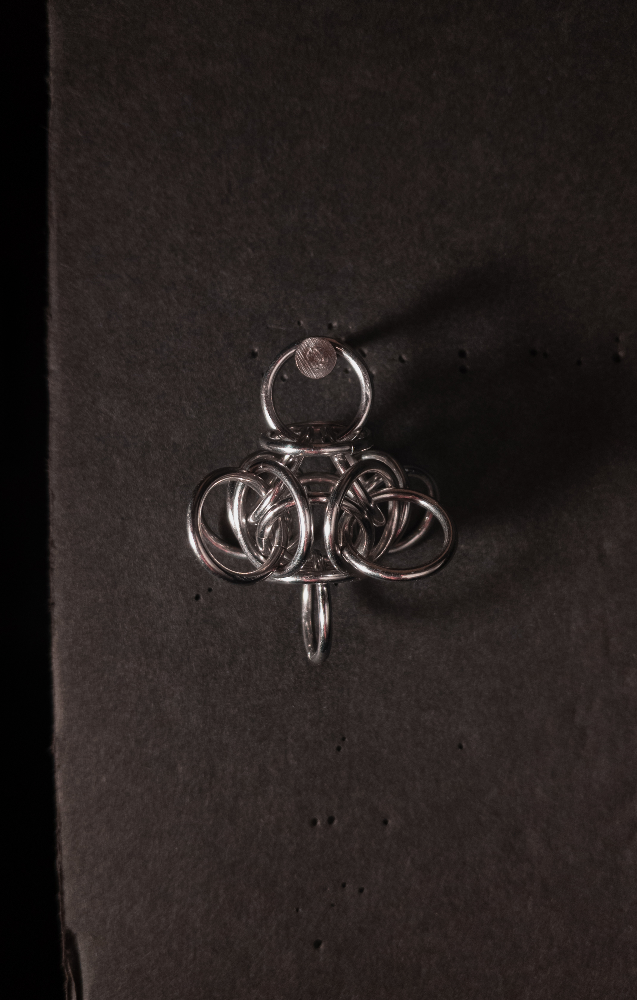
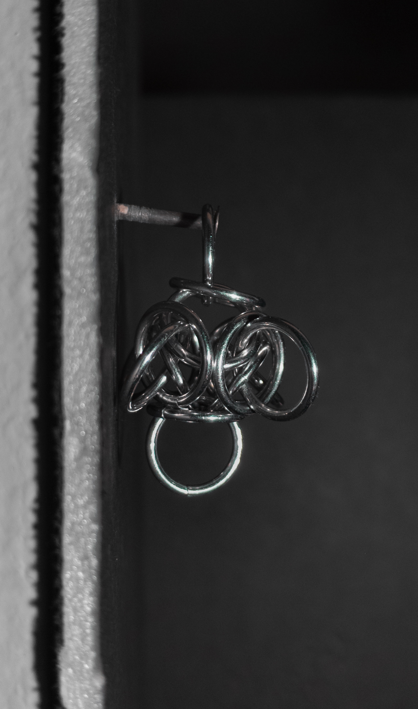
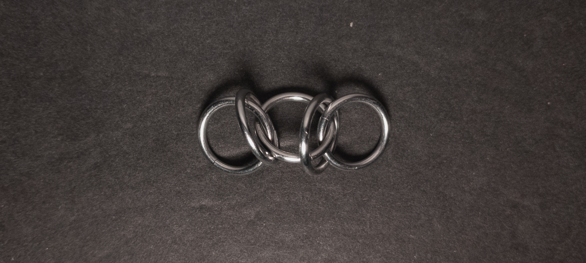
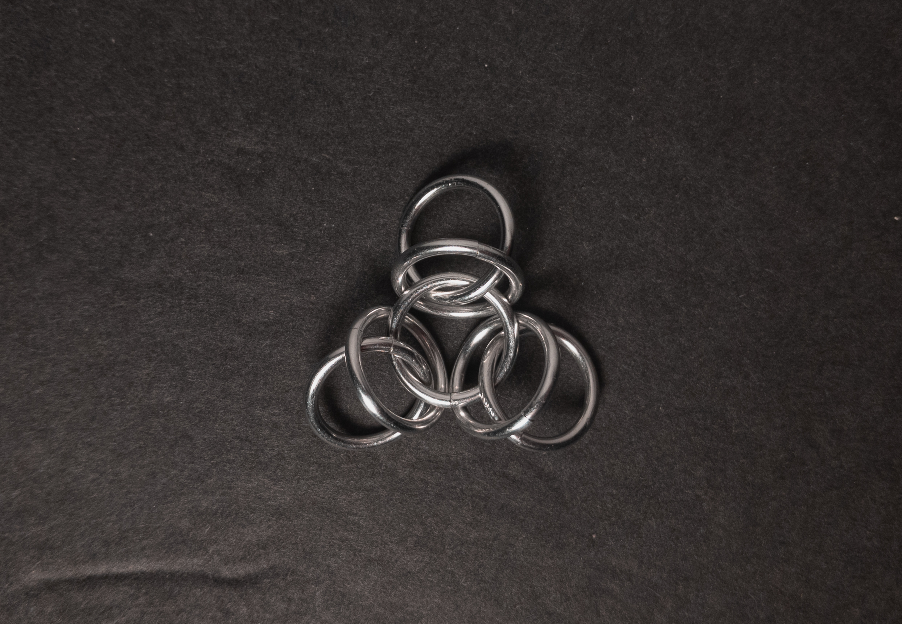
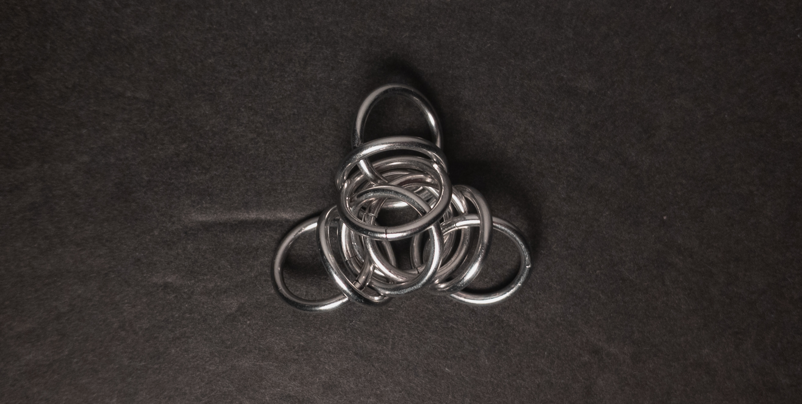

 posted: 2024-12-16 

## Tetra Orb

### Overview

While searching for new weaves, I came across [Tetra Orb](https://www.mailleartisans.org/weaves/weavedisplay.php?key=328) by [Blaise](https://www.mailleartisans.org/members/memberdisplay.php?key=249) on [M.A.I.L.](https://www.mailleartisans.org/). Tetra Orb is a captivating Japanese orbital unit weave derived from [Japanese 3 in 1](japanese_3_in_1.md). If you feel like trying this at home, I suggest this [tutorial](https://www.mailleartisans.org/articles/articledisplay.php?key=300) by [The Mad Mailler](https://www.mailleartisans.org/members/memberdisplay.php?key=2244).

### Materials

For the sample piece showcased in this post, I made the rings myself (bonus post coming soon if you are interested). I used 16 SWG Bright Aluminum wire from [The Ring Lord](https://theringlord.com/) coiled around a 10mm mandrel for an approximate aspect ratio of 6.15.

### Notes

The Tetra Orb weave is simple to understand and generally easy to create; however, adding the last three orbital rings can be difficult. I found it helpful to guide the edge locking ring through the orbital ring, through the edge of the tetrahedron, and finally back out through the orbital ring. You could also add the orbital ring after the edge locking ring. In my opinion, the weave looks especially aesthetically pleasing. As a unit weave, it is best suited for use as a standalone ornament, in earrings, pendants, or as a charm. I believe the name originates from the internal structure, which resembles a tetrahedron trapped in an "orb" of orbital rings. I highly suggest learning how to make this fun and captivating weave.

### Pictures

#### Flat

#### Flat: Angled

#### Flat: Profile

#### Vertical

#### Vertical: Profile

#### In Process

 

 

