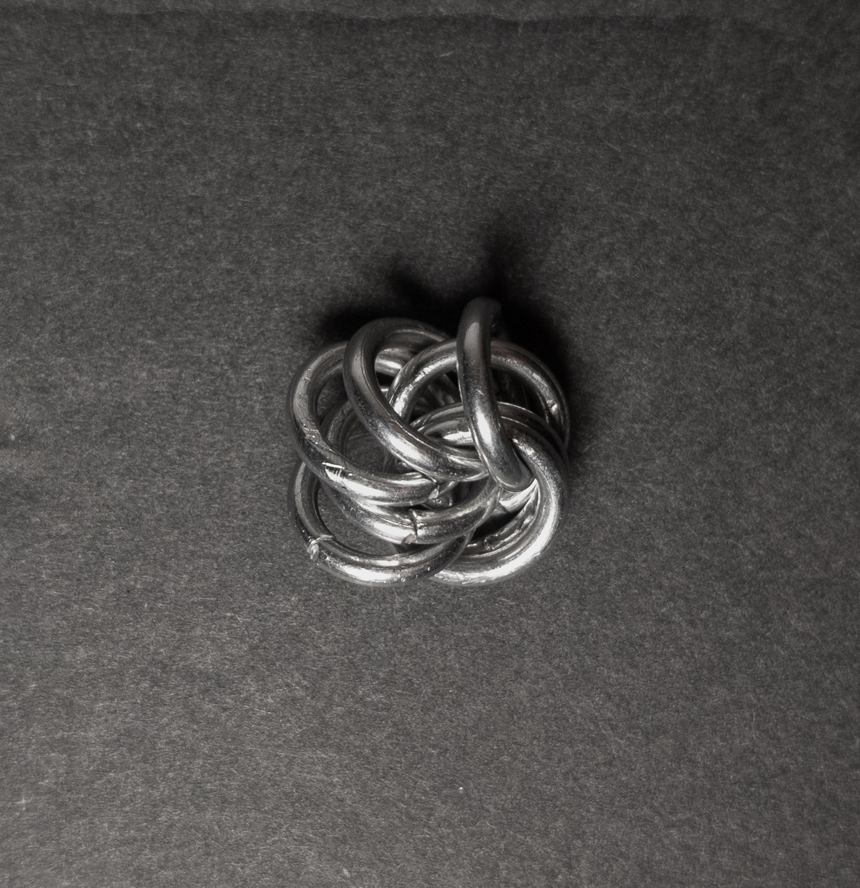
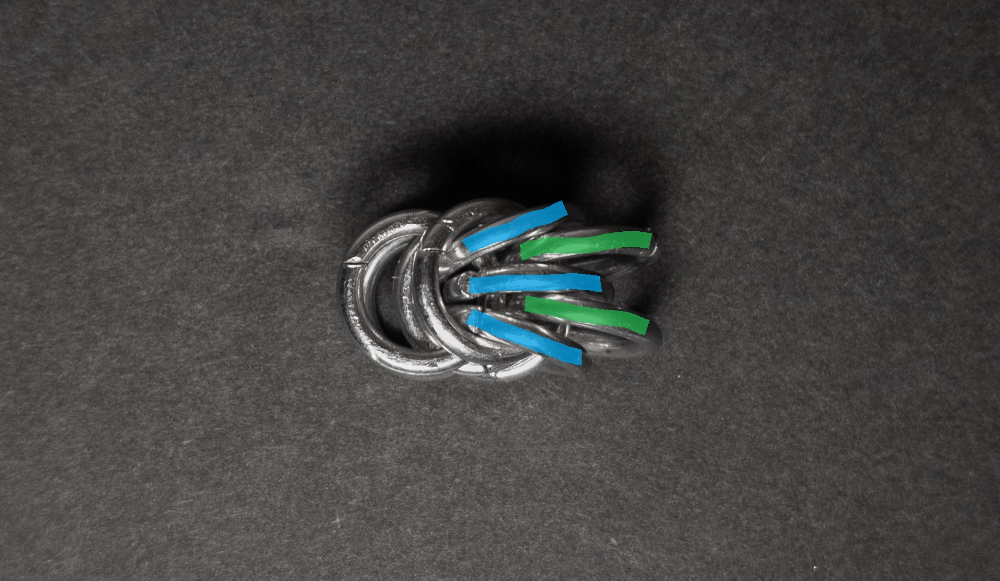
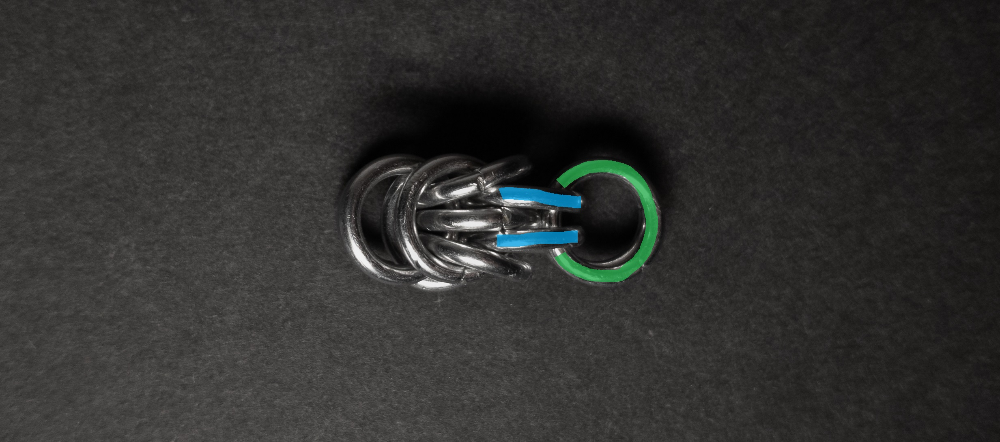
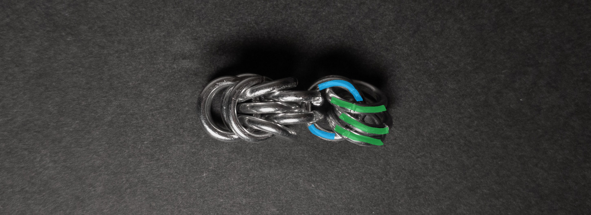
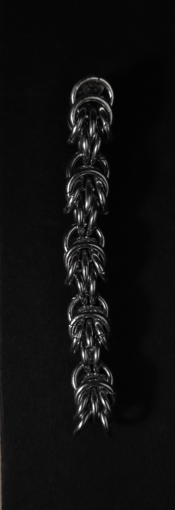
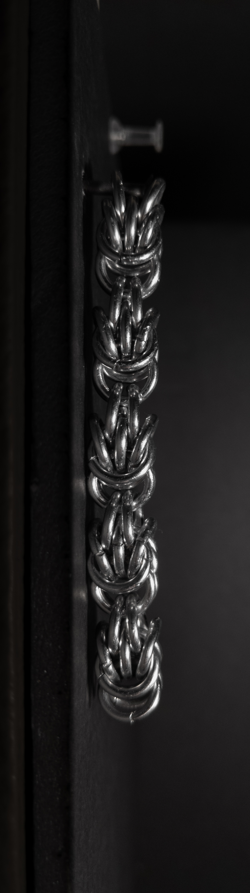
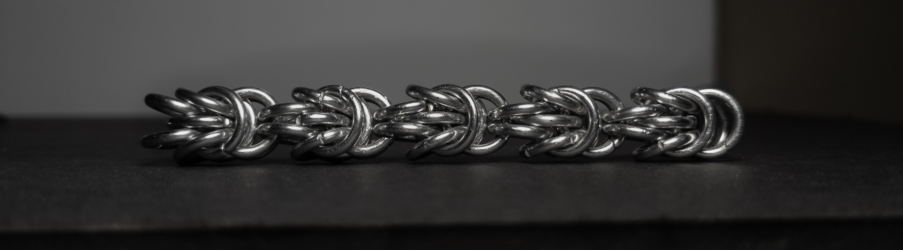
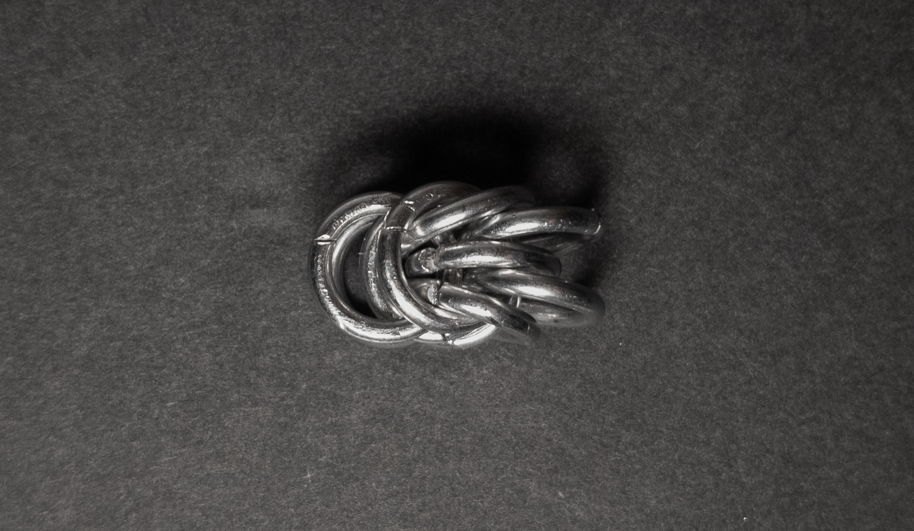
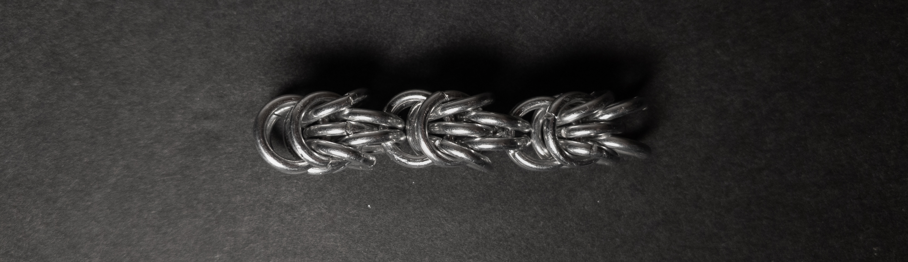
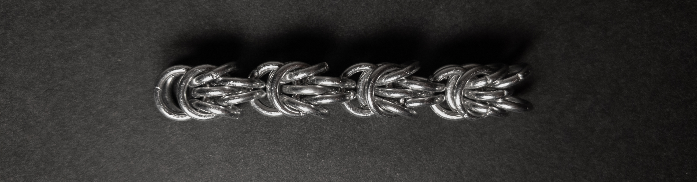

 posted: 2023-10-22 

## Trees

### Overview

While searching [M.A.I.L.](https://www.mailleartisans.org/) for the next new weave to try, I found [Trees](https://www.mailleartisans.org/weaves/weavedisplay.php?key=361) by [Tal](https://www.mailleartisans.org/members/memberdisplay.php?key=1226). Trees is a variant of [Trizantine](trizantine.md) made of half units all facing the same direction. Unfortunately, no tutorial was available, so I have included a tutorial for those interested in making it themselves.

### Materials

For the sample piece showcased in this post, I used Bright Aluminum rings purchased from [The Ring Lord](https://theringlord.com/). The rings are 16 SWG with a 1/4" internal diameter, resulting in an aspect ratio of 4.03.

### Tutorial

1. Start with 3 rings through 5 closed rings as shown below:
 
    

2. Next, add two new rings(green in the image below) through the top, middle, and bottom rings of the 5 rings from step 1 while ensuring that each new ring is between two of 3 rings from step 1(blue in the image below) as shown below:

    

3. Now add two new rings(green in image below) through the 2 rings added in step 2(blue in image below) as shown below:

    

4. Add three new rings(green in image below) through the 2 rings added in step 3(blue in image below) as shown below:

    

5. Add a single ring(green in image below) around the three rings from step 4(yellow in image below) and between the two rings from step 3(blue in image below) as shown below:

    

6. Add two rings(green in image below) through just the three rings from step 4(blue in image below), one to either side of the ring from step 5(yellow in image below) as shown in the image below:

    

7. Add two rings(green in image below) through the rings from steps 5 and 6(blue in image below) between the rings from step 4(yellow in image below) as shown in the image below:

    

8. Repeat steps 3 through 7 to add a new unit.

### Notes

The Trees weave presents a moderate level of complexity regarding understanding its structure. It is also somewhat complex to create, with one particularly challenging step (step 5). It's worth noting that using rings with an aspect ratio of 4.03 can result in an extremely tight and stiff weave, which may not be ideal. However, the resulting weave boasts an appealing appearance regardless of its orientation. Given its qualities as a well-constructed chain with a square cross-section, Trees is suitable for various applications, including bracelets, chokers, necklaces, and thick cord. Considering its neatness and versatility, I highly recommend learning how to create this weave.

### Pictures

#### Vertical

#### Vertical: Profile

#### Flat

#### Flat: Profile

#### In Process

 

 

 

