 posted: 2023-11-26 

## Treezantine

### Overview

While searching [M.A.I.L.](https://www.mailleartisans.org/) for new weaves to try out, I came across [Treezantine](https://www.mailleartisans.org/weaves/weavedisplay.php?key=833) by [jfair314](https://www.mailleartisans.org/members/memberdisplay.php?key=10361). Treezantine is a variant of [Trees](trees.md) that uses a [Byzantine](byzantine.md) half unit to ensure the weave looks the same both head-on and in profile. I have included a tutorial for those interested in trying this weave themselves, as no tutorial was available.

### Materials

For the sample piece showcased in this post, I used Bright Aluminum rings purchased from [The Ring Lord](https://theringlord.com/). The rings are 16 SWG with a 1/4" internal diameter, resulting in an aspect ratio of 4.03.

### Tutorial

1. Start with 1 ring through 2 closed rings as shown below:

    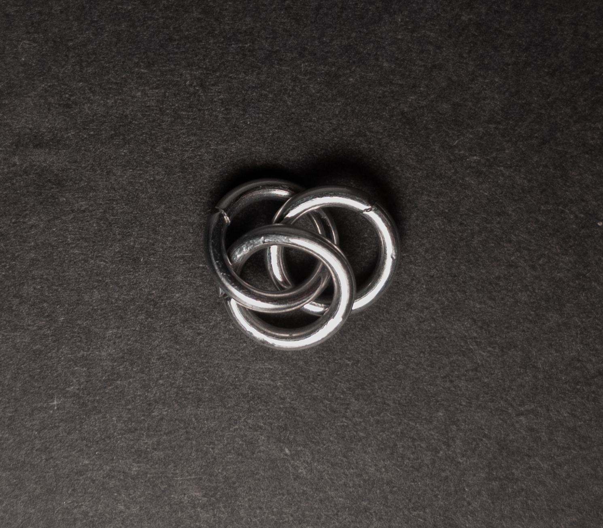

2. Add 3 rings(green in the image below) through the 2 rings from step 1(blue in the image below). When done, it should look something like this:

    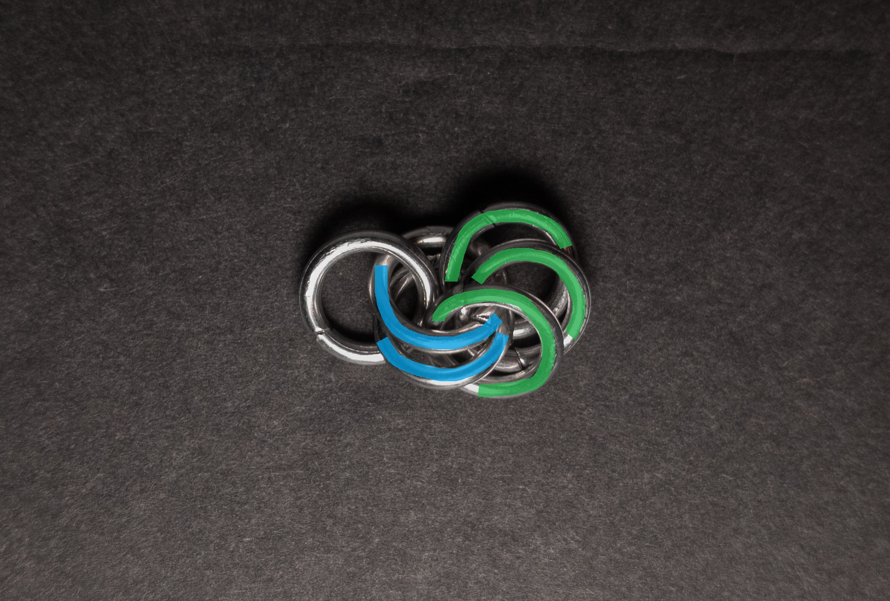
    
3. Add 2 rings(green in the image below) through the 3 rings from step 2(blue in the image below). When done, it should look something like this:

    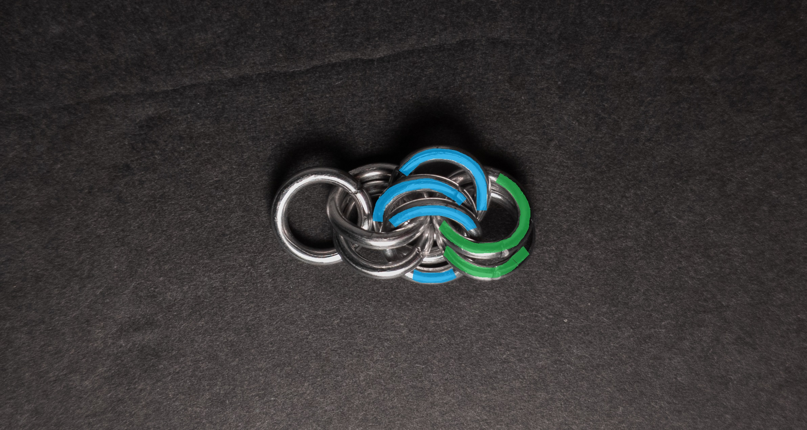

4. Fold the two rings from step 3(blue in the image below) backwards(towards the start of the weave), then add 2 new rings(green in the image below) through them, with each ring between 2 of the 3 rings from step 2(yellow in the image below). When done, it should look something like this:

    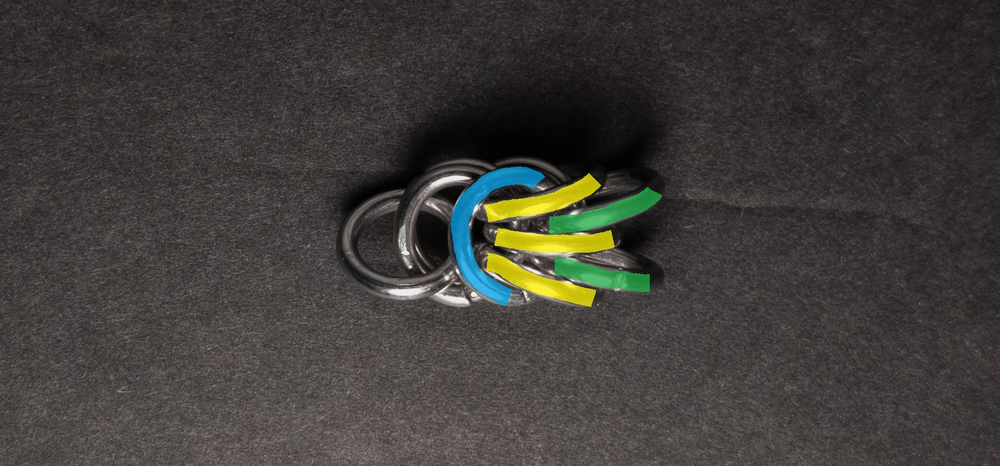

5. Repeat steps 2 through 4 to add a new half-unit. Repeat this until you are happy with the length of your chain

### Notes

Treezantine is a somewhat straightforward weave, both in terms of understanding its structure and the process of creating it. While it involves a step per unit that may present some initial challenges, the result is visually appealing. Thanks to its square cross-section, it lends itself well to many applications, such as bracelets, necklaces, and even cords. The name of the weave seems to be a clever combination of "Trees" and "Byzantine," hinting at its composition from these two foundational weaves. For those interested in expanding their repertoire of chainmail techniques, learning how to create Treezantine is highly recommended.

### Pictures

#### Flat

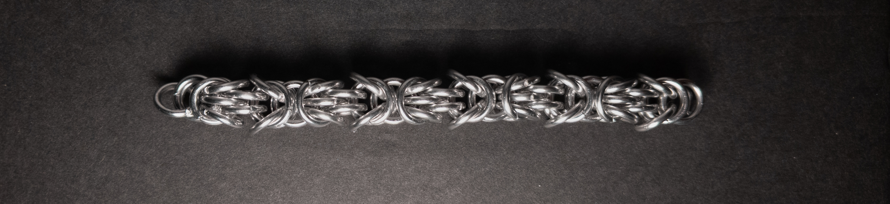

#### Flat: Profile

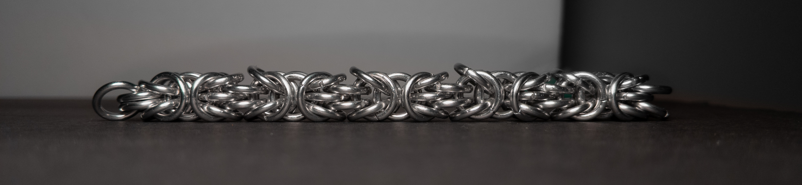

#### Vertical

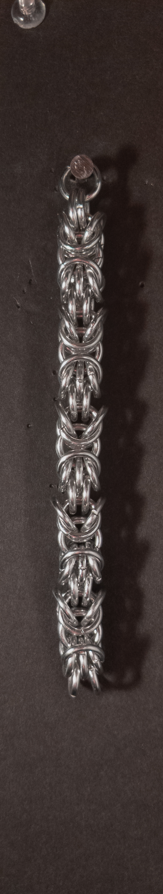

#### Vertical: Profile

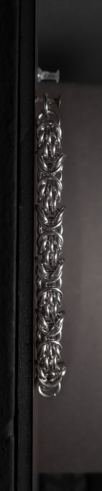

#### In Process

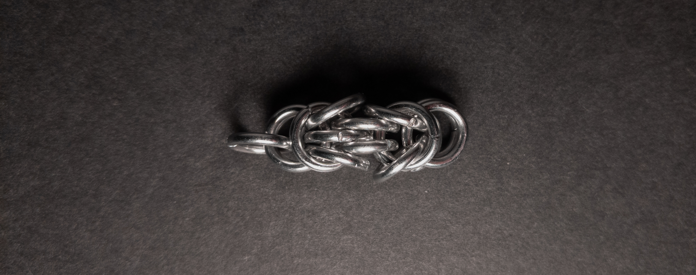

 

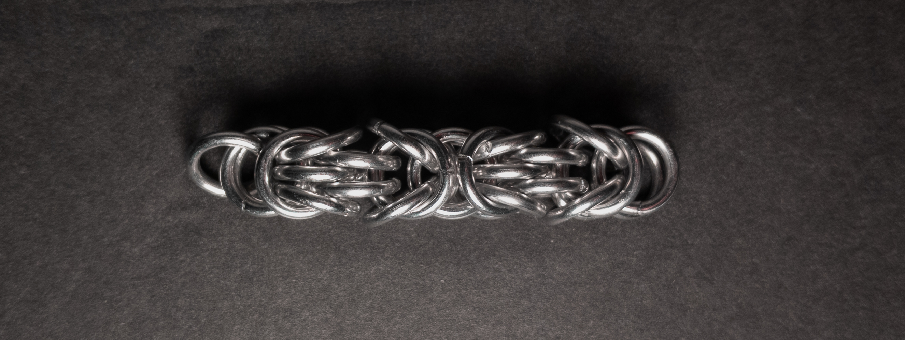

 

 

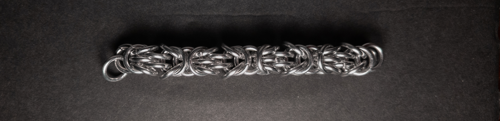
