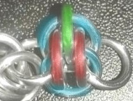
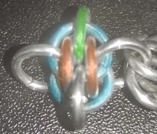
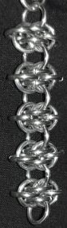
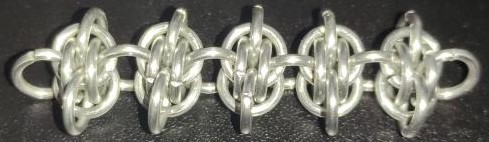
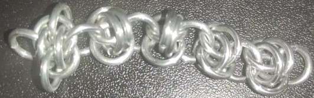
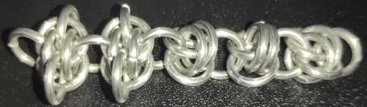
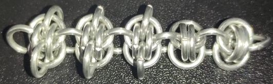
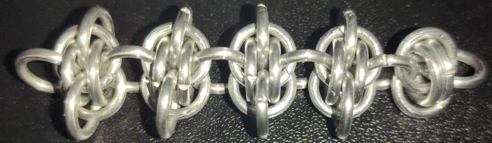

 posted: 2023-03-26 

## Triton

### Overview

Recently I found an interesting [picture](https://www.mailleartisans.org/gallery/gallerydisplay.php?key=9003) of a modification of the [Barrel](barrel_weave.md) weave called Triton by [Snjezna](https://www.mailleartisans.org/members/memberdisplay.php?key=26945) on the Barrel weave's [M.A.I.L.](https://www.mailleartisans.org/) page. Triton is a spiky and 'punk-esque' variation of Barrel; I recommend trying it out.

### Materials

The rings used for the sample piece shown in this post are 16 SWG with a 1/4" internal diameter for an aspect ratio of 4.03 made of Bright Aluminum that I bought from the [Ring Lord](https://theringlord.com/).

### Tutorial

This tutorial covers how to turn a Barrel unit into a Triton unit.

1. Take one ring(green) and place it through the tops of both flat rings(blue) and between the vertical rings(red) of the barrel segment.

2. Turn the piece around and take another ring(green) and place it through the tops of both flat rings(blue) and between the vertical rings(red) of the barrel segment.

Repeat these steps for each Barrel unit you wish to convert.

### Notes

Triton is a small step up in difficultly from Barrel weave. The sample piece shown in this post is quite tight due to being made with rings whose AR is 4.03 rather than the 4.19 used in the original picture. However, even with the each segment being very tight, the overall weave is still loose enough  for use in bracelets and neclaces. Wile Triton uses more material per inch than Barrel, it is still quite efficent and thus budget-friendly. Overall, Triton is a fun and novel weave that I recommend trying out some time.

### Pictures

#### Vertical

#### Flat

#### In Process

 

 

 

