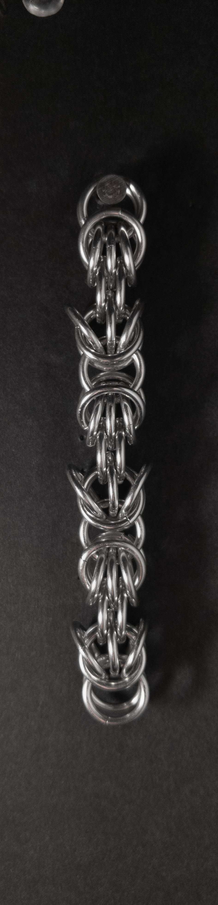
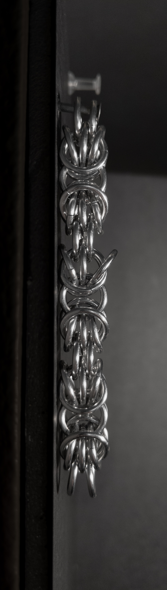
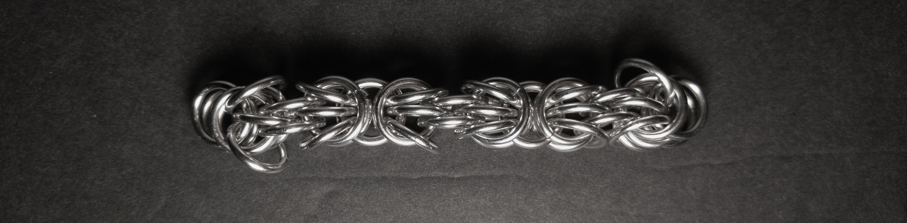
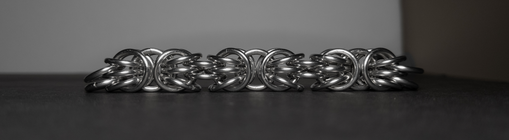
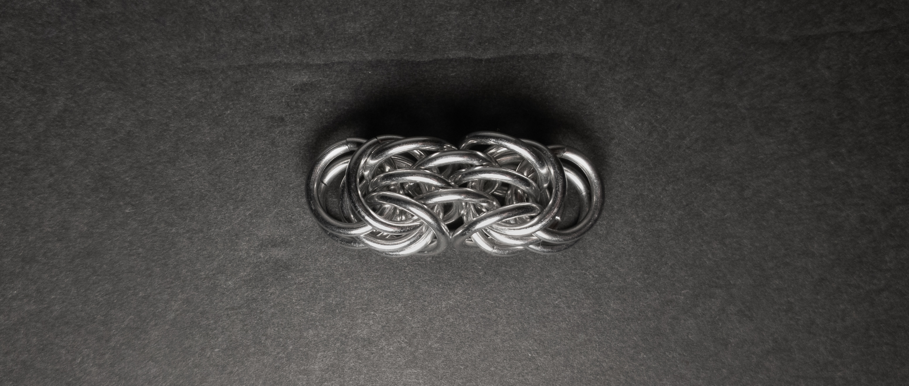

 posted: 2023-10-15 

## Trizantine

### Overview

While browsing [MA.I.L.](https://www.mailleartisans.org/) for new weaves, I came across [Trizantine](https://www.mailleartisans.org/weaves/weavedisplay.php?key=1) by [Derakon](https://www.mailleartisans.org/members/memberdisplay.php?key=233). Trizantine is an interesting modification of the [Byzantine](byzantine.md) weave that occurs when adding additional rings between the rings joining the units. If you want to follow along and try making it yourself, I recommend this [tutorial](https://www.mailleartisans.org/articles/articledisplay.php?key=338) by [Tesserex](https://www.mailleartisans.org/members/memberdisplay.php?key=1705).

### Materials

For the sample piece showcased in this post, I made the rings myself (bonus post coming soon if you are interested). I used 16 SWG Bright Aluminum wire from [The Ring Lord](https://theringlord.com/) coiled around an 8mm mandrel for an approximate aspect ratio of 4.9.

### Notes

The Trizantine weave is moderately complex, both to understand and create. Its aesthetic appeal is notable, although its loose nature can make it somewhat challenging to maintain its shape effectively. Using the rings I had on hand; I made the weave using an aspect ratio of 4.9 rather than the recommended 5.2. Even though my rings were tighter than recommended, I still found the weave very loose. As a chain with a square cross-section, Trizantine is well-suited for various applications, including bracelets, necklaces, and even as a general-purpose cord. However, it's worth mentioning that crafting Trizantine can be resource-intensive, requiring a significant number of rings for each unit. I highly recommend learning this weave if you like the Byzantine weave and are looking for a fun modification.

### Pictures

#### Vertical

#### Vertical: Profile

#### Flat

#### Flat: Profile

#### In Process

 

