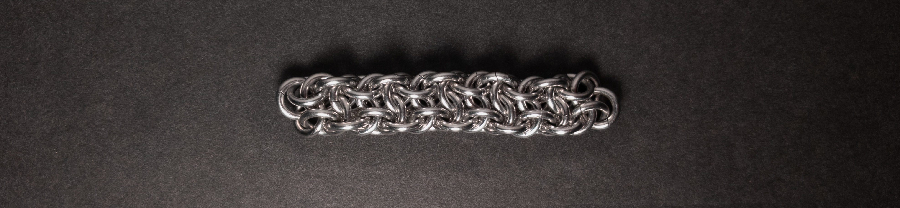
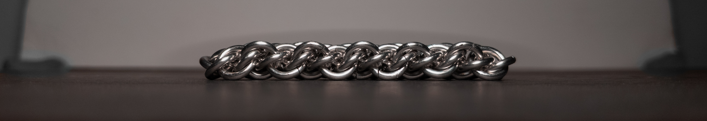
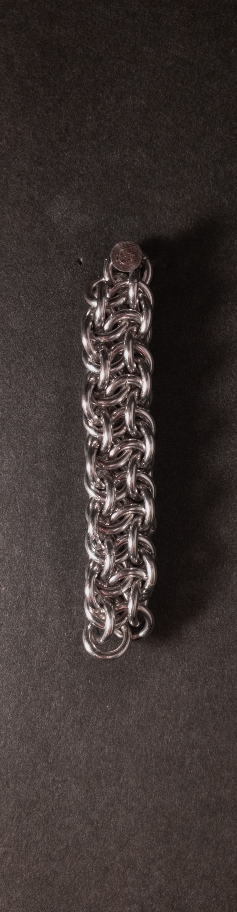
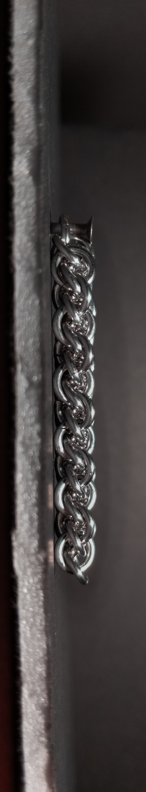
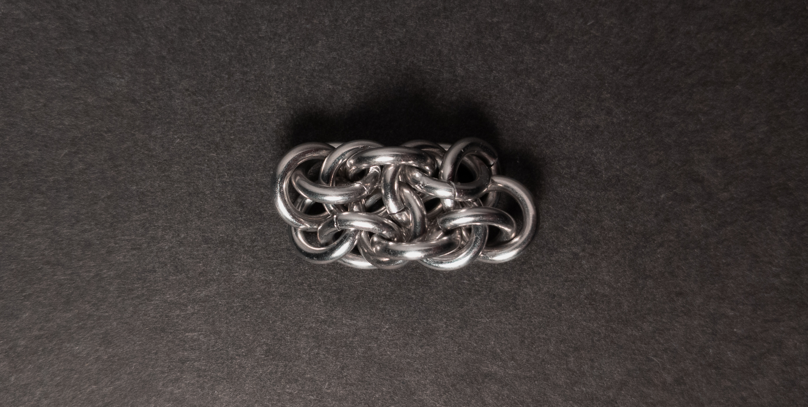
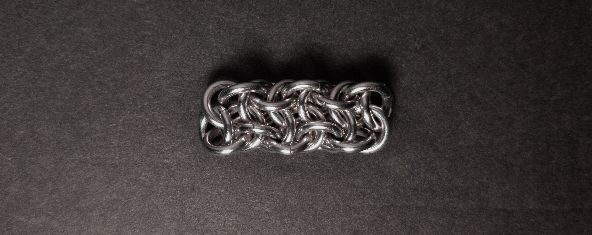
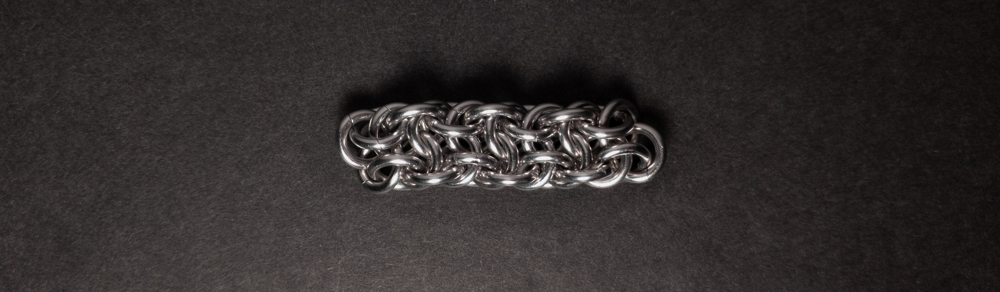
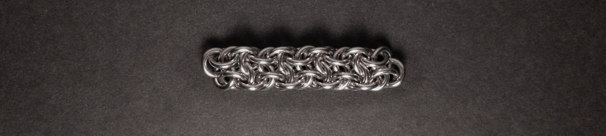

 posted: 2024-01-14 

## Vipera Beerus

### Overview

When first starting to learn new chainmail weaves, I came across [Vipera Beerus](https://www.mailleartisans.org/weaves/weavedisplay.php?key=471) by [Loke](https://www.mailleartisans.org/members/memberdisplay.php?key=1722); however, I didn't have the skills or materials to make it at that time. I recently came across it again while checking [M.A.I.L.](https://www.mailleartisans.org/) for more weaves to try out, and decided to give it another try now that I have more skills and resources. If you would like to try making this at home, this [tutorial](https://www.mailleartisans.org/articles/articledisplay.php?key=343) by [MaxumX](https://www.mailleartisans.org/members/memberdisplay.php?key=949) should prove helpful.

### Materials

For the sample piece showcased in this post, I made the rings myself (bonus post coming soon if you are interested). I used 16 SWG Bright Aluminum wire from [The Ring Lord](https://theringlord.com/) coiled around a 5mm mandrel for an approximate aspect ratio of 3.1.

### Notes

The Vipera Beerus weave combines simplicity in understanding with a moderate level of challenge in its creation. While it is aesthetically pleasing, the weaving process can be somewhat demanding due to the time required for stabilization and the small, intricate rings involved. The weave's flat rectangular cross-section makes it well-suited for bracelets and chokers, although its narrow width may limit its use as a band. When working on closures, I suggest closing the rings on the side away from the center, providing more room for pliers. While Vipera Beerus is an enticing weave, its complexity makes it more suitable for experienced mailers or those with significant patience.

### Pictures

#### Flat

#### Flat: Profile

#### Vertical

#### Vertical: Profile

#### In Process

 

 

 

