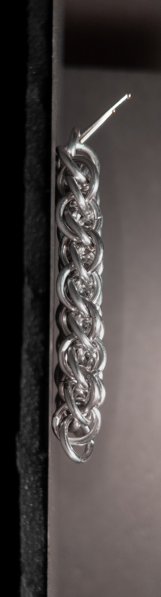
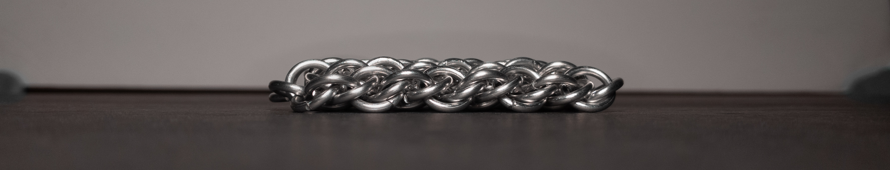
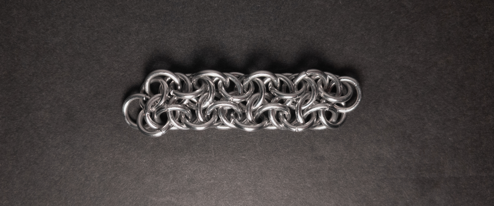
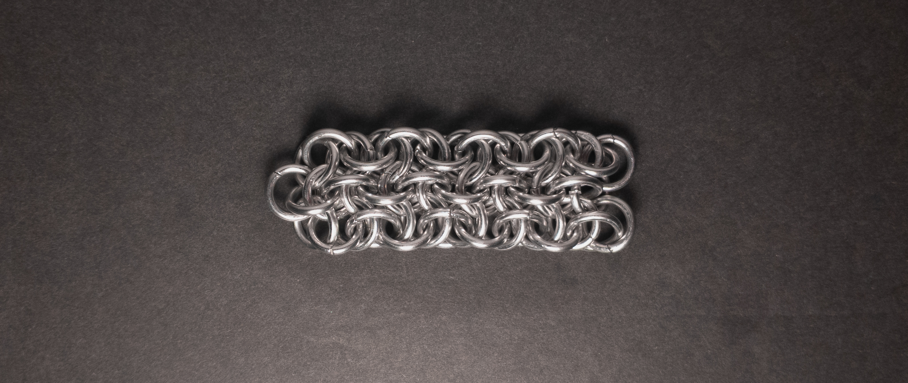
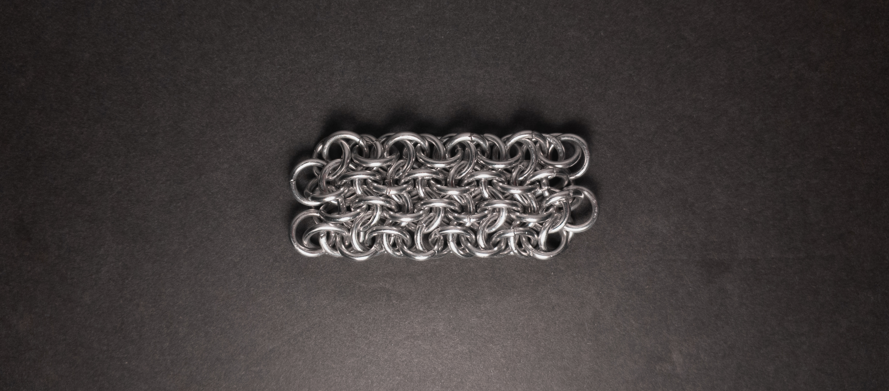

 posted: 2024-01-21 

## Vipera Beerus Sheet

### Overview

When I found [Vipera Beerus](vipera_beerus.md) on [M.A.I.L.](https://www.mailleartisans.org/) I also found [Vipera Beerus Sheet](https://www.mailleartisans.org/weaves/weavedisplay.php?key=473) also created by [Loke](https://www.mailleartisans.org/members/memberdisplay.php?key=1722). Vipera Beerus Sheet is simply the sheet expansion of Vipera Beerus. If you are interested in this weave and wish to follow along at home, this [tutorial](https://www.mailleartisans.org/articles/articledisplay.php?key=619) by [NetStormer](https://www.mailleartisans.org/members/memberdisplay.php?key=15228) should be incredibly helpful.

### Materials

For the sample piece showcased in this post, I used Bright Aluminum rings purchased from [The Ring Lord](https://theringlord.com/). The rings are 16 SWG with a 1/4" internal diameter, resulting in an aspect ratio of 4.03.

### Notes

The Vipera Beerus Sheet weave is somewhat complex both to understand and create. However, the fact that the core of the pattern is short alleviates some difficulty. Additionally, it's important to note that constructing this weave is time-consuming. Despite not reaching the aesthetic appeal of Vipera Beerus, the sheet still possesses a pleasing appearance. As a sheet weave, it offers versatility for various applications, including bracelets, chokers, straps, and even as a sturdy fabric or cloth. Balancing its complex and time-consuming nature against how fun and versatile it is, I recommend this weave to more experienced mailers who have time time to invest in this weave.

### Pictures

#### Vertical

#### Vertical: Profile

#### Flat

#### Flat: Profile

#### In Process

 

 

