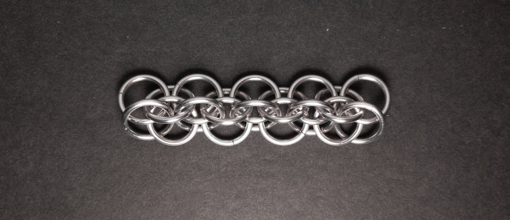

 posted: 2024-07-07 

## Windmill

### Overview

While checking [M.A.I.L.](https://www.mailleartisans.org/) for new weaves to try out, I came across [Windmill](https://www.mailleartisans.org/weaves/weavedisplay.php?key=122) by [sakredchao](https://www.mailleartisans.org/members/memberdisplay.php?key=21). Windmill is a variant of [European 4-in-1](european_4_in_1.md) that borrows some ideas from [Box Chain](box_chain.md). If you want to follow along, I recommend this [tutorial](https://artofmakingthings.com/articles/windmill-weave-tutorial) by [Simon Livingston](https://artofmakingthings.com/author/p9cnoqm5).

### Materials

For the sample piece showcased in this post, I made the rings myself (bonus post coming soon if you are interested). I used 16 SWG Bright Aluminum wire from [The Ring Lord](https://theringlord.com/) coiled around a 9mm mandrel for an approximate aspect ratio of 5.5.

### Notes

The windmill weave presents a moderate challenge; thankfully, comprehension is made easier by the tutorial's provision of various angles for the most intricate step. However, its complexity primarily arises from incorporating a second ring into each group of four. I found it worked best to start adding the ring to the pair lacking a second ring and adjusted the direction of opening my rings to streamline the process. In my opinion, the weave looks nice when [flat and upside-down](#flat---bottom); however, its aesthetic appeal diminishes in other orientations. As a chain weave, it finds suitability in crafting bracelets, necklaces, and cords. However, I advise caution when using it as a cord due to its profile with small sides that can feel sharp. Considering the effort required to master the weave and its generally average aesthetics, I would advise against learning it unless it aligns with your aesthetic sense or a specific project requirement.

### Pictures

#### Flat - Top

#### Flat - Bottom

#### Flat: Profile - Top

#### Flat: Profile - Bottom

#### Vertical - Top

#### Vertical - Bottom

#### Vertical: Profile - Top

#### Vertical: Profile - Bottom

#### In Process

 

 

 

