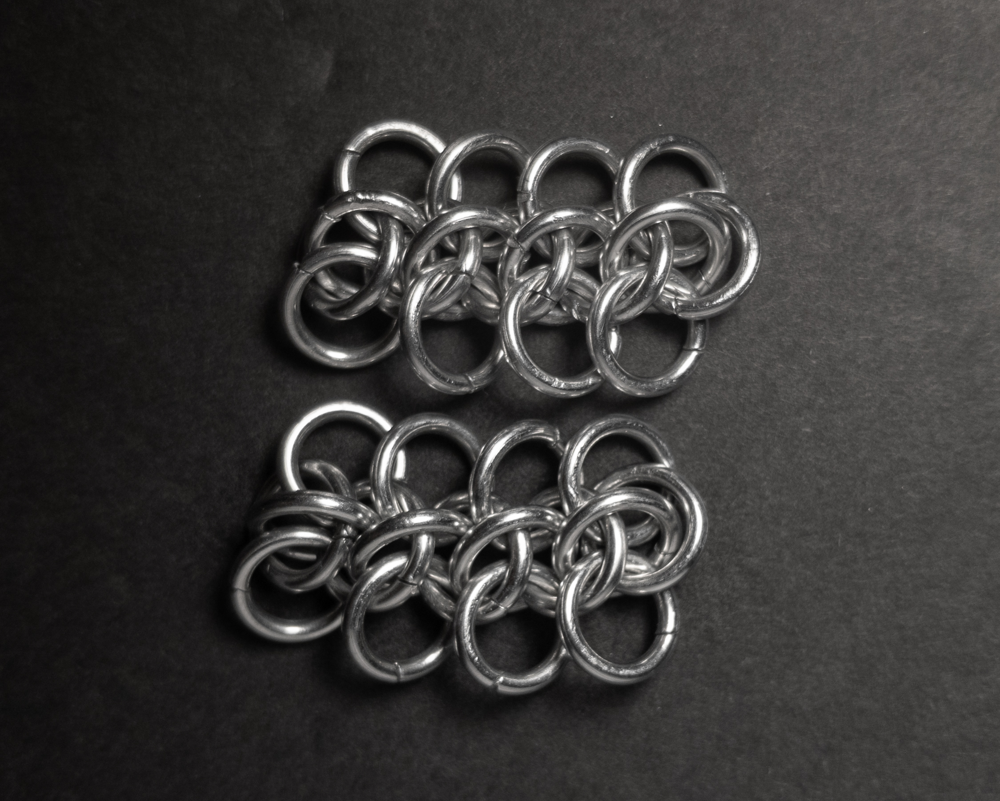
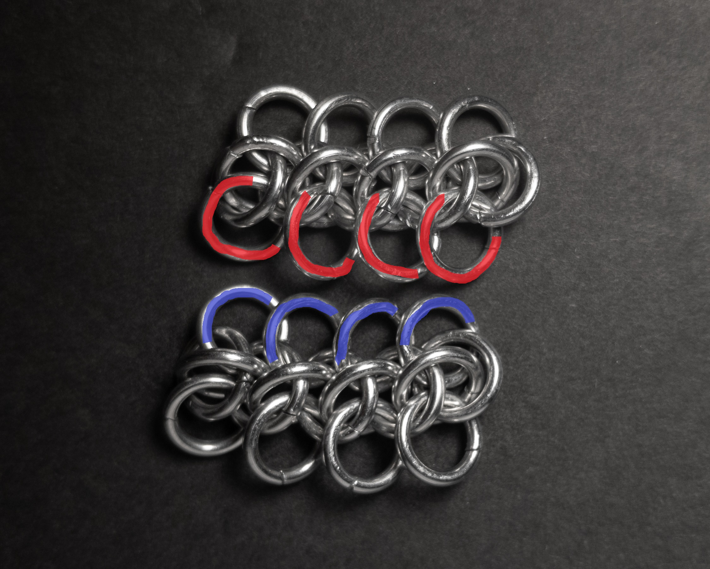
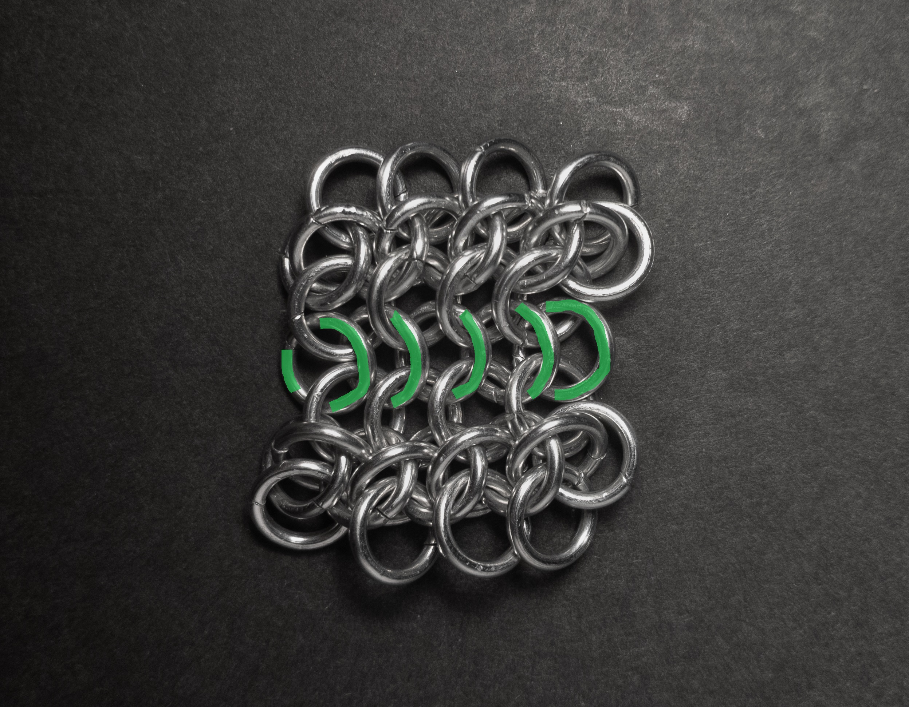
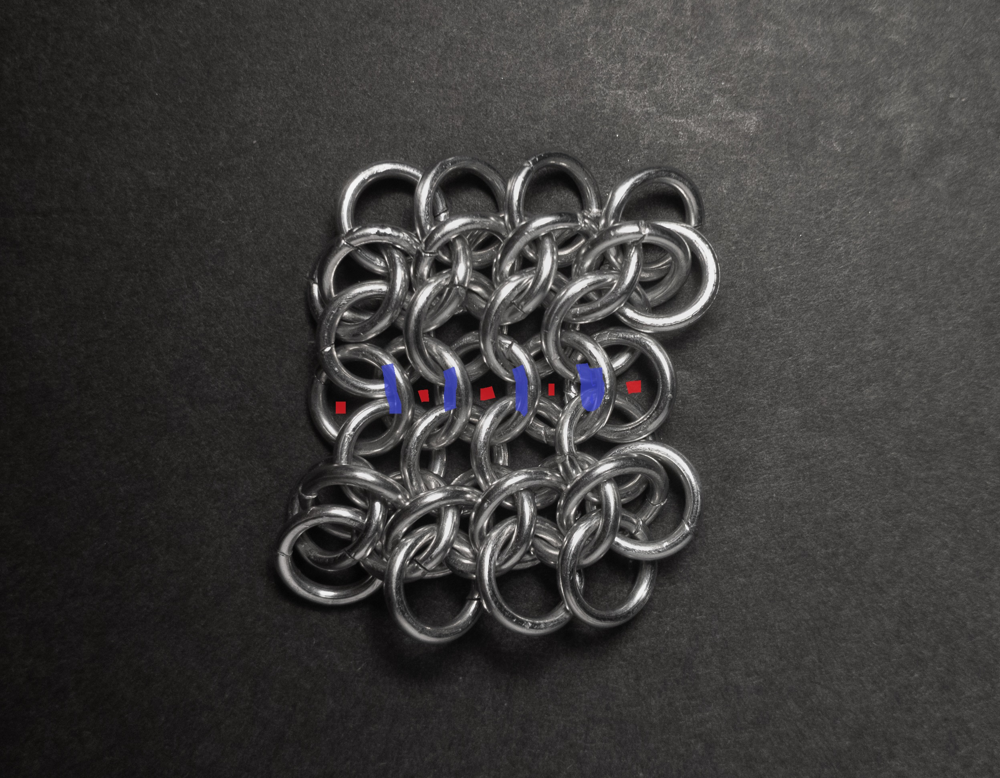
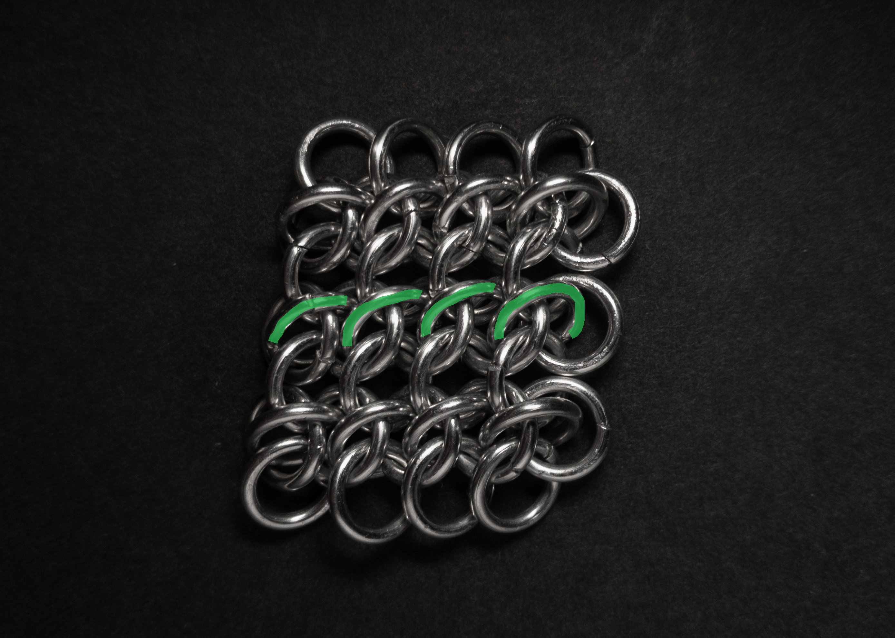
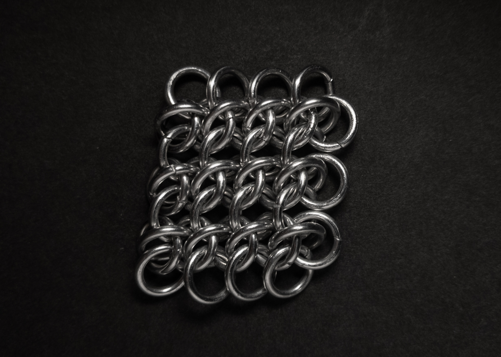
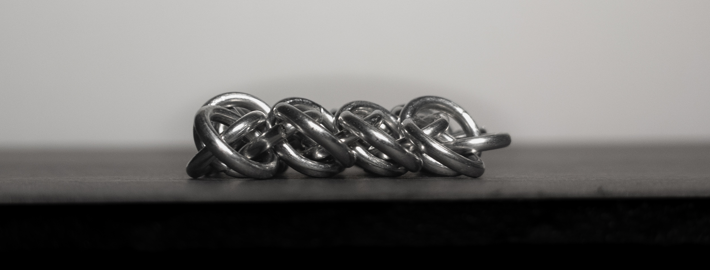
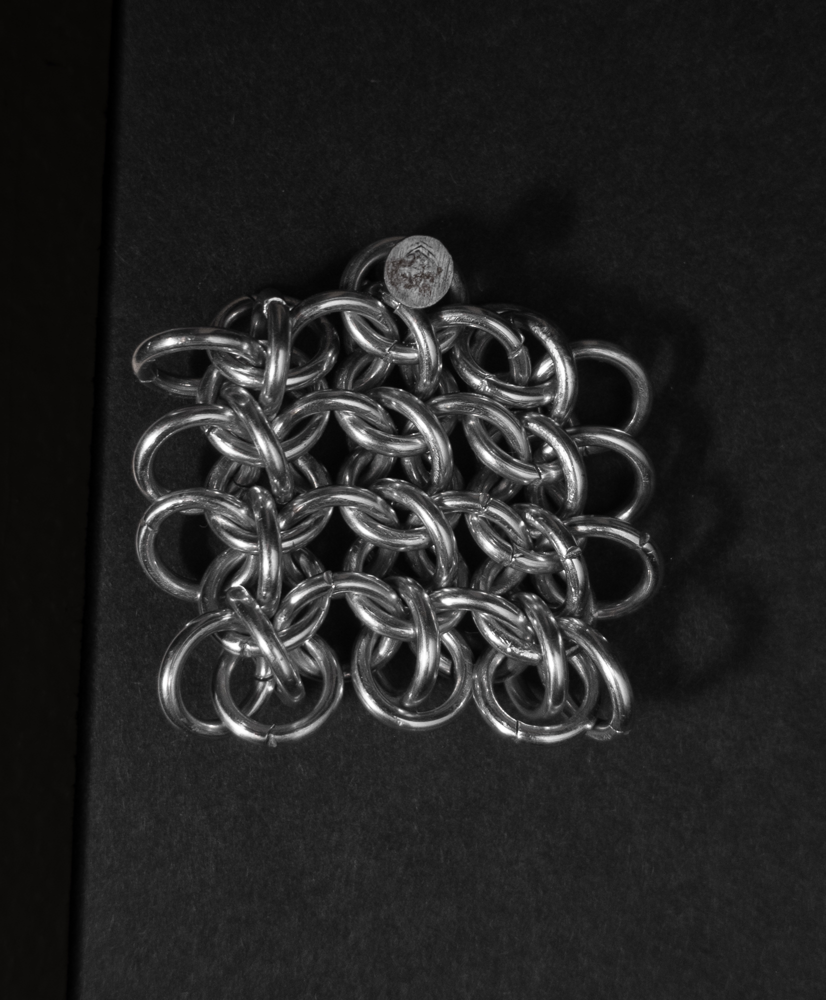
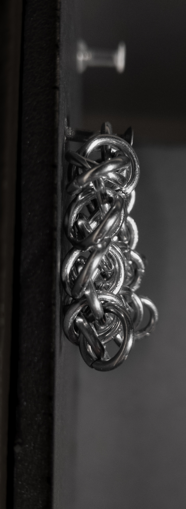
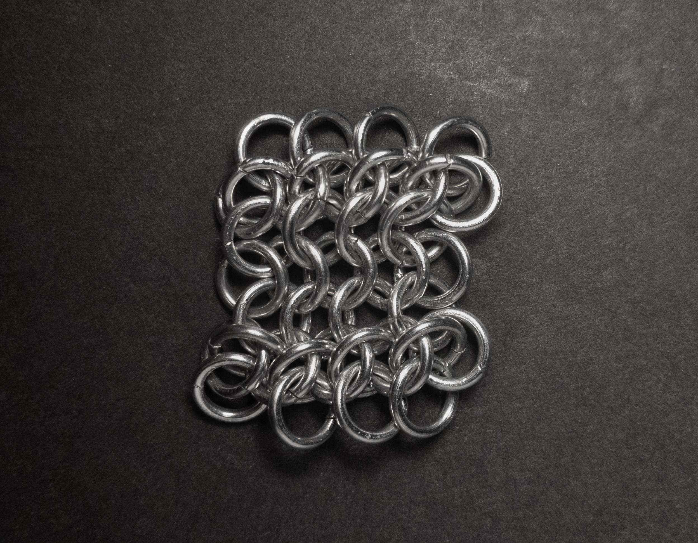

 posted: 2023-07-30 

## Wolfsheet

### Overview

When I found [Wolfweave](wolfweave.md) on [M.A.I.L.](https://www.mailleartisans.org/), I also found its sheeted variant, [Wolfsheet](https://www.mailleartisans.org/weaves/weavedisplay.php?key=603), also submitted by [Florantine](https://www.mailleartisans.org/members/memberdisplay.php?key=4833). With how much I liked the look of Wolfweave, I decided to try making Wolfsheet. Unfortunately, I was unable to find a tutorial, though I was able to figure out how to make it. I have also included a brief tutorial on making Wolfsheet for those interested in making it themselves.

### Materials

For the sample piece showcased in this post, I used Bright Aluminum rings purchased from [The Ring Lord](https://theringlord.com/). The rings are 16 SWG with a 1/4" internal diameter, resulting in an aspect ratio of 4.03.

### Tutorial

1. First, create two Wolfweave chains of the same length:

    

2. Secondly, join the chains by adding rings between each red ring, the red ring behind it (except for the last ring) and the corresponding blue rings. If you are familiar with [European 4-in-1](european_4_in_1.md), this is equivalent to joining two European 4-in-1 patches.

    

    When you are done, you should have something that looks like this (new rings in green):

    

3. Finally, add a spike ring around each eye highlighted in blue. The sides of the ring should go through the centers of the rings added in step 2 (highlighted in red).

    

    When you are done, you should have something that looks like this (new rings in green):

    

    **Please Note**: When you add a second spike ring through a flat ring you can either add the new one to the left or right of the older one. In order to get the most visually appealing result, it is crucial to make the decision at the beginning and keep it consistent.

### Notes

The Wolfsheet weave is relatively straightforward to understand, especially if you are already familiar with Wolfweave. It is slightly more complex than Wolfweave but is still quite manageable. It is worth the effort, as the resulting weave looks truly beautiful. When making Wolfsheet, it is crucial to pay careful attention to the orientation of the vertical rings. Improper layering of these rings can negatively impact the appearance of the weave. Wolfsheet offers versatility in its applications. As a sheet weave, it can be used as a fabric substitute for clothing. When made narrower, it can be utilized for bracelets or chokers. However, it may not be as suitable for long necklaces. In conclusion, I highly recommend learning to make Wolfsheet, as it is a fantastic weave with various potential uses.

### Pictures

#### Flat

#### Flat: Profile

#### Vertical

#### Vertical: Profile

#### In Process

 

