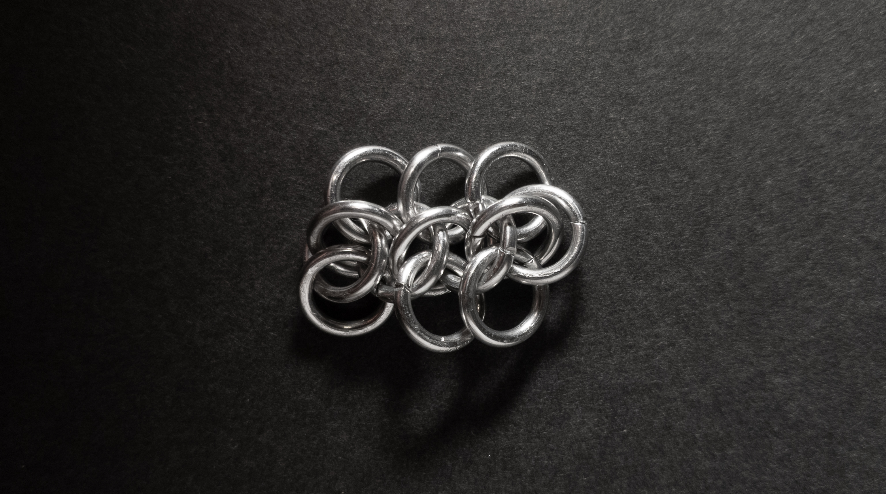

 posted: 2023-07-23 

## Wolfweave

### Overview

Recently I found a [tutorial](https://www.mailleartisans.org/articles/articledisplay.php?key=391) by [Florantine](https://www.mailleartisans.org/members/memberdisplay.php?key=4833) on [M.A.I.L.](https://www.mailleartisans.org/) that teaches how to create [Wolfweave](https://www.mailleartisans.org/weaves/weavedisplay.php?key=605). Wolfweave is an interesting twist on [European 4-in-1](european_4_in_1.md). If you find that intriguing, try the tutorial yourself.

### Materials

For the sample piece showcased in this post, I used Bright Aluminum rings purchased from [The Ring Lord](https://theringlord.com/). The rings are 16 SWG with a 1/4" internal diameter, resulting in an aspect ratio of 4.03.

### Notes

Wolfweave is a simple weave that is easy to understand and create. One of the appealing aspects of this weave is its versatile aesthetic, as it looks nice in any orientation. Being flat and wide, it is particularly well-suited for use in bracelets or chokers, though it may not lie as nicely if used in necklaces. When crafting the weave, it is essential to ensure that the vertical rings sticking out are properly layered on top of each other for a clean and polished look. Overall, I highly recommend learning the Wolfweave as it is a simple and aesthetically pleasing modification of a classic weave.

### Pictures

#### Flat

#### Flat: Profile

#### Vertical

#### Vertical: Profile

#### In Process

 

 

 

