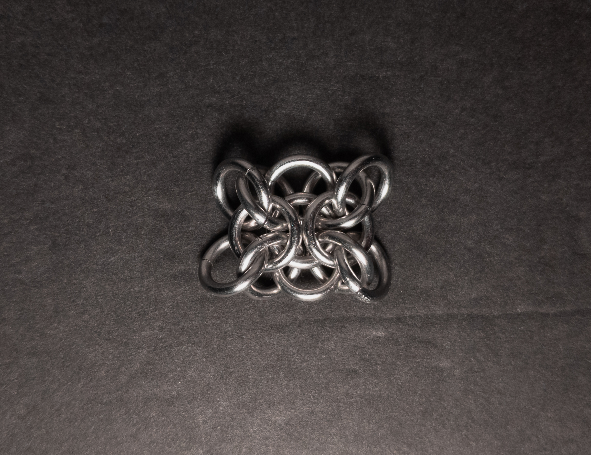
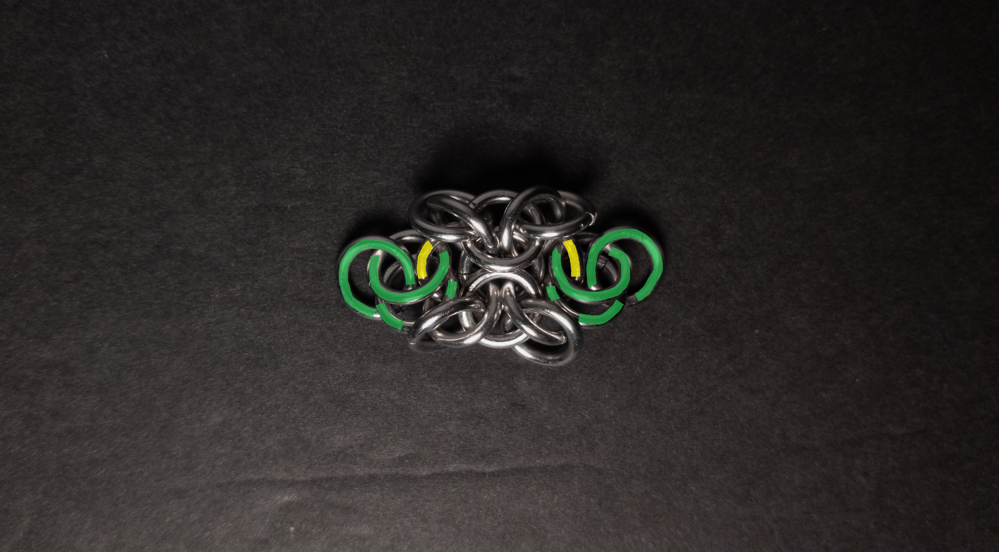
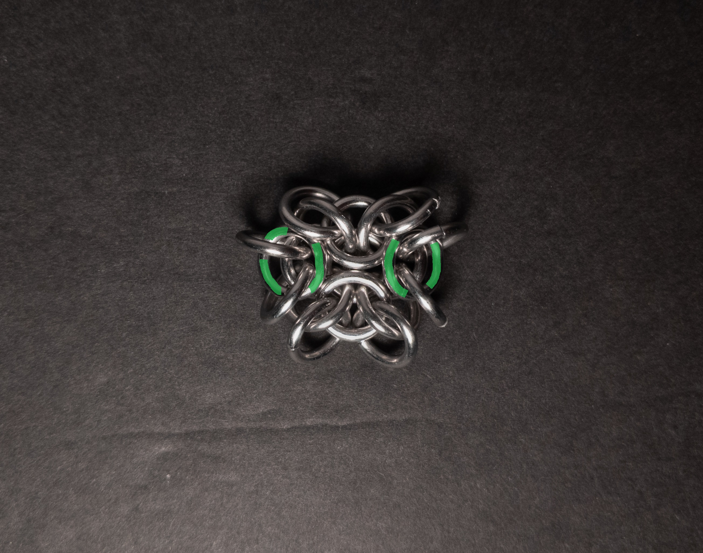
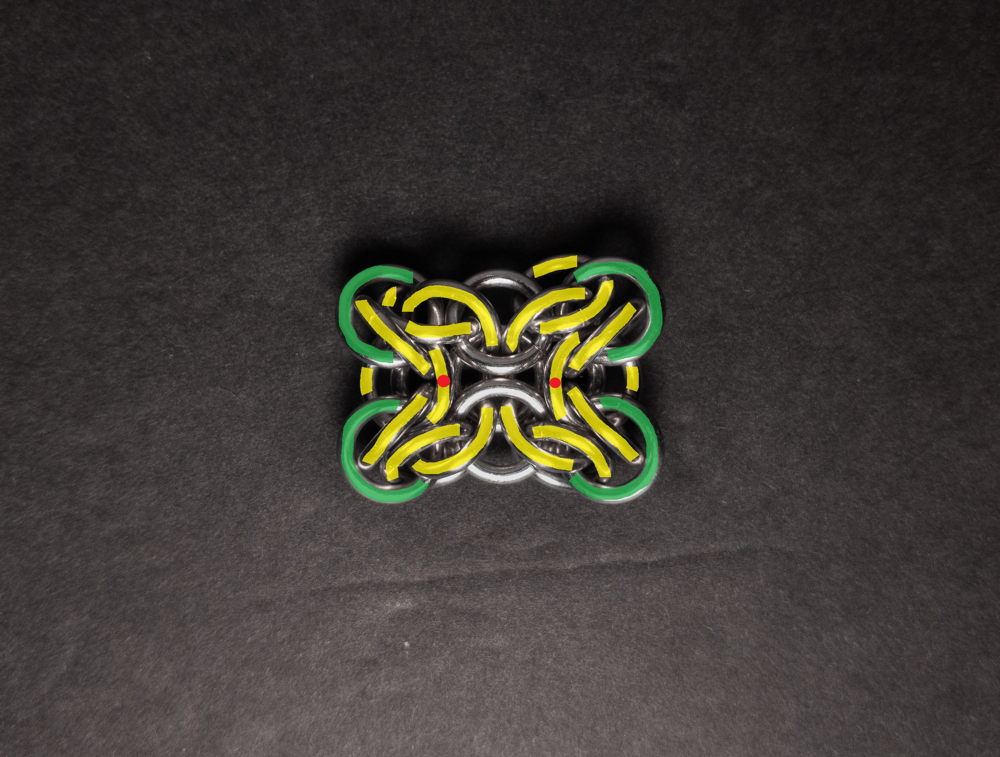
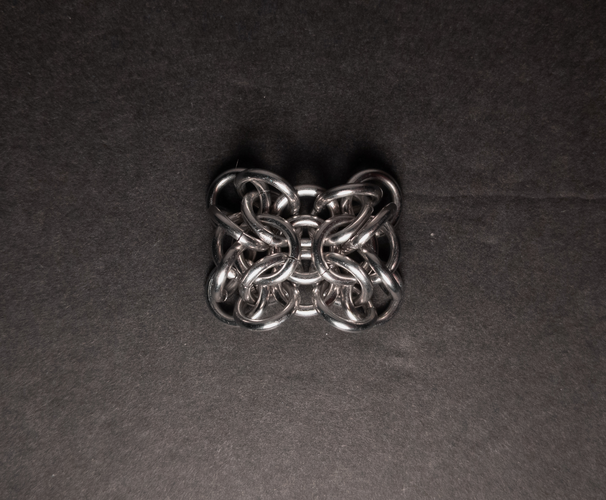
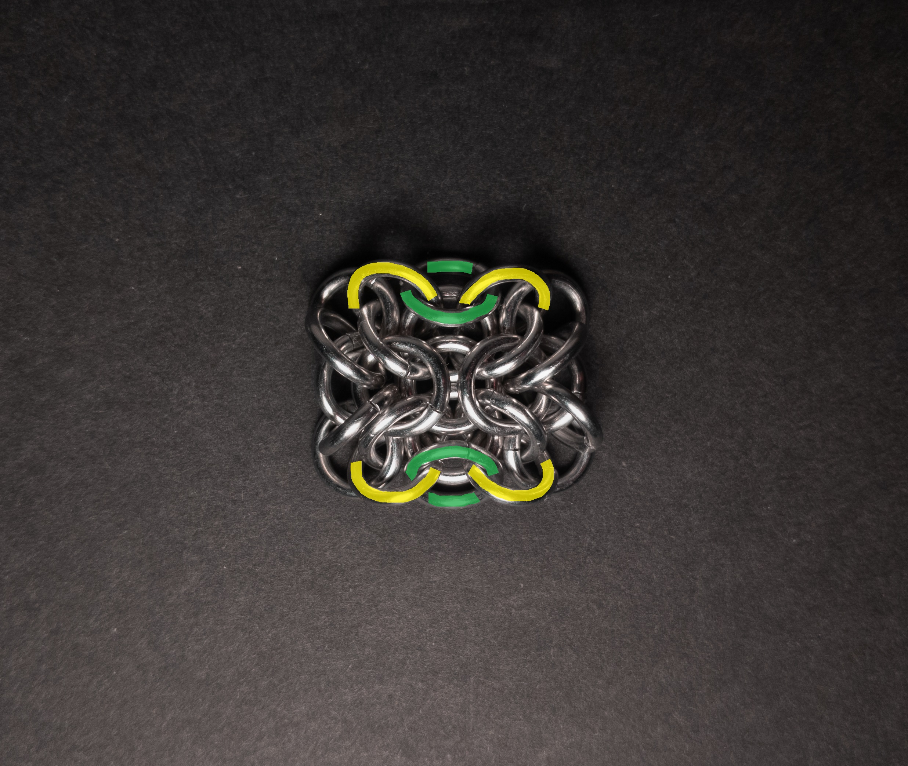
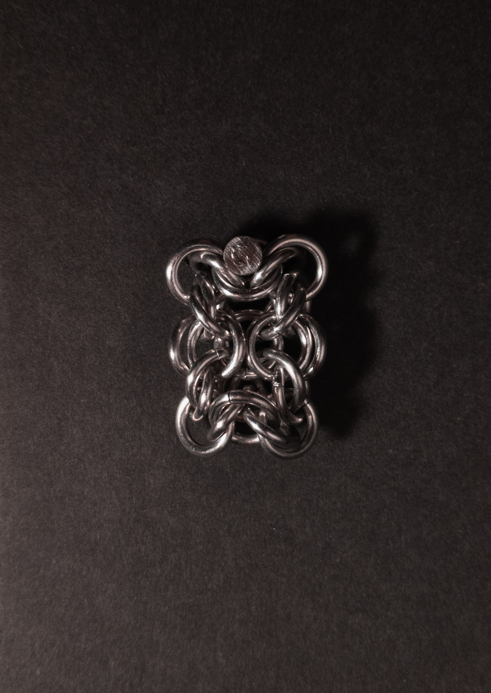
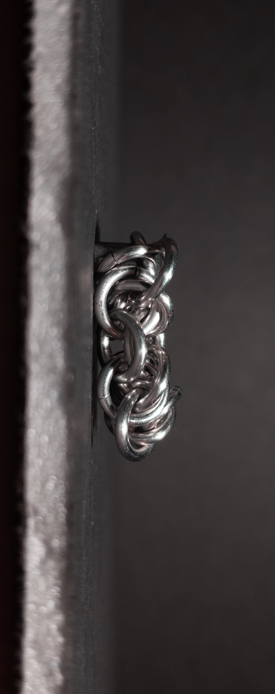
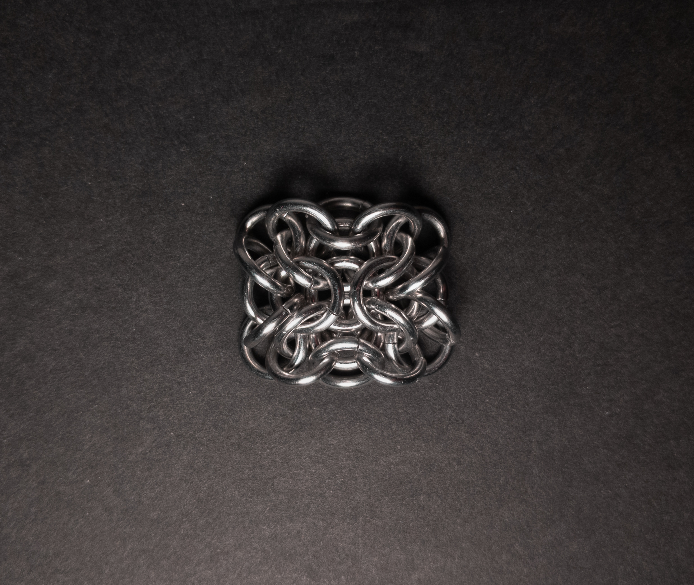
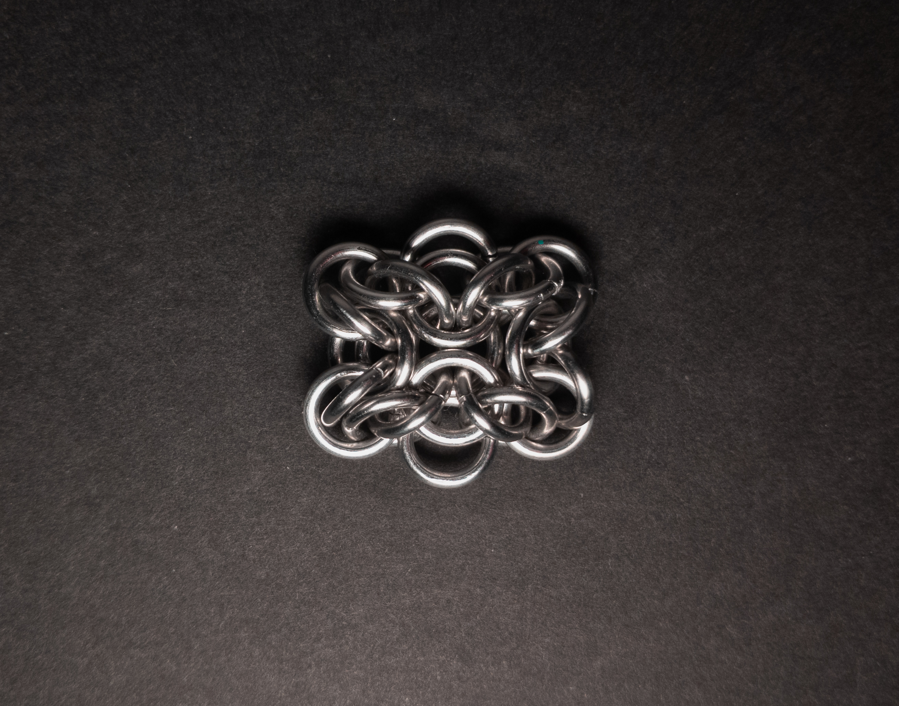

 posted: 2024-02-25 

## Xenesthis

### Overview

I found [Xenesthis](https://www.mailleartisans.org/weaves/weavedisplay.php?key=949) by [Nárrína](https://www.mailleartisans.org/members/memberdisplay.php?key=6120) on [M.A.I.L.](https://www.mailleartisans.org/) when looking for new weaves to try out. Xenesthis is an aesthetically pleasing unit based on [Gridlock](gridlock.md) that also has many ring connections in common with [Elfweave](elfweave.md). While no dedicated tutorial is available, this [tutorial](https://www.mailleartisans.org/articles/articledisplay.php?key=607) by [lorraine](https://www.mailleartisans.org/members/memberdisplay.php?key=9915) for [Orc Weave](https://www.mailleartisans.org/weaves/weavedisplay.php?key=950)(a descendant of Xenesthis) covers most of the steps. I have included an extension of that Orc Weave tutorial to fill in the gaps so those interested can make their own Xenesthis units at home.

### Materials

For the sample piece showcased in this post, I made the rings myself (bonus post coming soon if you are interested). I used 16 SWG Bright Aluminum wire from [The Ring Lord](https://theringlord.com/) coiled around a 6mm mandrel for an approximate aspect ratio of 3.7.

### Tutorial

1. Start by following the first 8 steps of [this](https://www.mailleartisans.org/articles/articledisplay.php?key=607) Orc Weave tutorial by lorraine. When done, you should have something that looks like this:

    

2. Now, flip over the weave and add 6 new rings(green in the image below) by adding 2 rings then 1 ring to those to each of the rings at the center left and right(yellow in the image below). When done, it should look something like this:

    

3. Now take the leftmost and rightmost rings from step 2(green in the image below) and fold them into the center at the top. When done, it should look something like this:

    

4. Now add 4 new rings(green in the image below) with one going in each corner. Each ring should go through the 4 nearby rings(highlighted in yellow in the image below) where each yellow ring only has one green ring going through it(except for the yellow rings with a red dot, those have two green rings go through them). When done, it should look something like this:

    

5. Now flip the weave over. When done, it should look something like this:

    

6. Now add 2 new rings(green in the image below), one at the top center and one at the bottom center. Each ring should go through the the 2 nearby rings(highlighted in yellow in the image below.) When done, it should look something like this:

    

7. Congratulations, you now have a unit of Xenesthis. You can attatch this to other creations or enjoy how it looks as a small trinket.

### Notes

Xenesthis, a weave of relatively high complexity, poses a certain level of difficulty during the crafting process, especially in its initial stages, where stability can be a concern. Despite these challenges, the resulting Xenesthis units exhibit a highly aesthetic appeal. This unit weave lends itself well to various accessory applications, such as earrings or pendants, and can be incorporated into bracelets, necklaces, or chokers, adding an ornamental touch. However, as units are a fixed size, Xenesthis is not easily used for structural purposes. While the weave is undoubtedly beautiful, its complexity adds the requirement of patience when learning how to make it. Therefore, I recommend learning Xenesthis, but with a willingness to approach it patiently.

### Pictures

#### Vertical

#### Vertical: Profile

#### Flat

Top:

Bottom:

#### Flat: Profile

